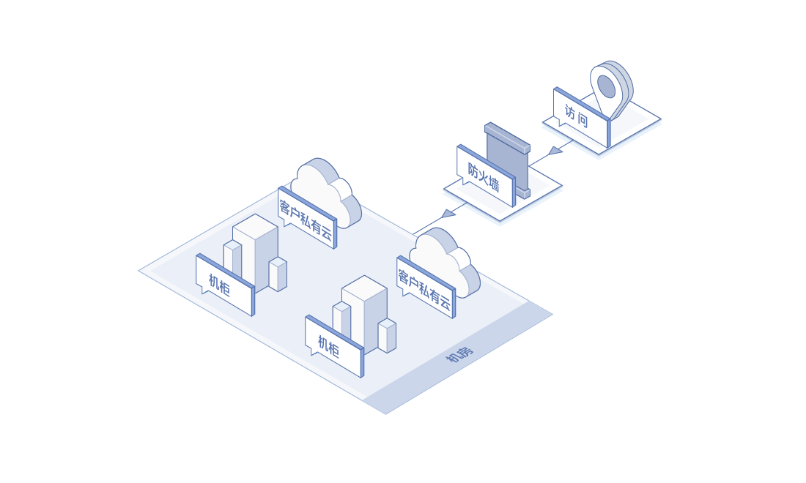
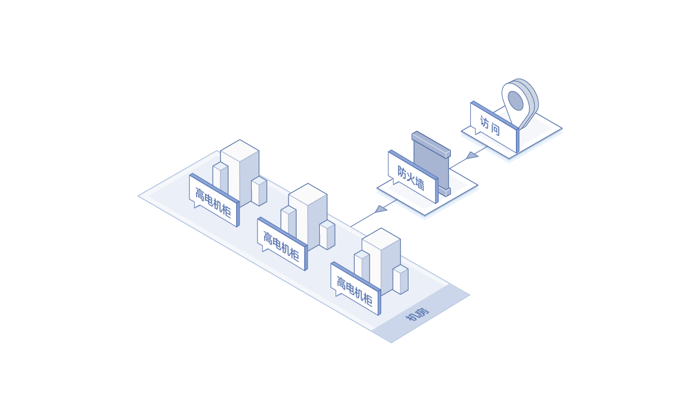

# 应用场景
## 私有云托管
政企和集团客户将私有云托管于京东云IDC，京东云提供带宽接入、基础运维等。企业独享物理资源，数据完全自主可控。既能满足企业内部审计及合规要求，又能满足行业监管要求。依托京东公有云和网络优势，客户也可以无缝接入京东公有云，构建自己的混合云方案。

## 深度学习
众所周知，GPU可以高效地处理矩阵乘法和卷积，非常适合于深度学习模型训练。GPU的功耗较高，往往一台GPU服务器又配置多块GPU卡，电力需求很大。AIDC提供高电机柜产品，用户深度学习业务部署在高电机柜中，京东云提供可靠的电力保障。

