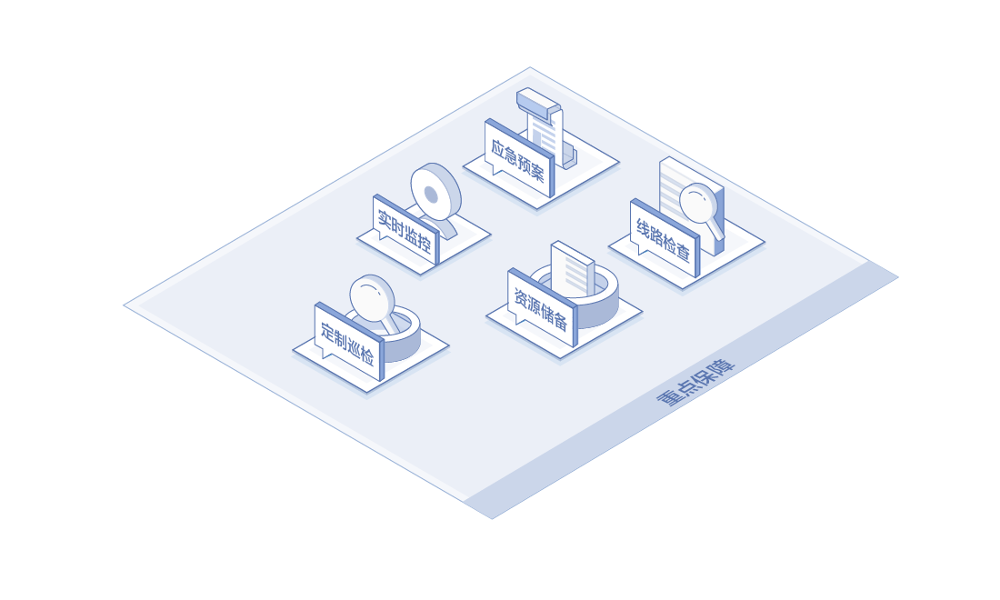

# 应用场景
## 重点保障
在业务上线、秒杀大促、突发新闻、重大节假日期间，京东云配合客户制定业务重保方案。现场重保期间可暂停重保区域内物理操作、电力操作，并加强重保区域巡检强度，提升巡检次数，保障业务稳定运行。

## 行业客户
对于政府、金融、电信、能源、游戏、大型企业等对机房和设备安全级别有较高要求的客户，京东云按照国家信息安全等级保护规范要求，出具规范的巡检记录报告和故障记录报告。

