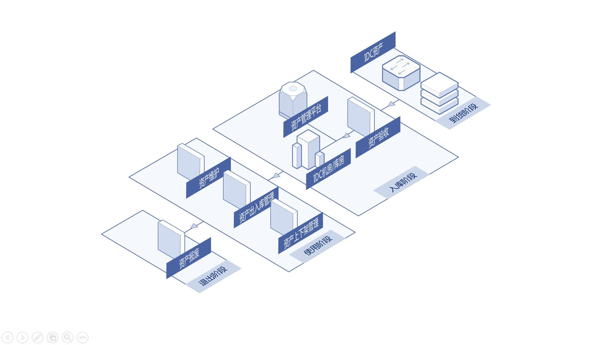
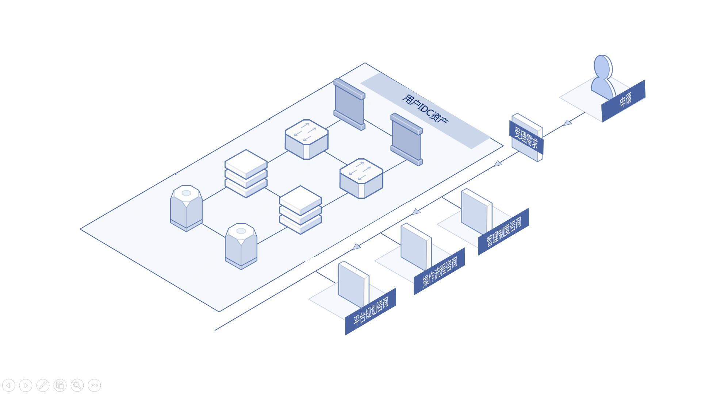

# 应用场景
## 行业客户（电商、AI、物流等）
基于客户目前的资产体量，以及未来发展与规划，对资产信息进行收集、分析、搜索、挖掘。京东云为您提供资产全生命周期的管理，使资产的使用率提升、闲置率下降，储存安全无忧。

## IDC资产管理咨询
针对新建系统用户，在建设前期、中期提供一站式资产管理与技术咨询；对已经具备线下管理制度的用户，进行资产管理手段数字化优化或改造分析，提供管理平台建设的成熟方案；针对用户战略转型过程中面临的问题，进行IDC资产与主营业务间的正相关分析，提供管理流程平台重塑设计方案。

