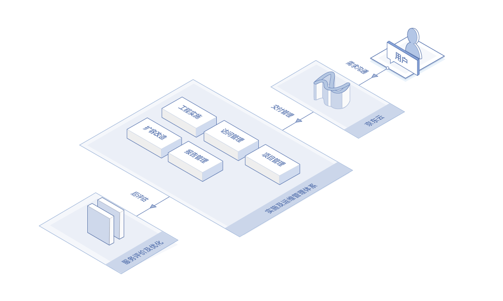
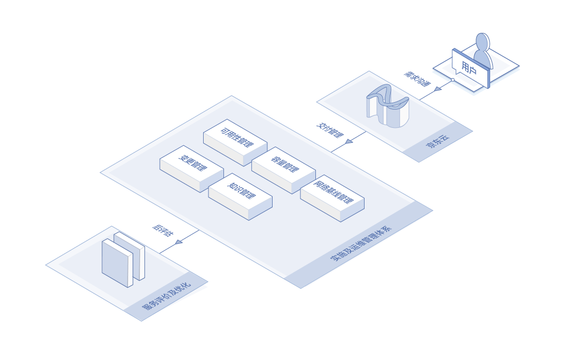
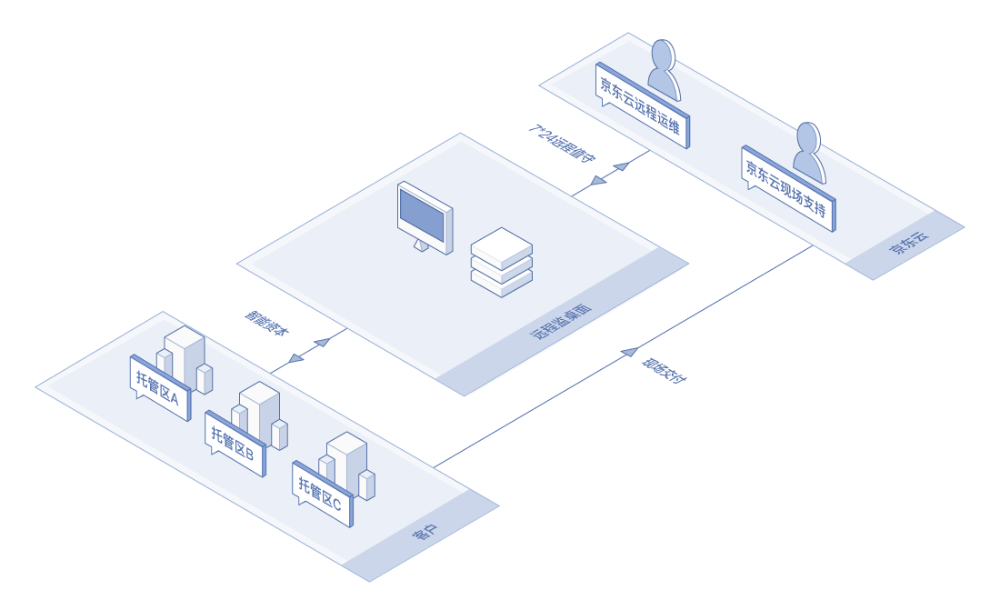

# 应用场景

## 人员成本控制
在控制成本的前提下，有限的运维人员将带来非常大的运维压力，同时对人员的管理难度也不低，专业的事情交给专业的团队，节约成本。

## 复杂业务支撑
业务环境复杂，新产品、新技术支持难度大，网络中所存在的隐患无从可知，往往是问题发生后的被动响应。需要专业手段进行实时监控。

## 数据中心分散
在数据中心地域分散以及人员无法有效覆盖的情况下，需要集中统一管理，以及借助远程手段覆盖分支。

