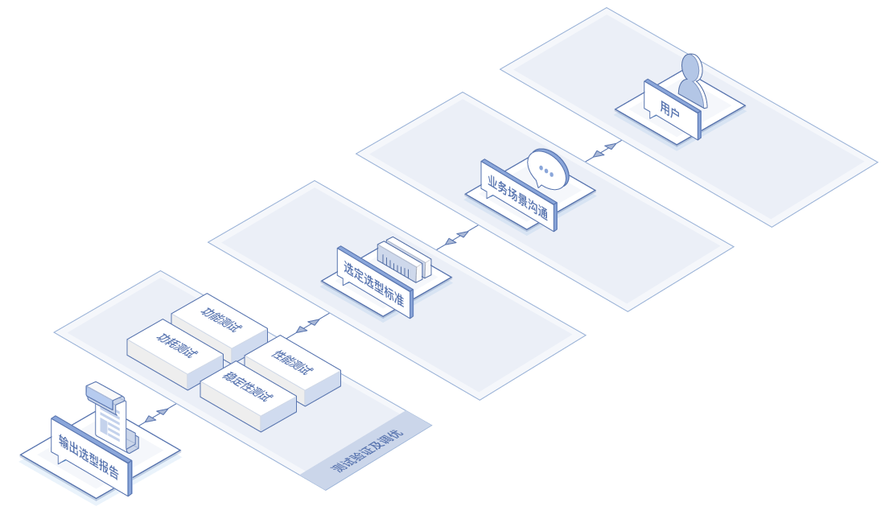
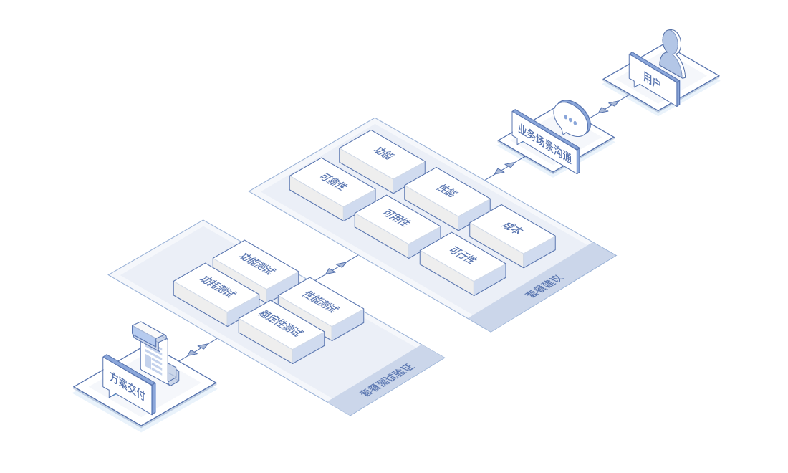
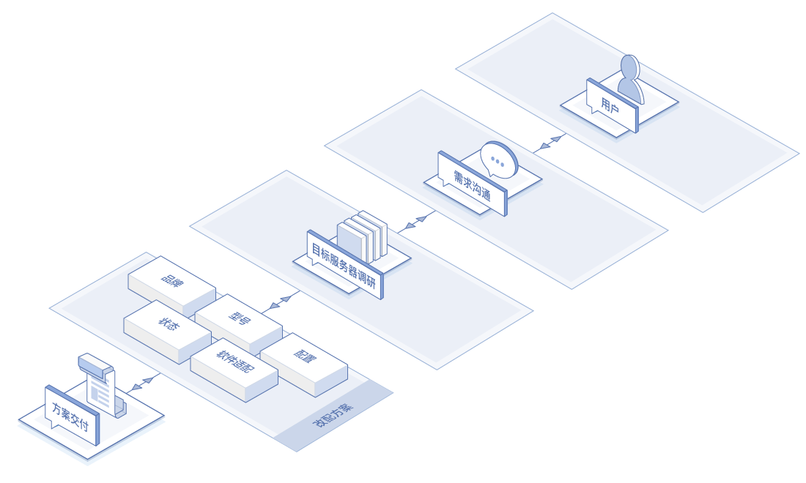
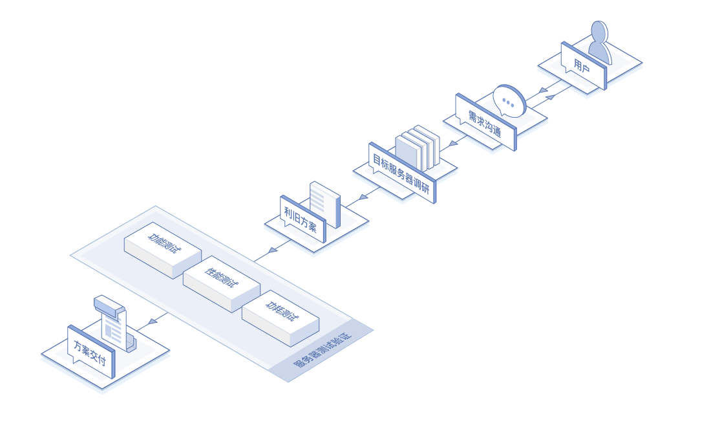
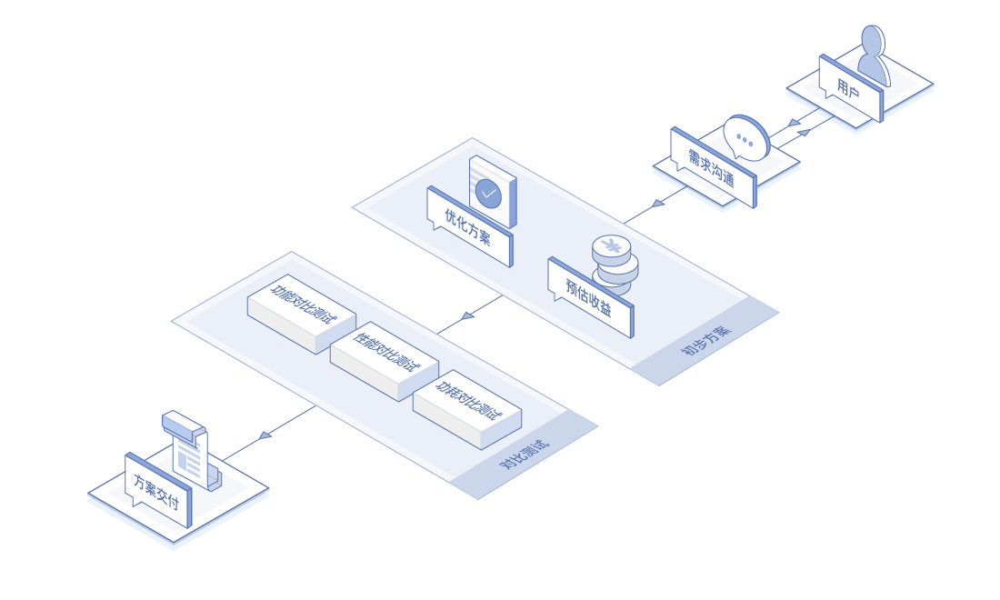

# 应用场景
## 硬件选型
根据客户的应用需求，结合京东多年来积累的硬件选型经验和对硬件技术、供应链的深入了解，提供服务器、网络设备及部件的测试选型服务。

## 服务器套餐规划和定义
从功能、性能、成本、可靠性、可用性、可行性等角度，为您定制最符合业务场景的服务器套餐。

## 线上服务器改配
根据线上服务器的品牌、型号以及具体配置和状态，提供简单可行的改配或扩容方案。

## 服务器利旧
将客户数据中心的老旧服务器重新利用再改造，将原来的传统架构、物理机环境，通过部件的整合以及软件的升级重新创造价值，节约客户成本。

## 硬件优化
通过客户访谈，分析客户应用与系统特点，找出系统性能瓶颈或过剩部分，为客户当前使用的硬件方案提供成本或性能优化建议。

