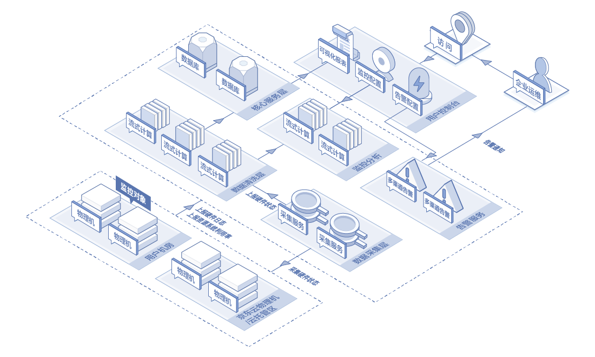
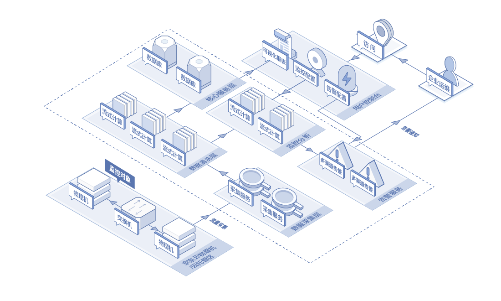

# 应用场景
## 服务器健康状态监控
企业运维希望对自有机房和京东云托管区的服务器系统及硬件运行情况进行全面监控，并在一个平台上集中管理，随时查看服务器硬件信息、硬件工作状态、服务器的CPU、内存等系统资源消耗情况；结合自身业务，可以分别对系统资源指标、服务器硬件类型设置告警规则和通知渠道，及时发现异常，提高运维效率。

## 网络监控
企业用户需要对京东云托管区的网络流量使用情况进行实时监控，可通过可视化图表查看网络流量使用情况，可对网络流量根据自身业务形态设置告警规则，通过短信、邮件、电话等方式接收告警。

