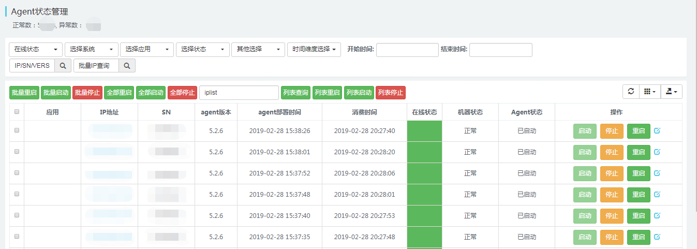
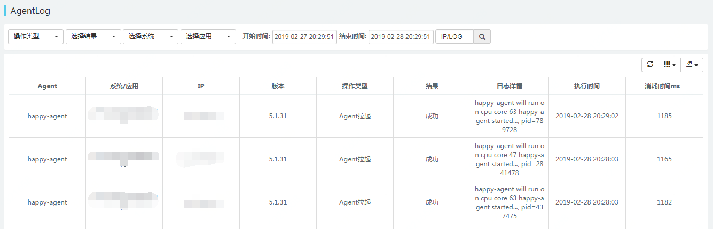
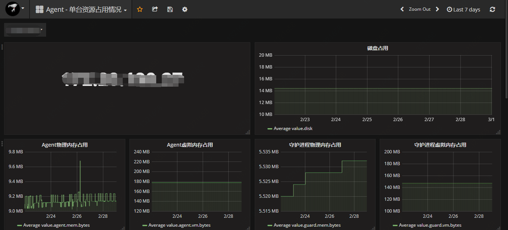
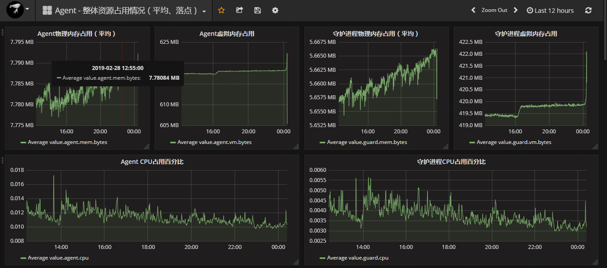
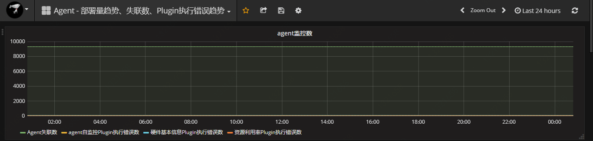

# Agent管理
## Agent 状态管理：
对部署agent的服务器进行服务的启动、停止及重启。当服务器安装agent，并且正常启动之后，应该会出现在下面的列表中，如果没有，见下面的问题排查。

操作类型分为三种：
- 启动
- 停止
- 重启
操作对象分为三类：
- 批量：选定下列服务器进行操作
- 列表：手工数据服务器IP进行操作
- 全部：针对所有服务器进行操作

## Agent日志:
展示agent相关的日志

操作类型分为三种：
- agent下载：当守护进程更新agent时输出的日志信息
- agent拉起：当守护进程重启拉起停止中的agent时输出的日志信息
- agent停止：当守护进程停止agent时输出的日志信息
## 查看Agent自身资源占用情况：
查看单台服务器的Agent资源占用情况：展示Agent以及守护进程占用的CPU、内存及磁盘空间等信息。

查看整体资源占用情况：从宏观上掌握当前agent及守护进程资源占用情况

查看Agent失联数、各个Plugin执行错误数量：
