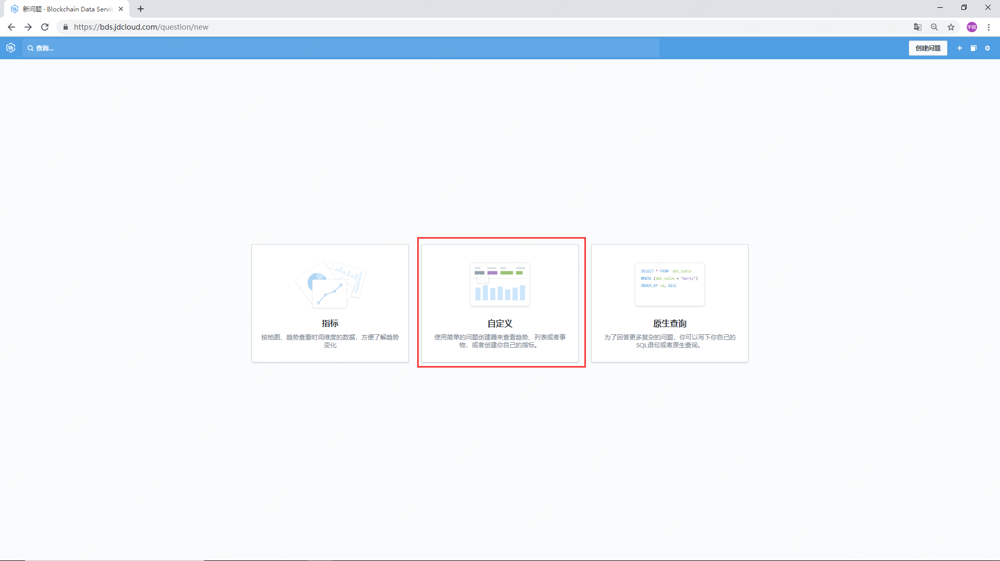
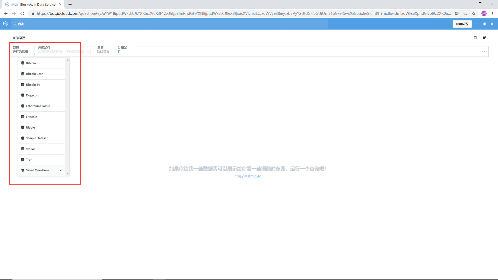
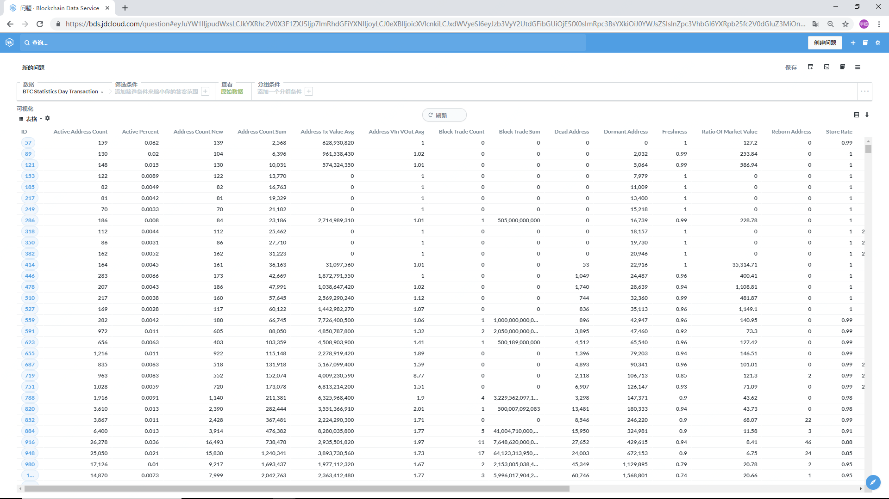
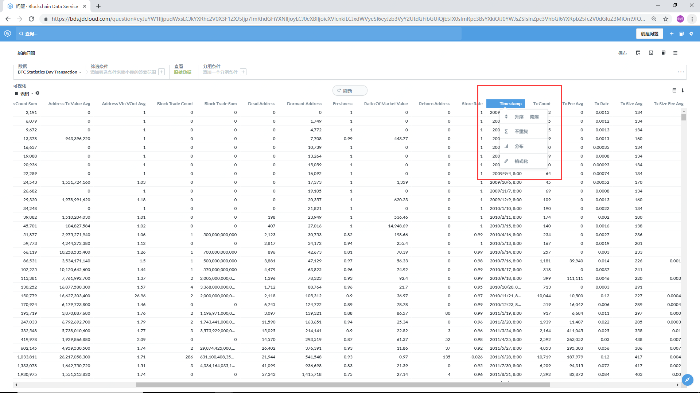
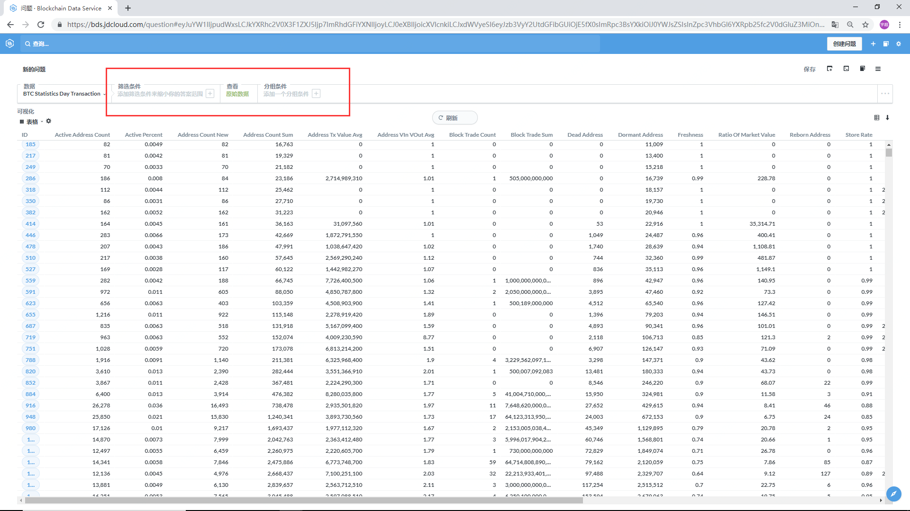
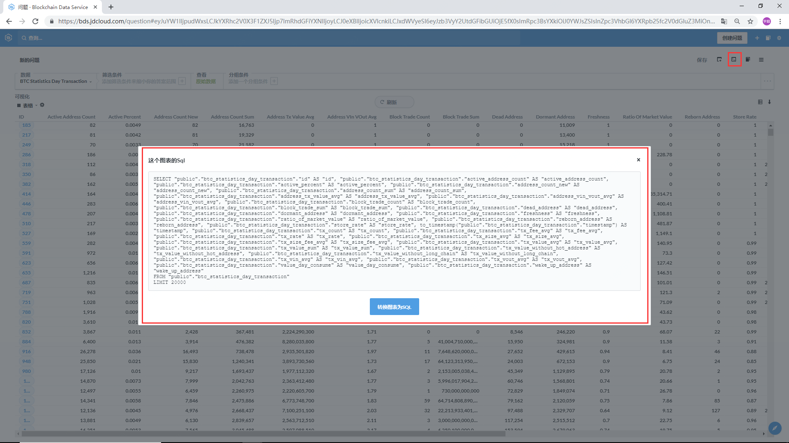

# 进行提问
## 条件查询
用户可以通过简单拖拽的交互方式添加各种类型的过滤条件，对数据进行筛选，查询想要的数据。

### 操作步骤
1. 点击“创建问题”并选择“自定义”

    

2. 选择你所想要查询的公链。

    

3. 点击“得到答案”之后得到表格类型的数据展示。

    

4. 对数据指标进行排序，分布，格式化等操作。

    

5. 对查询的数据进行进一步操作。

    - 添加筛选条件
    - 查看数据类型
    - 添加分组条件

    

6. 获取对应问题的SQL语句

    

## 

