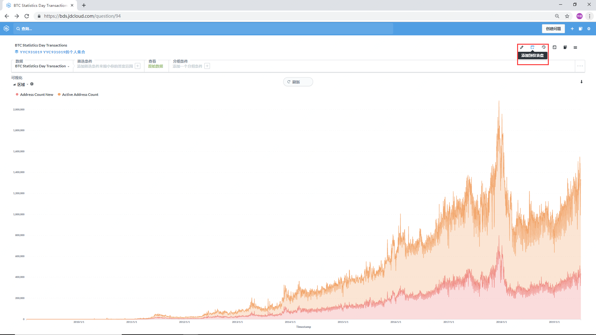
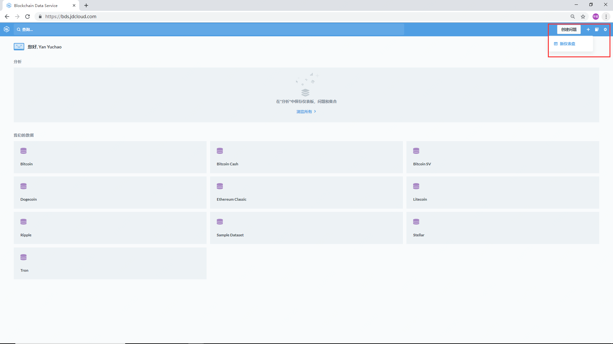
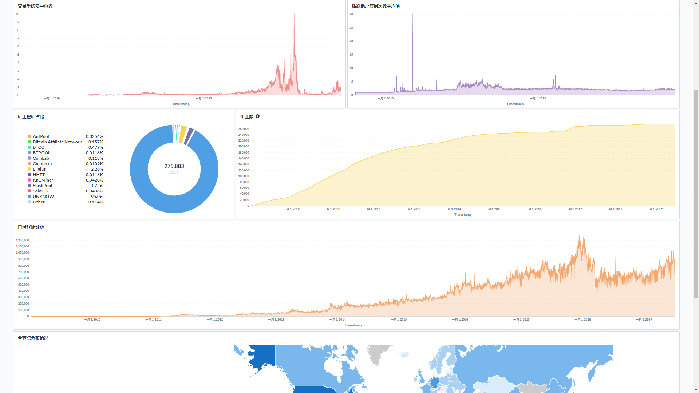
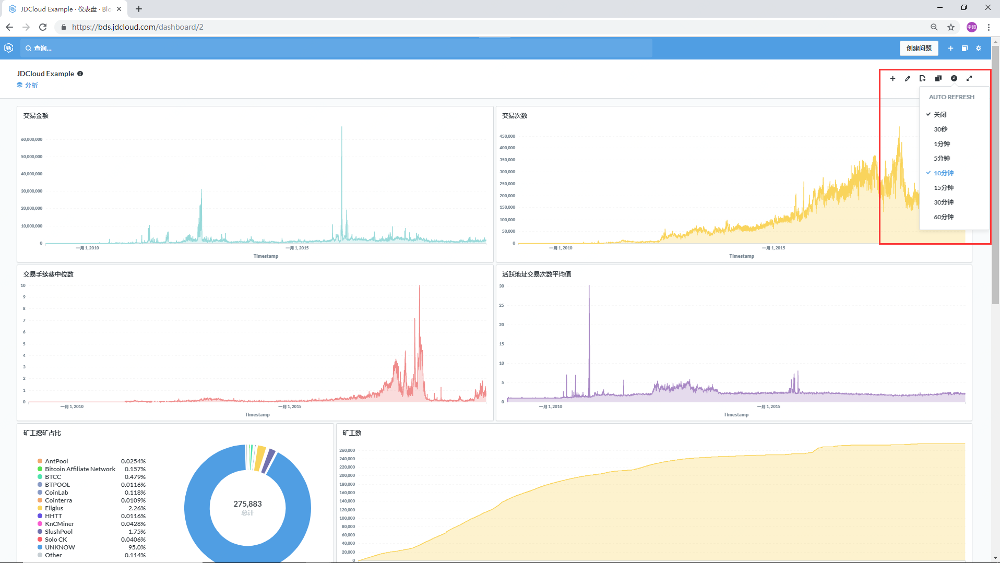
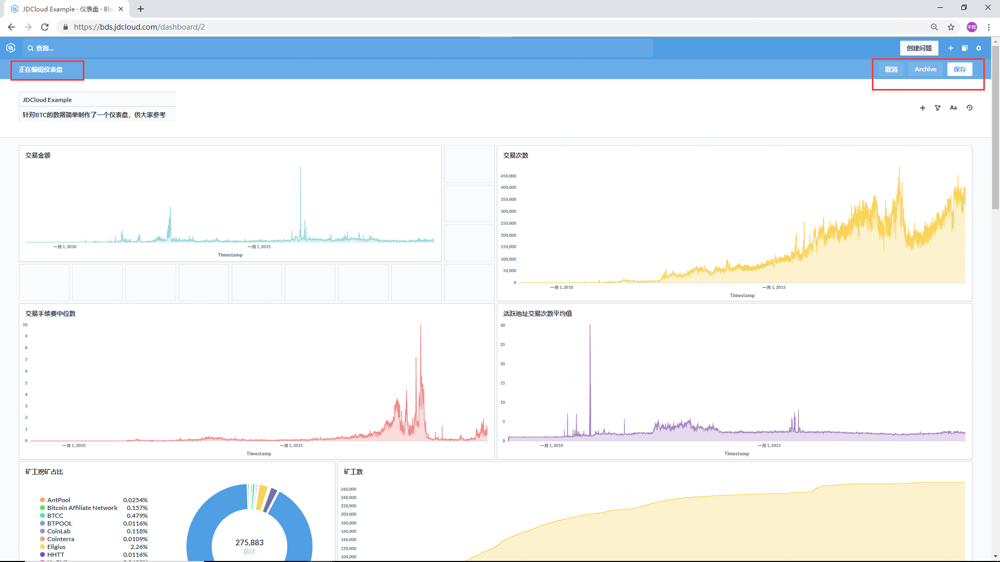
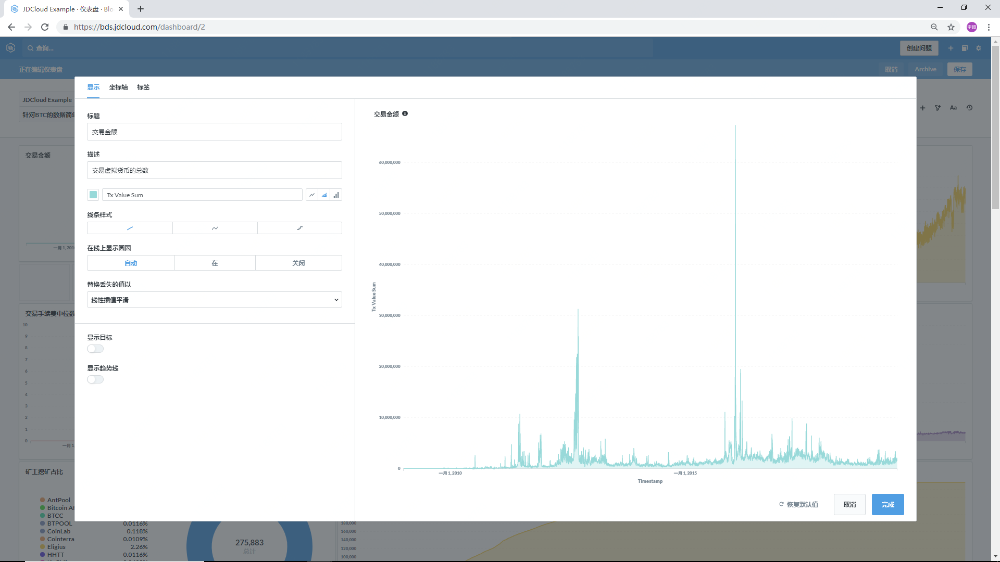
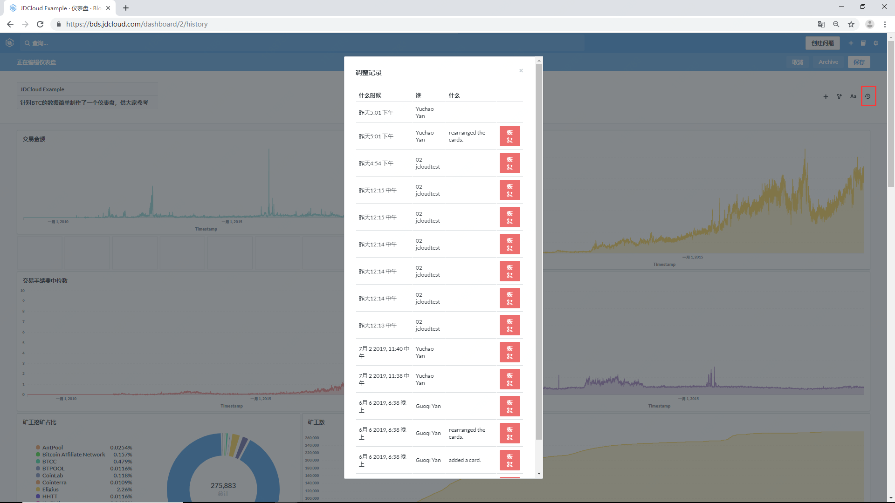

# 仪表盘
## 添加到仪表盘
用户可以将数据的可视化结果保存到自己的仪表盘中。

## 创建新仪表盘

用户可以在主界面右上角选择创建新仪表盘，对数据图表进行分类放置。

## 仪表盘效果展示

登陆BDS，在主界面左上角选择“JDCloud Example",进入仪表盘样本展示。

## 编辑仪表盘

### 自动刷新

选择仪表盘的自动刷新时间间隔

### 布局编辑

对仪表盘的图表进行移动，放大，缩小，改变仪表盘的布局样式。

### 内容编辑

在仪表盘中可以直接对图表进行内容编辑。

### 操作记录

编辑仪表盘时可查看自己对仪表盘进行的操作记录，同时可以选择恢复到之前的版本。

