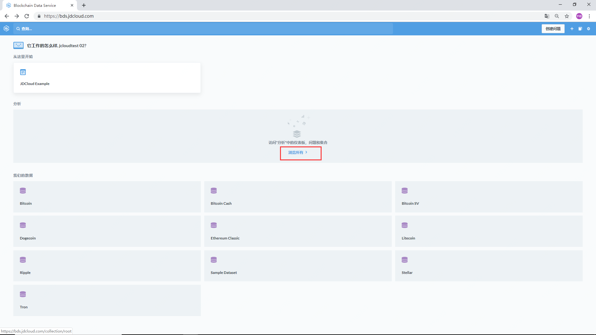
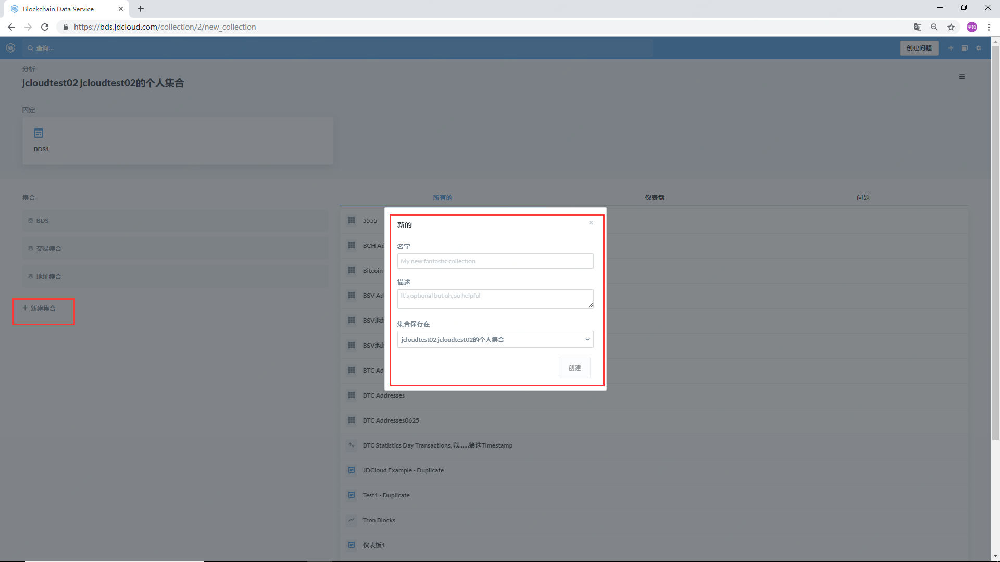
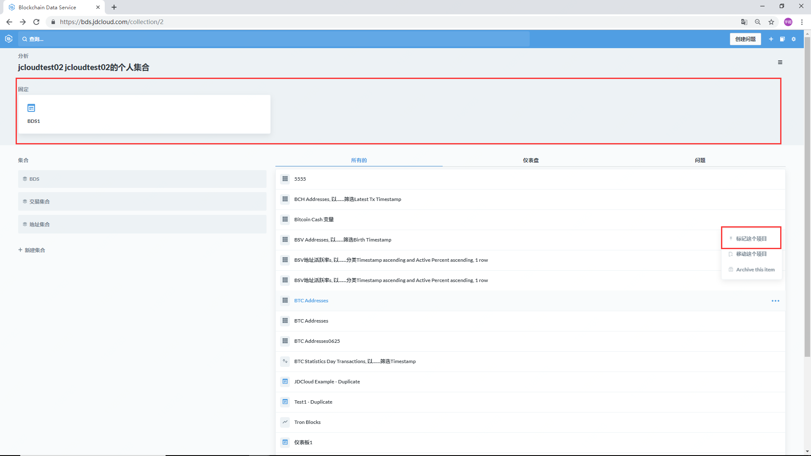
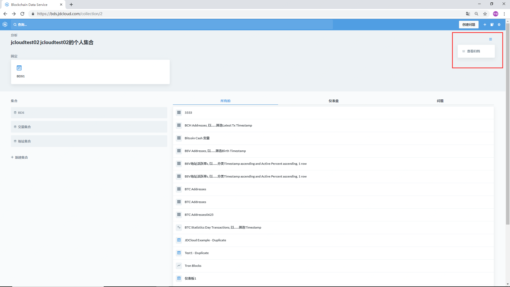

# 个人集合
## 我的个人集合
### 操作步骤

登陆BDS，选择分析-浏览所有，进入到”我的个人集合“

## 创建子集合
### 操作步骤

选择分析-浏览所有-我的个人集合，点击”新建集合“，可以在个人集合中创建新的子集合，并进行命名，添加备注。

## 编辑集合中的内容
### 标记这个项目

对子集合中的问题和仪表盘进行标记，可以将其在子集合中置顶呈现。

### 移动这个项目

在子集合之间移动所保存的问题，图表，仪表盘。

### 归档这个项目

可以通过”查看归档“获取被归档的项目。

