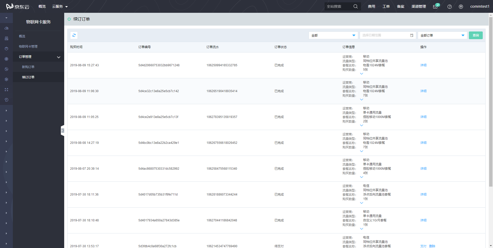
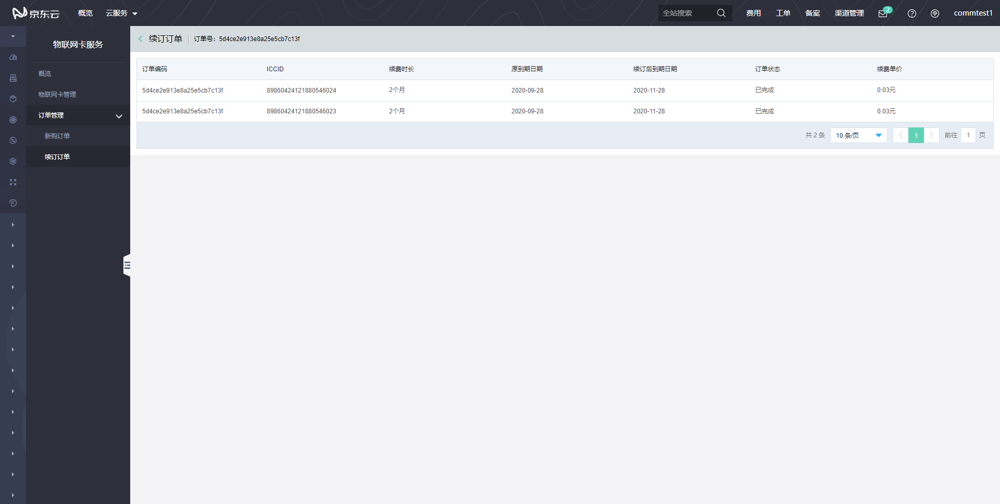

# 订单管理
对新购订单和续订订单进行管理。
## 新购订单
进入“新购订单”页，您可以查询新购订单记录详情信息，通过[物联网卡购买](../Operation-Guide/Purchase.md)生成的订单都属于新购订单。

发起支付，未进行支付的订单状态为“待支付”，待支付的订单支持“支付”和“删除”操作；订单支付成功后，订单状态为“已支付”，已支付的订单京东云第一时间为您邮寄物联网卡，已为您邮寄物联网卡的订单状态为“处理中”，处理中的订单支持“确认收货”操作，当您收到物联网卡后，点击“确认收货”后，订单状态变更为“已完成”，已完成的订单，您可以点击“详细”按钮查询物联网卡的相关信息。

## 续订订单
进入“续订订单”页，您可以查询续订订单记录详情信息，在物联网卡管理页面进行续费生成的订单都属于续订订单。

发起续费，未进行支付的订单状态为“待支付”，待支付的订单支持“支付”和“删除”操作；订单支付成功后，订单状态为“已完成”，已完成的订单，您可以点击“详细”按钮查询续费详情。

