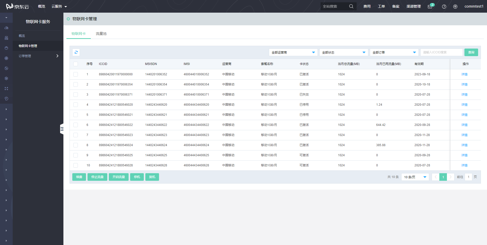
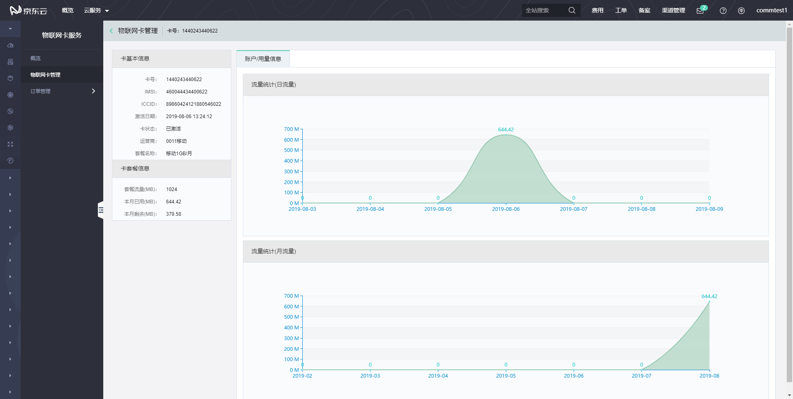
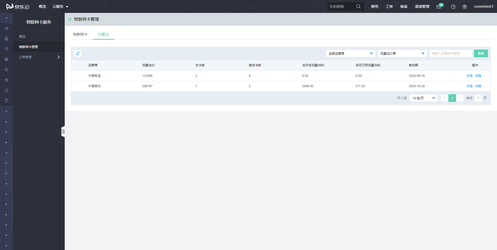
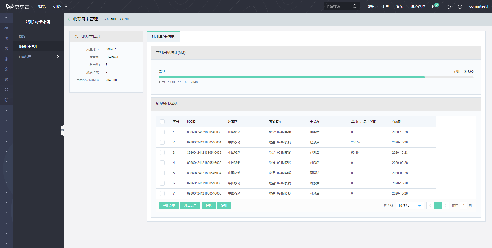

# 物联网卡管理

进入“物联网卡管理”页面，可对物联网卡和流量池进行管理。

## 物联网卡

您可以根据不同的条件查询已购买的物联网卡，对这些卡您可以进行续订、停止流量、开启流量，也可以对卡做停机和复机操作。

点击物联网卡列表“操作”列中的“详情”连接，您可查看对应物联网卡的详细信息，主要包含卡信息、套餐信息、流量使用等信息。

## 流量池

您可以根据不同的条件查询已购买的流量池，您可对流量池进行续费和查询详情操作。

点击流量池列表“操作”列中的“详情”连接，您可查看流量池内的物联网卡信息，同时可对流量池内的物联网卡进行停止流量、开启流量，也可以对卡做停机和复机操作。

