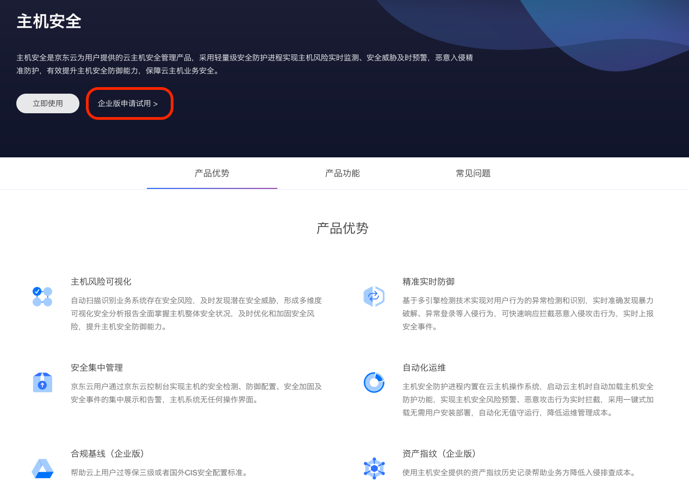
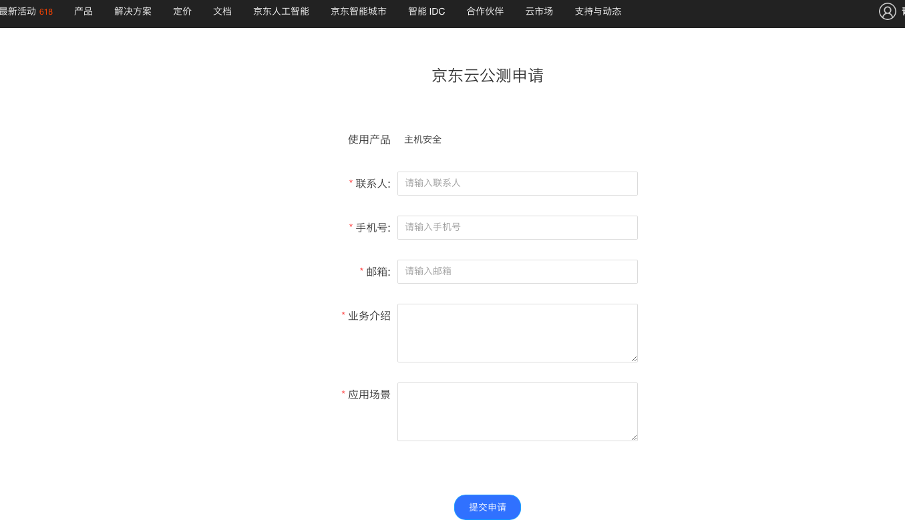
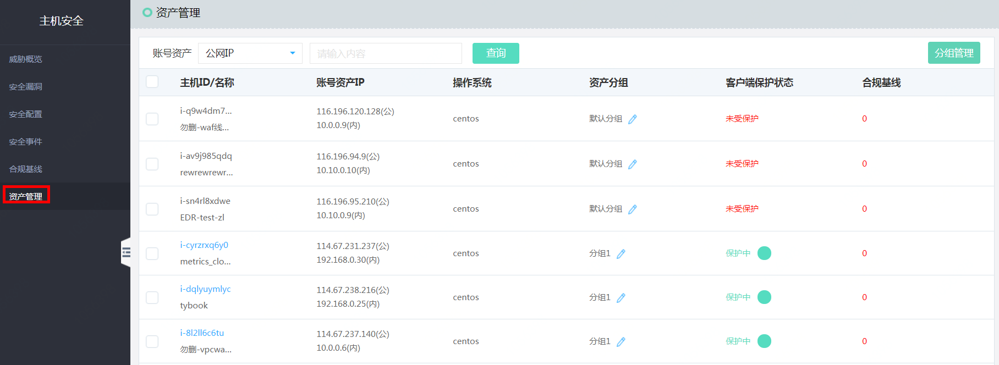

## 资产管理

### 企业版申请

由于合规基线功能属于企业版范围，租户想拥有本功能需要申请企业版试用。

登录官网->产品->主机安全，点击 企业版申请试用。
[申请链接](https://www.jdcloud.com/cn/public/testApply/baseline)，

等待后台审批。审批完成后，该账号下主机安全产品菜单中就会显示合规基线和资产管理。

### 资产管理

#### 产品功能入口

登录【主机安全】->【资产管理】

### 资产指纹

#### 功能说明
态势感知资产指纹功能定期收集并记录服务器上的以下信息：运行进程、端口服务、账号信息、软件信息，帮助您全面了解资产的运行状态，便于入侵排查。

- 查看单个资产指纹

登录【主机安全】->【资产管理】，点击具体资产信息。

- 查询指定资产指纹历史变更

登录【主机安全】->【资产管理】，输入需要查询的进程，查询历史变更情况。

- 查看全部资产指纹

登录【主机安全】->【资产管理】，点击具体资产信息，点击你关注的进程、进入你关注进程在全网资产中的运行情况。

- 查询指定资产指纹聚合结果

登录【主机安全】->【资产管理】，点击具体资产信息，点击进程、进入聚合数据界面，输入需要查询的进程。

