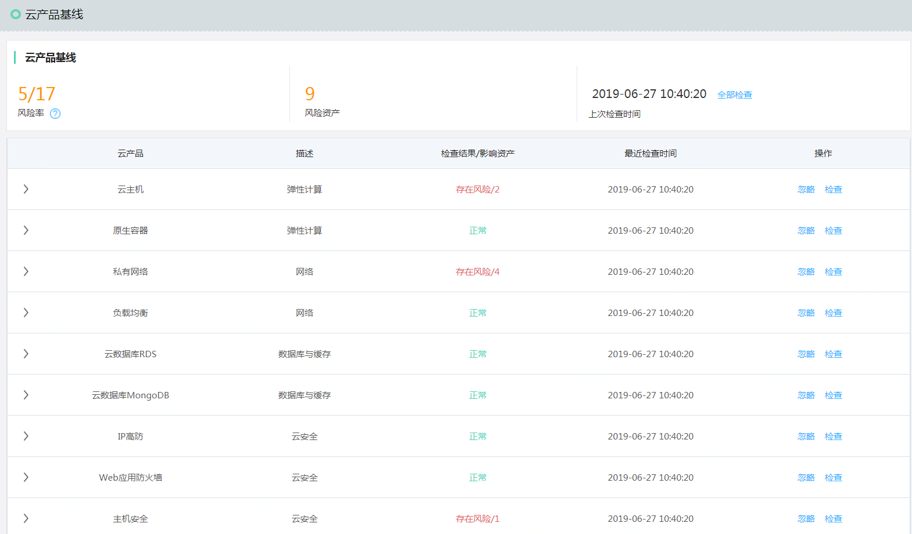
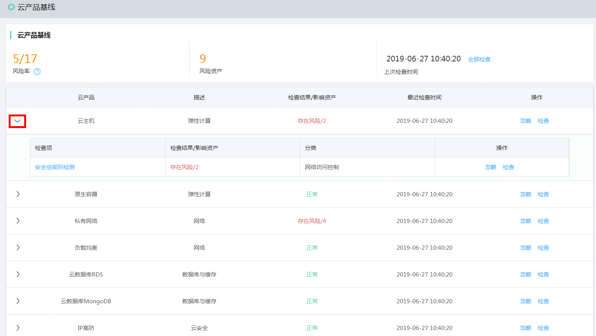
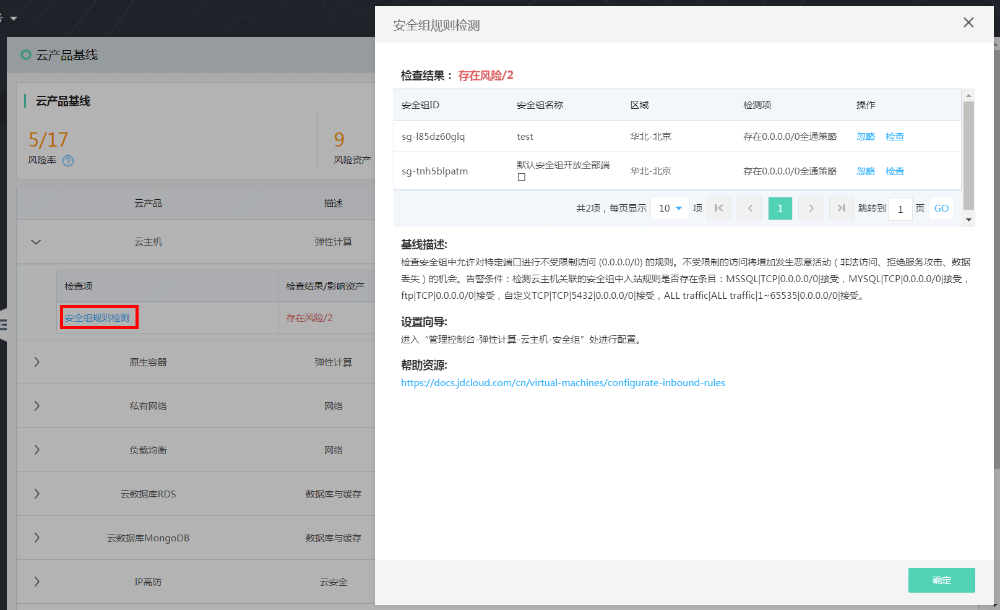
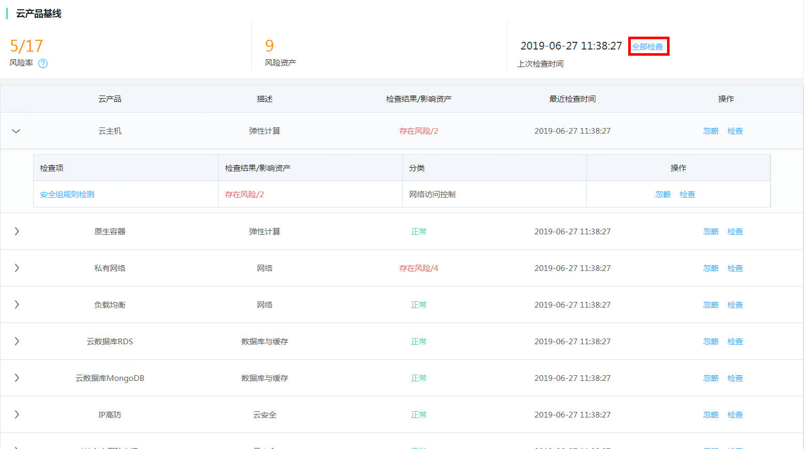
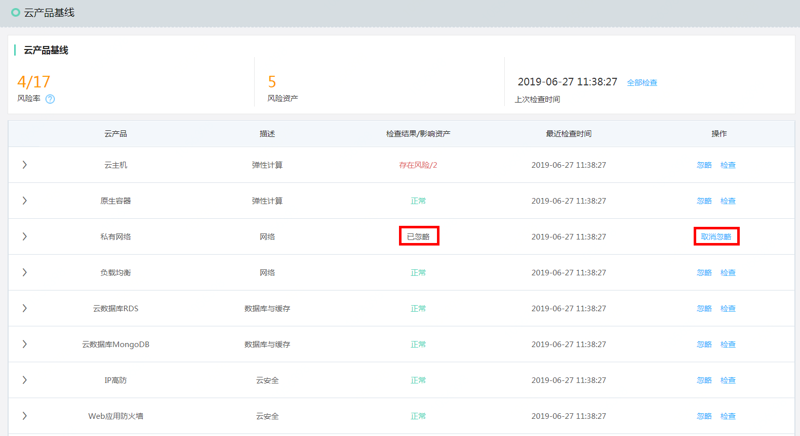
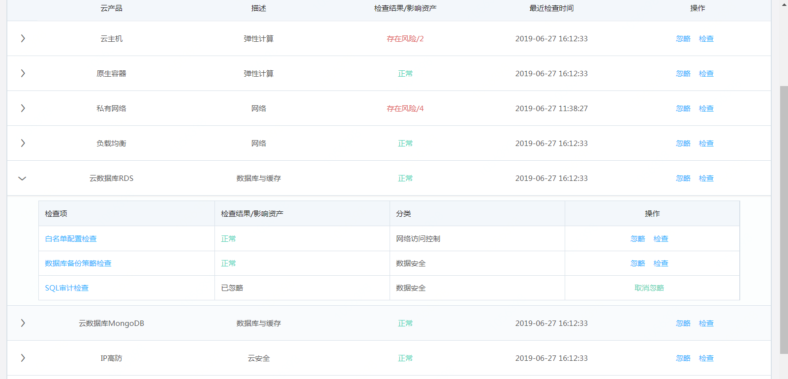

# 云产品基线

### 功能模块定义

从身份认证、网络访问控制、数据安全、日志审计、基础安全防护五个维度为您提供云产品安全配置的检测，帮助您及时发现您的云产品配置风险并提供相应的修复方案。

#### 功能说明

本次云产品基线提供11款云产品共16项安全配置核查，如下表：

|  云产品   | 检查项  |
|  ----  | ----  |
| 云主机  | 安全组规则检测 |
| 原生容器  | 安全组规则检测 |
| 私有网络  | ACL规则检测 |
| 负载均衡  | 高危端口暴露 |
|   | 安全组规则检测 |
| 云数据库RDS  | 白名单配置检查 |
|   | 数据库备份策略检查 |
|   | SQL审计检查 |
| 云数据库MongoDB  | 白名单配置检查 |
|   | 数据库备份策略检查 |
| IP高防  | 清洗服务开启 |
| Web应用防火墙  | waf版本检测 |
| 主机安全  | 主机安全防护状态检查 |
|  访问控制 | 账号双因素认证检查 |
|  | IAM密码策略检查 |
| 操作审计  | 云平台操作审计服务检查 |

登录【态势感知】-> 【云产品基线】，点击三角号，展开检查项，点击检查项，进入检查详情页

针对特殊情况，用户对当前检查项或者当前产品不感兴趣，可以点击忽略，

