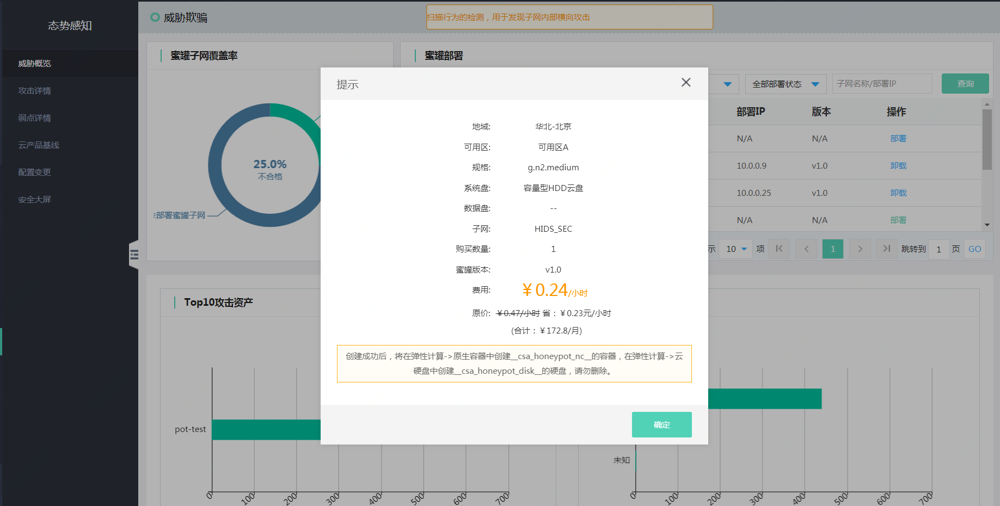
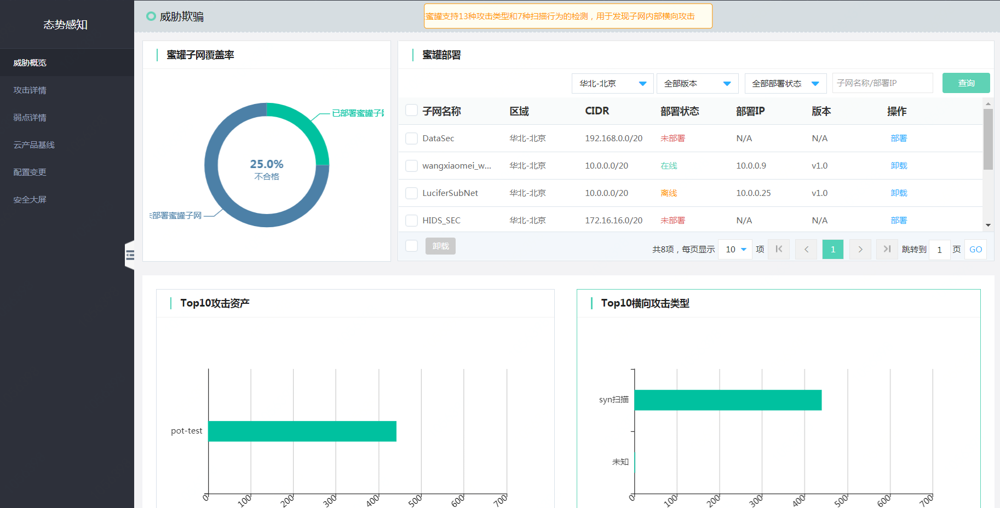
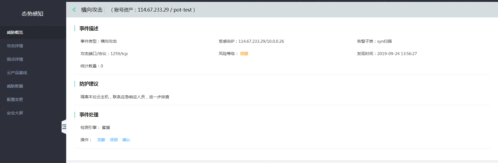
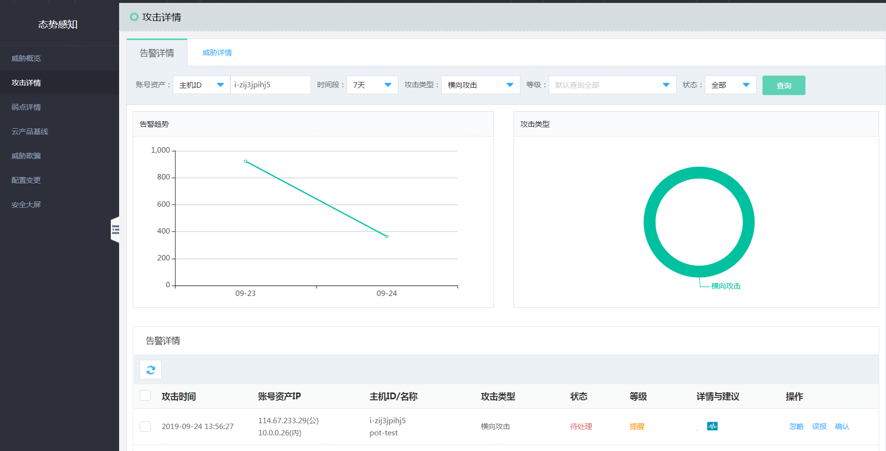

# 威胁欺骗

### 功能模块定义

在黑客入侵必经之路上构建陷阱（蜜罐），精准感知黑客攻击行为，并且溯源入侵者，形成告警，由用户进一步应急响应。

#### 功能说明

本次威胁欺骗提供14项横向攻击分类，如下表：

|  攻击类型   | 攻击端口/协议  | 风险等级  |
|  ----  | ----  | ----  |
| ftp登录尝试	 | 21/tcp  |  严重 | 
| http登陆尝试 | 80/tcp |  严重 | 
| smb登录尝试  | 445/tcp | 严重 | 
| mysql登录尝试  | 3306/tcp，3358/tcp | 严重 | 
| sip访问请求	 | 5060/udp | 严重 | 
| ntp monlist请求  | 123/udp | 严重 | 
| tftp访问请求  | 69/udp | 严重 | 
| mssql登陆尝试 | 1433/tcp | 严重 | 
| vnc登陆尝试  | 5900/tcp | 严重 | 
| mongodb登陆尝试 | 27017/tcp | 严重 | 
| elasticsearch登陆尝试  | 9200/tcp | 严重 | 
| oracle登陆尝试  | 1521/tcp | 严重 | 
| redis登陆尝试  | 6379/tcp | 严重 | 
| 端口扫描 | TCP SYN SCAN/TCP ACK SCAN/TCP FIN SCAN/XMAS SCAN/MAIMON SCAN/NULL SCAN | 严重 | 

#### 操作说明

1、蜜罐部署   

登录【态势感知】-> 【威胁欺骗】，点击需要部署蜜罐的VLAN点击【部署】

2、横向攻击分析   

蜜罐部署覆盖率：通过获取VPC中VLAN等相关数据，计算出蜜罐部署覆盖率，30%~100% 认为达标（绿色），：0%~29% 认为不达标（红色）  
Top10攻击资产：通过蜜罐反馈的攻击数据统计出Top10攻击蜜罐的风险资产。  
Top10攻击类型：通过蜜罐反馈的攻击数据统计出Top10横向攻击类型。  

3、攻击详情查看   

点击【Top10攻击资产】中的一台云主机，进入【攻击详情】，

