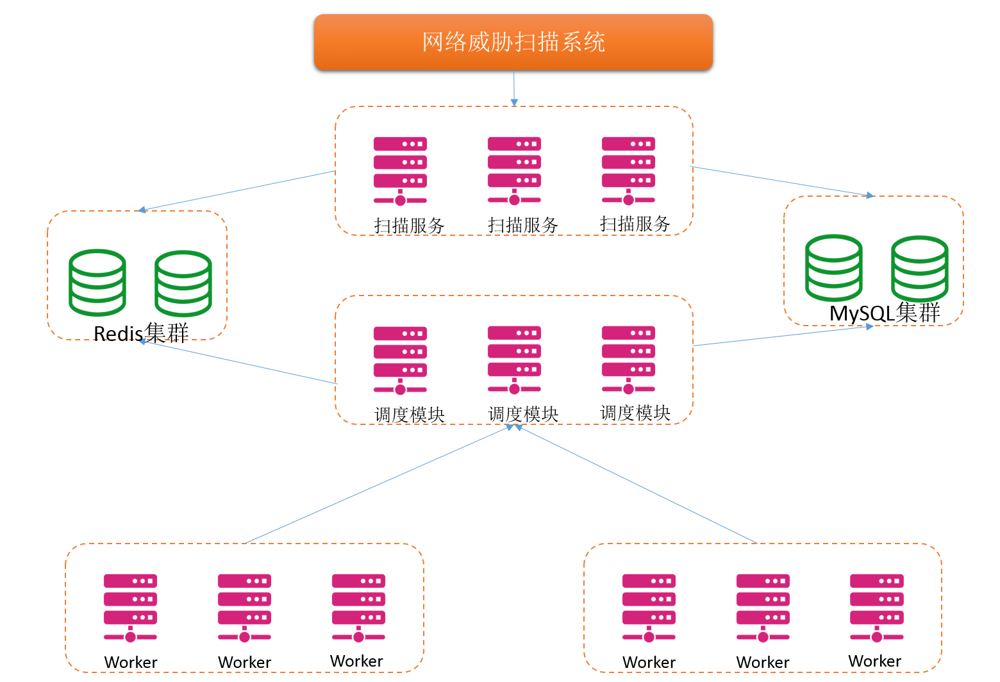
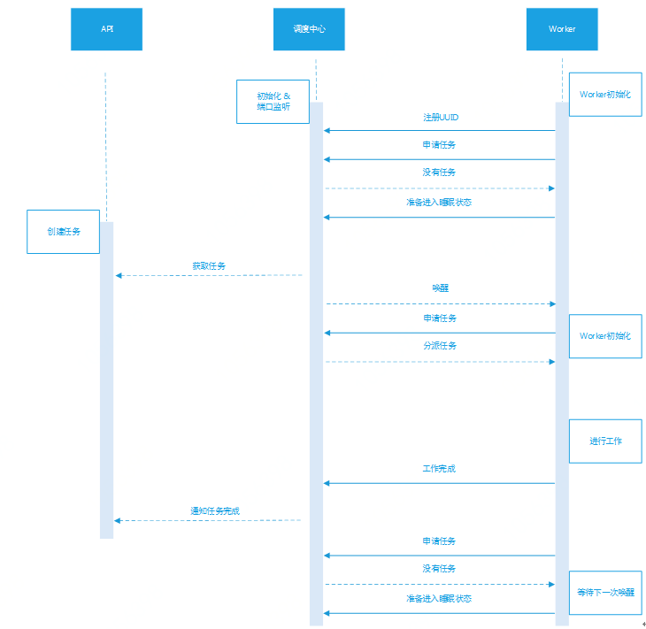

# 产品架构

1.	网站威胁扫描产品采用分布式、松耦合的设计理念，主要分为API、调度、Worker 3大模块，数据存储采用Redis与MySQL。各个组件的功能如下：  
a)	API负责对完服务，所有设置、获取类别的请求都通过API接口进行。  
b)	调度属于扫描的“核心”，负责worker信息的收集、监控，任务的获取、分发等工作。  
c)	Worker主要是“干活”的，执行调度派下来的任务，并将通过API存入数据库。  
d)	Redis主要存储运行中的一些临时信息，比如任务进行中时，需要频繁的读写任务的状态和结果都存在Redis中。任务结束后，会将Redis中的数据内容同步到MySQL中。  
e)	MySQL存储所以的任务以及结果信息。  
f)	POC插件以及worker组件支持热更新升级， 升级文件存放在文件中心中。  
2.	网站威胁扫描产品的Worker部分采用分步骤执行，  
a)	每个步骤可以单独使用并进行扫描，步骤之间松耦合。  
b)	但也支持部分Worker组件依赖前面的Worker组件的结果。例如端口漏洞扫描可以依赖端口扫描与端口指纹的结果，这样会提升扫描的准确性与扫描速度。   
3.	产品采用分布式架构，满足一致性、可用性和分区容错性的特点，可以提供高质量、高稳定的扫描服务
a)	任务分派与执行任务分模块工作，并且会有任务状态监控机制，保证出错的任务会被重新派发  
b)	会有Worker工作资源的监控机制，如果Worker主机状态不可用，调度会将该主机提出可用列表，并不会再向其派发任务。  
c)	采用多区域，双、多活部署，防止某区域的主机出问题时，依然可以正常提供服务  
d)	如果当前没有运行任务，或者运行任务较少时，Worker会进入睡眠状态。减少资源无意义的使用率。当有新的任务派发下来后，会酌情唤醒Worker去工作。  
e)	下面是产品工作时序图，阐述了worker工作的简化流程  

