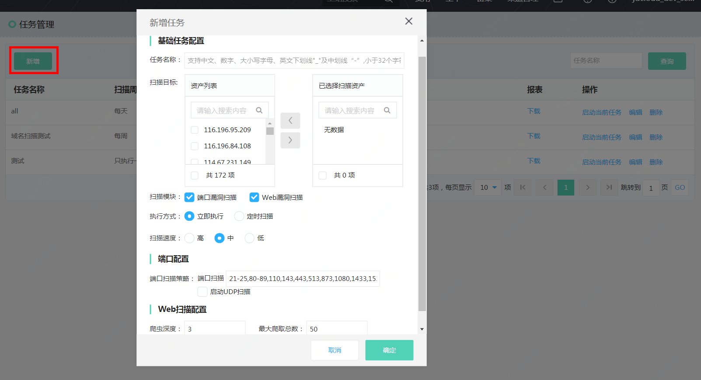
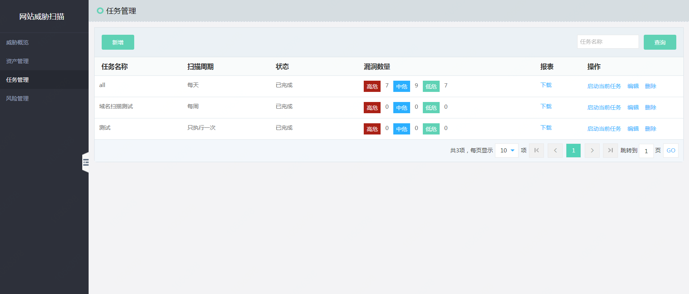
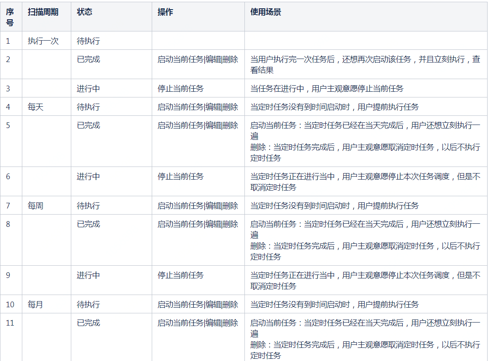

# 任务管理

#### 创建任务

  

扫描目标：通过资产管理导入，支持单IP，域名、子域名  

扫描模块：端口漏洞扫描，Web漏洞扫描。（插件支持范围：请参考下方插件支持列表） 

执行方式：立刻执行、定时执行  

端口配置：端口扫描策略，用户可编辑，默认启动扫描的端口：21-25,80-89,110,143,443,513,873,1080,1433,1521,1158,3306-3308,3389,3690,5900,6379,7001,8000-8090,9000,9418,27017-27019,50060,111,11211,2049  

          是否启动UDP扫描，由于启动本配置会影响扫描速度，请用户谨慎开启。  
         
Web扫描配置：爬虫深度：默认为3，最大可设置为6，由于启动本配置会影响扫描速度，请用户谨慎开启。   

           最大爬取总数：默认为50，最大可设置为100  
            

#### 任务管理

  

  

#### 报表

在任务栏，点击【下载】

  

#### 插件支持列表

| 类别 |	名称 |
| ------ | ------ |
| 端口漏洞扫描 |	MySQL数据库弱口令爆破
| 端口漏洞扫描 | MSSQL数据库弱口令爆破
| 端口漏洞扫描 | PostgrSQL数据库弱口令爆破
| 端口漏洞扫描 | 	MongDB未授权访问检测和弱口令爆破
| 端口漏洞扫描 | Redis未授权访问检测和弱口令爆破
| 端口漏洞扫描 |	Memcached未授权访问检测、弱口令爆破
| 端口漏洞扫描 |	Ftp弱口令爆破
| 端口漏洞扫描 |	SSH弱口令爆破
| 端口漏洞扫描 |	Telnet弱口令爆破
| 端口漏洞扫描 | RDP弱口令爆破
| web漏洞扫描 | Microsoft RDP CVE-2019-0708 远程代码执行漏洞
| web漏洞扫描	 | Web敏感信息扫描 - phpinfo
| web漏洞扫描 |	Elsaticsearch 未授权访问
| web漏洞扫描	 | Apache Tomcat Manager弱口令爆破
| web漏洞扫描	 | phpMyAdmin弱口令爆破
| web漏洞扫描 |	服务端请求伪造（SSRF）检测
| web漏洞扫描 |	XML外部实体注入（XXE）检测
| web漏洞扫描 |	未经验证的开放重定向检测
| web漏洞扫描 |	代码执行检测
| web漏洞扫描 |	跨站脚本攻击（XSS）检测
| web漏洞扫描 |	SQL注入攻击检测
| web漏洞扫描 |	本地文件包含（LFI）检测
| web漏洞扫描 |	Struts2历史高危漏洞检测
| web漏洞扫描 |	心脏出血（HeartBleed）漏洞检测
| web漏洞扫描 |	破壳（ShellShock）漏洞检测
| web漏洞扫描  |	WordPress 远程代码执行漏洞检测（CVE-2016-10033）
| web漏洞扫描	| WordPress拒绝服务攻击漏洞检测(CVE-2018-6389)
| web漏洞扫描	| weblogic 反序列化漏洞（CVE-2015-4852、CVE-2016-0638、CVE-2016-3510、CVE-2017-3248、CVE-2018-2628、CVE-2018-2893）
| web漏洞扫描	| weblogic XMLDecoder 远程代码执行漏洞(CVE-2017-10271)	
| web漏洞扫描	| ThinkPHP5.X 远程代码执行漏洞(CVE-2018-20062)
| web漏洞扫描	| DedeCms低版本识别
| web漏洞扫描	| DedeCms guestbook注入漏洞
| web漏洞扫描	| 公开代理
| web漏洞扫描	| NTP 反射放大
| web漏洞扫描	| Discuz X3.4 Arbitrary File Deletion
| web漏洞扫描	| Discuz X3.1 Convert RCE
| web漏洞扫描	 | ElasticSearch RCE CVE-2014-3120
| web漏洞扫描	 | ElasticSearch Directory Traversal CVE-2015-3337
| web漏洞扫描	 | Memcached反射放大
| web漏洞扫描	| Discuz! DiscuzX跨站脚本漏洞(CVE-2018-10298)
| web漏洞扫描	| Discuz! x3.4 前台SSRF
| web漏洞扫描	| ElasticSearch RCE (CVE-2015-1427)
| web漏洞扫描	| ElasticSearch Directory Traversal(CVE-2015-5531)
| web漏洞扫描	| Apache Solr RCE(CVE-2019-0192)
| web漏洞扫描	| ColdFusion 反序列化（CVE-2017-3066）
| web漏洞扫描	| ColdFusion RMI反序列化（CVE-2018-4939）
| web漏洞扫描	| ColdFusion 文件上传（CVE-2018-15961）
| web漏洞扫描	| Hadoop YARN ResourceManager 未授权（json）
| web漏洞扫描 | Storm UI 未授权（json）
| web漏洞扫描	 | SWFUpload 上传控件 跨站脚本攻击（XSS）漏洞
| web漏洞扫描	| Flash配置不当漏洞
| web漏洞扫描	| ECShop会员中心 user.php XSS漏洞
| web漏洞扫描	| ECShop GBK版本宽字符SQL注入漏洞
| web漏洞扫描	| Ecshop pages.lbi.php XSS漏洞
| web漏洞扫描	| ECShop receive.php XSS漏洞
| web漏洞扫描	| ECShop 支付宝SQL注入漏洞
| web漏洞扫描	| ECShop calendar.php 本地文件包含漏洞
| web漏洞扫描	| ECShop user.php SQL注入和RCE漏洞
| web漏洞扫描	| DedeCMS Dialog目录下配置文件XSS漏洞
| web漏洞扫描	| DedeCMS mysql_error 信息泄露漏洞
| web漏洞扫描	| DedeCMS recommend.php title XSS漏洞
| web漏洞扫描	| DedeCMS wapXSS漏洞
| web漏洞扫描	| DedeCMS carbuyaction.php 本地文件包含漏洞
| web漏洞扫描	| DedeCMS bshareXSS漏洞
| web漏洞扫描	| DedeCMS install/index.php 变量覆盖漏洞
| web漏洞扫描	| Hishop Brand.aspx sortOrderBy SQL注入漏洞
| web漏洞扫描	| Hishop ShoppingHandler.aspx options SQL注入漏洞
| web漏洞扫描	| phpMyAdmin error.php 跨站脚本攻击（XSS）
| web漏洞扫描	| Shopex 安装目录敏感信息
| web漏洞扫描	| Discuz!7x showmessage 跨站脚本攻击（XSS）漏洞
| web漏洞扫描	| 敏感信息泄露 - Apache solr 管理后台
| web漏洞扫描	| 敏感信息泄露 - JetBrains IDE workspace.xml
| web漏洞扫描	| 敏感信息泄露 - 版本控制系统 - SVN
| web漏洞扫描	| 敏感信息泄露 - 版本控制系统 - Git 
| web漏洞扫描	| Wordpress theme template 本地路径信息泄漏漏洞
| web漏洞扫描	 | WordPress Social Warfare Plugin(<=3.5.3) XSS/RCE漏洞（CVE-2019-9978）
| web漏洞扫描	| 敏感信息泄露 - 探针文件
| web漏洞扫描	| 敏感信息泄露 - SSH密钥及凭据
| web漏洞扫描	| MS-15034 IIS HTTP.SYS 远程代码执行（RCE）漏洞
| web漏洞扫描	 | Cormail 关键敏感信息泄露

