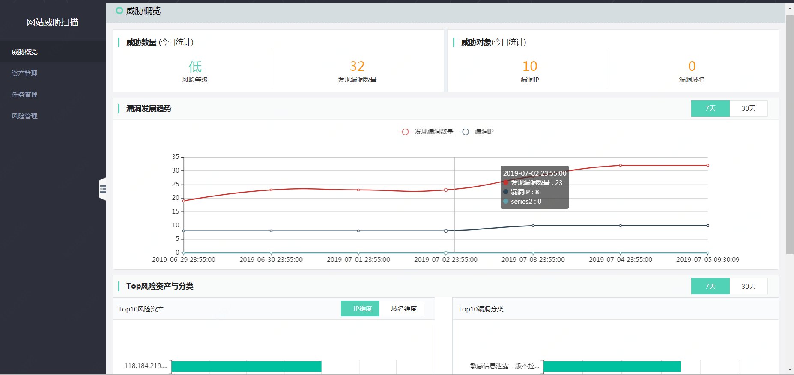

# 威胁概览

### 界面

  

### 风险等级

风险等级：PIN下所有资产风险值，风险等级范围：高、中、低

PIN风险值定义

|危险程度 |	危险值区域 |
| ------ | ------ |
|高 |	5<= 漏洞风险值 <= 10
|中 |   3 <= 漏洞风险值 <= 4
|低 |	 1 <= 漏洞风险值 < 3

单个资产风险值定义：

高危资产定义：存在1个高危漏洞，或者存在5个中危，或者存在10个低危  
中危资产定义：存在0个高危漏洞，或者存在3个中危，或者存在5个低危  
低危资产定义：存在0个高危漏洞，或者存在0个中危，或者存在1个低危  

单个漏洞风险值定义：

| 危险程度 | 危险值区域 | 危险程度说明 |
| ------ | ------ | ------ |
| 高 | 8<= 漏洞风险值 <= 10 | 攻击者可以远程执行任意命令或者代码，或进对系统行远程拒绝服务攻击 |
| 中 | 5 <= 漏洞风险值 <= 7 | 攻击者可以远程创建、修改、删除文件或数据，或对普通服务进行拒绝服务攻击 |
| 低 | 1 <= 漏洞风险值 < 4 | 攻击者可以获取某些系统、服务的信息，或读取系统文件和数据 |

### 漏洞发展趋势

显示每天发现漏洞数量、已处理漏洞数量、漏洞IP、漏洞域名的统计数据，显示范围：7天/30天。

### Top10风险资产

分别从IP维度、域名维度显示Top10风险资产，横坐标：漏洞数量。同时支持高中低危等级。  

#### Top10漏洞分类

从漏洞分类角度显示Top10漏洞名称，横坐标：漏洞数量。

#### 威胁数量&威胁对象

点击【威胁数量】->【发现漏洞数量】，跳转到 【风险管理】-> 【漏洞维度】

  
  
点击【威胁对象】->【漏洞IP】，跳转到 【风险管理】-> 【IP维度】

  

点击【威胁对象】->【漏洞域名】，跳转到 【风险管理】-> 【域名维度】

  
