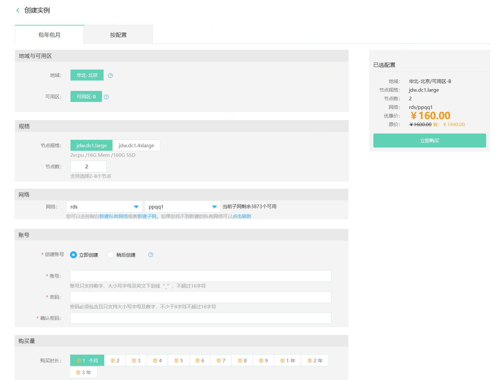

# 创建实例

您可以通过云数据库 Greenplum 控制台快速创建 Greenplum 实例，本文介绍如何通过控制台创建 JDW 实例。

## 前提条件

- 已注册京东云账号，并完成实名认证。如果还没有账号请 [注册](https://accounts.jdcloud.com/p/regPage?source=jdcloud&ReturnUrl=//uc.jdcloud.com/passport/complete?returnUrl=http://uc.jdcloud.com/redirect/loginRouter?returnUrl=https%3A%2F%2Fwww.jdcloud.com%2Fhelp%2Fdetail%2F734%2FisCatalog%2F1)，或 [实名认证](https://uc.jdcloud.com/account/certify)。
- 如计费类型选择按配置计费，请确认您的账户余额（包括代金券）不小于50元。

## 操作步骤

1. 登录 [Greenplum 控制台](https://jdw-console.jdcloud.com/list)。

2. 在实例列表页面，点击**创建**，进入“创建实例”页面。

   

   

3. 在“创建实例”页面，选择计费类型，可选择：**包年包月**或**按配置**。

4. 选择实例配置。

   - 地域

     京东云的机房分布在全球多个位置，这些位置称为地域。云数据库 Greenplum 目前支持华北-北京，后续将支持更多地域。

     说明：

     - 处在同一地域的云服务产品之间通过内网互通，但不同账户的资源内网完全隔离；
     - 处在不同地域的云服务产品之间内网不能互通；
     - 购买云服务时建议选择最靠近您客户的地域，可降低访问时延；

   - 规格

     支持选择节点规格与节点数量，节点为 Greenplum 实例的数据节点，即Segment节点。

     - 节点规格，支持jdw.dc1.large（2vcpu /16G Mem /160G SSD）、jdw.dc1.large（2vcpu /16G Mem /160G SSD）两种规格。
     - 节点数，支持2-8个节点。

   - 网络

     云数据库 Greenplum 支持私有网络部署，如果您当前尚未完成网络规划，请先去创建私有网络与子网。

     Greenplum 实例在选择私有网络后不可更改，请务必保证您的 Greenplum 实例与云主机在同一个私有网络内，以免您的云主机不能连接 Greenplum 实例。

   - 账号

     可选选择是否在创建实例同时创建账号，可立即创建或创建实例完成后再创建账号。

     账号为高权限账号，每个 Greenplum 实例仅支持在控制台创建一个账号，您可以通过该账号创建其他账号。

   - 购买量

     计费类型选择包年包月时，需指定购买时长。云数据库 Greenplum  支持选择1个月至3年。通常购买时长越长，折合单价越便宜，具体优惠信息可在创建实例页面的时长处查看。

5. 点击立即购买，进入“订单确认”页面。

6. 在“订单确认”页面，确认实例信息，并阅读《云数据库 Greenplum 服务条款》。

   - 如计费类型为按配置，请点击 **立即开通** 。
   - 如计费类型为包年包月，请点击 **立即支付** ，进入“订单支付”页面，完成支付流程。

7. 支付流程流程完成后，页面会自动跳转到 “Greenplum 实例列表''页面，等待实例创建完成，您可以在“实例列表”页面查看新创建的 Greenplum 实例。

