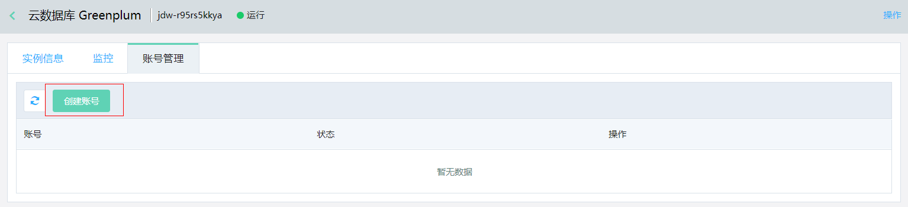
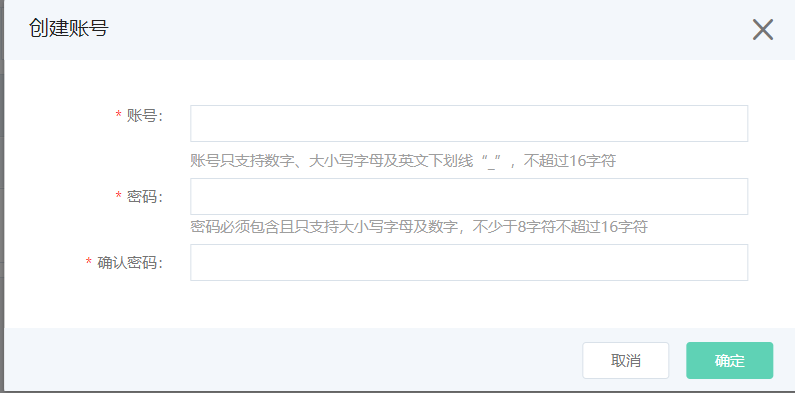

# 创建账号

每个 Greenplum 实例可以通过控制台创建一个高权限账号，可以通过此账号创建其他账号。

## 前提条件

- 实例状态为运行且计费正常的实例，可执行创建账号的操作。

## 操作步骤

1. 登录 [Greenplum 控制台](http://jdw-console.jdcloud.com/list)。

2. 在“实例列表”页面选择目标实例，点击实例名称进入实例详情页。

3. 在实例详情页点击**账号管理**，进入“账号管理”页面。

   

4. 点击创建账号，**打开创建账号弹窗**。

   

5. 填写账号、密码信息，点击**确定**，等待账号创建完成。

6. 账号创建完成后可在“账号管理”页面查看。