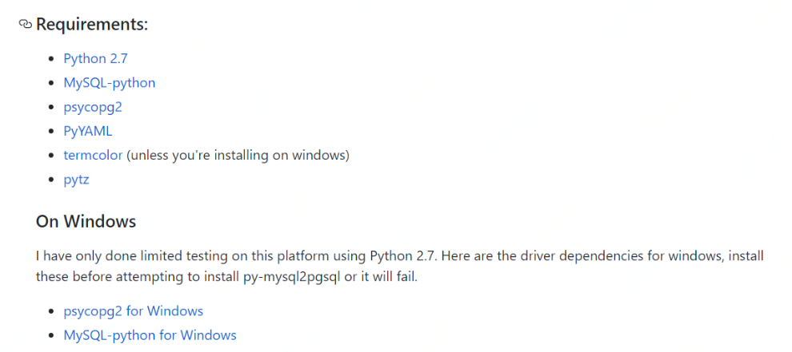

# MySQL数据迁移至Greenplum


py-mysql2pgsql是一个开源的数据迁移工具 ，支持将MySQL中的表迁移到Greenplum。此工具同时连接源端MySQL数据库和目的端数据库，从MySQL库中通过查询得到要导出的数据，然后通过 COPY命令导入到目的端。

## 安装说明

1. pip安装

   ```
   pip install py-mysql2pgsql
   ```

2. 源码编译

   ```
   1. git clone git://github.com/philipsoutham/py-mysql2pgsql.git
   2. cd py-mysql2pgsql
   3. python setup.py install
   ```

   可能发生的错误处理：

   - Error: pg_config executable not found.
     - sudo yum install postgresql-devel
     - whereis pg_config
     - 加入PATH环境变量
   - EnvironmentError: mysql_config not found.
     - yum install python-devel mysql-devel

3. 官方依赖说明

   

## 使用说明

1. 查看帮助

   ```
   py-mysql2pgsql -h
   ```

2. 首次使用：

   执行py-mysql2pgsql命令，获取配置文件模板。

3. 编辑配置文件

   ```
   # a socket connection will be selected if a 'socket' is specified
   # also 'localhost' is a special 'hostname' for MySQL that overrides the 'port' option
   # and forces it to use a local socket connection
   # if tcp is chosen, you can use compression
   
   mysql:
    hostname: localhost
    port: 3306
    socket: /tmp/mysql.sock
    username: mysql2psql
    password:
    database: mysql2psql_test
    compress: false
   destination:
    # if file is given, output goes to file, else postgres
    file:
    postgres:
     hostname: localhost
     port: 5432
     username: mysql2psql
     password:
     database: mysql2psql_test
   
   # if tables is given, only the listed tables will be converted.  leave empty to convert all tables.
   #only_tables:
   #- table1
   #- table2
   # if exclude_tables is given, exclude the listed tables from the conversion.
   #exclude_tables:
   #- table3
   #- table4
   
   # if supress_data is true, only the schema definition will be exported/migrated, and not the data
   supress_data: false
   
   # if supress_ddl is true, only the data will be exported/imported, and not the schema
   supress_ddl: false
   
   # if force_truncate is true, forces a table truncate before table loading
   force_truncate: false
   
   # if timezone is true, forces to append/convert to UTC tzinfo mysql data
   timezone: false
   
   # if index_prefix is given, indexes will be created whith a name prefixed with index_prefix
   index_prefix:
   ```

   **重要参数说明：**

   - file

     将mysql数据导入语句记录到指定文件中，而不做数据导入，记录包括但不仅包括（DDl语句，COPY指令），若期望数据正确导入，确保其为空。

   - only_tables、exclude_tables

     只导入指定表、除了指定表都导入，唯一需要注意的是，table名前的"-"不可省略，否则会造成意料之外的导入。

   - supress_data

     只导入表，不导入数据。

   - supress_ddl

     只导入数据，前提是需要自己创建好表结构。

4. 执行指令

   ```
   py-mysql2pgsql -v -f mysql2pgsql.yml
   ```

   -v：展示操作过程

5. 更多信息请查看 https://github.com/philipsoutham/py-mysql2pgsql
