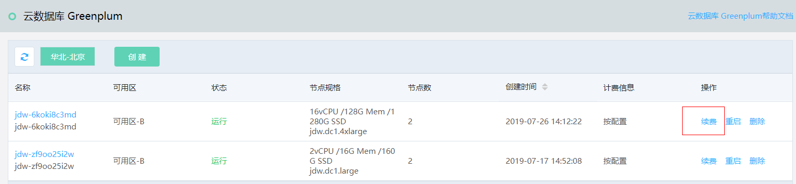
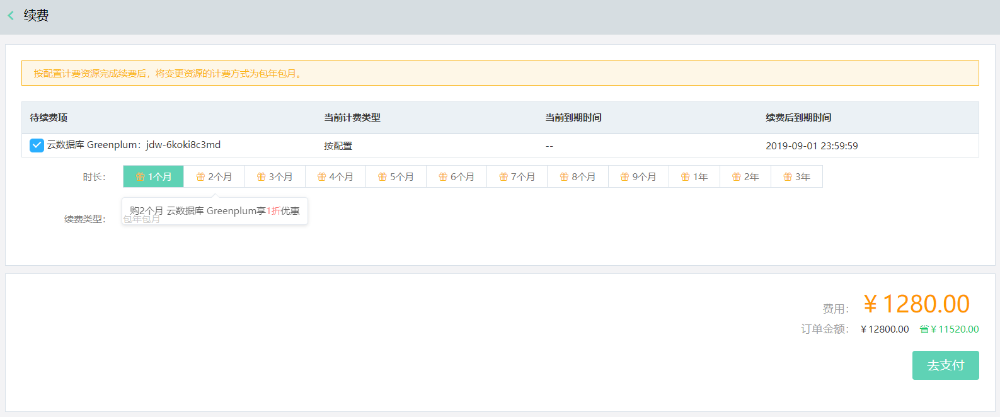

# 续费实例

通过京东云控制台，您可以对当前运行的实例续费，请在实例到期或欠费后7天内续费，否则实例将被删除。

## 注意事项

对计费类型为按配置的实例，续费完成后，实例计费类型将变更为包年包月。

## 操作步骤

1. 登录 [Greenplum 控制台](https://jdw-console.jdcloud.com/list)。

2. 在实例列表页，选择要续费的实例，点击右侧操作项中的**续费**。

   

3. 在“续费”页面，选择您要续费的时长。

   

4. 确认无误，点击 **去支付**，完成支付流程。

5. 续费完成后，您可以在“实例列表”页或“实例详情”页面查看该实例的最新到期时间。