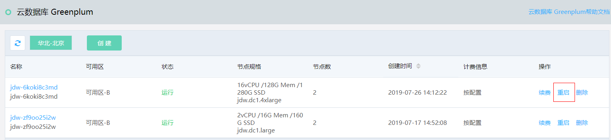

# 重启实例

如果您的 Greenplum 实例运行异常，但不确认原因时，您可以考虑重启实例。

## 注意事项

- 重启实例会造成连接中断，请操作前请您务必确认已做好业务安排。

## 操作步骤

1. 登录 [Greenplum 控制台](https://jdw-console.jdcloud.com/list)。

2. 在实例列表页，选择要重启的实例，点击右侧操作项中的**重启**。

   

3. 在确认弹窗中，点击**确定**。

4. 实例状态变更为“重启中”，等待重启完成。

5. 重启完成后，实例状态将变更为“运行”。

