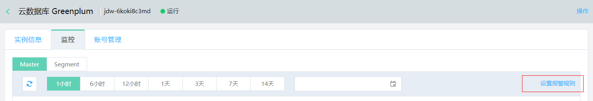
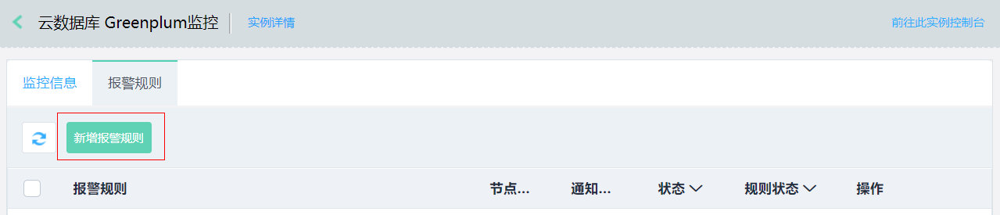

# 设置报警规则

在 Greenplum 控制台，您可以根据监控项设置报警规则，当监控项达到设置的阈值时，我们会通过短信和邮件的方式向您发送报警信息。

## 操作步骤

1. 登录 [Greenplum 控制台](https://jdw-console.jdcloud.com/list)。

2. 在实例列表页，选择目标实例，点击**实例名称**，进入实例详情页。

3. 在实例详情页，点击**监控**，查看监控信息。

4. 点击页面右侧**设置报警规**，进入"报警规则"页面。

   

5. 在“报警规则”页面，点击**新增报警规则**，进入”设置报警规则“页面，按页面提示添加新规则。

   

