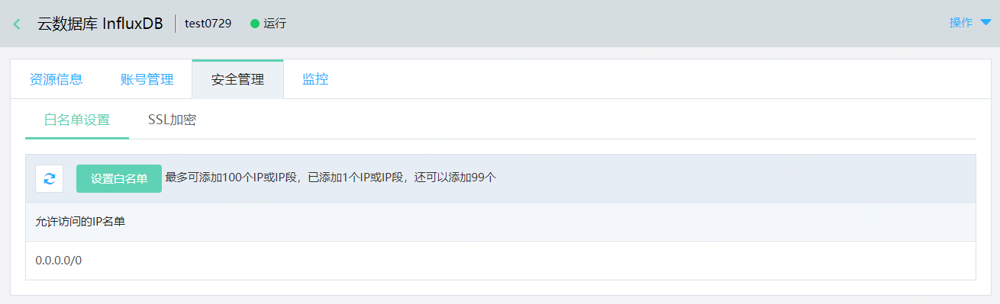
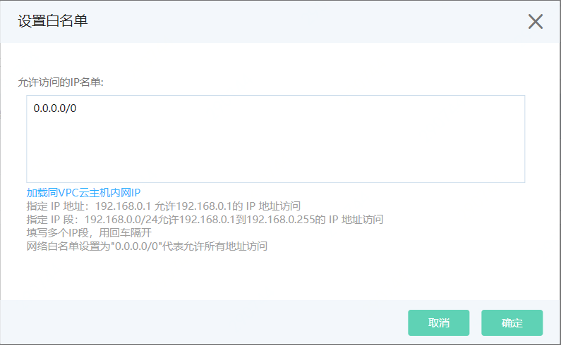
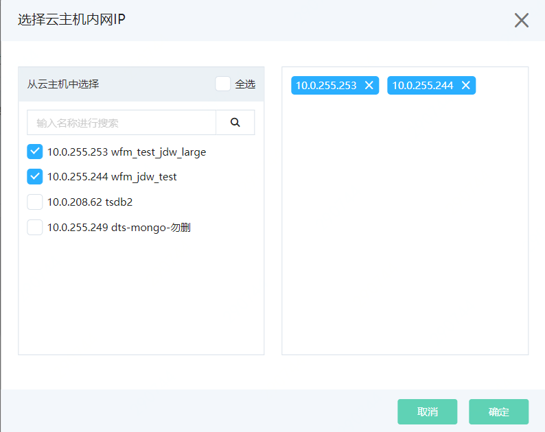

# 设置白名单

云数据库 InfluxDB 支持设置白名单功能，您可以通过白名单精确控制访问源。

InfluxDB 实例创建完成后，默认会将 0.0.0.0/0 加入白名单，即对访问IP无限制。为了数据库的安全，您可以在创建实例后将访问源的IP地址或者IP段加入到白名单。

## 使用限制

- 每个 InfluxDB 实例目前允许最多添加100个IP地址或IP段。

## 前提条件

- InfluxDB 实例状态为运行，且计费状态正常。

## 操作步骤

1. 登录 [InfluxDB控制台](http://tsds-console.jdcloud.com/list)。

2. 在“实例列表”页面，选择目标实例，点击 **实例名称** ，进入实例详情页面。

3. 在“实例详情”页面，点击 **安全管理**，进入白名单设置页面。

   

4. 点击 **设置白名单** ，打开设置弹窗。

   您可以手动填写IP或IP段，也可以直接加载云主机内网IP。

   - 手动填写IP或IP段

     

     - 指定 IP 地址：192.168.0.1 允许192.168.0.1的 IP 地址访问。
     - 指定 IP 段：192.168.0.0/24允许192.168.0.1到192.168.0.255的 IP 地址访问。
     - 填写多个IP段，用回车隔开。
     - 网络白名单设置为"0.0.0.0/0"代表允许所有地址访问。

   - 加载云主机内网IP  

     - 点击弹窗左下角 **加载云主机内网IP**，进入"IP选择弹窗"。
     - 弹窗左侧展示当前与该 InfluxDB 实例处于同一VPC内的云主机IP，您可以借助全选按钮和搜索框实现快速选择。选中的IP会展示在右侧预览区。
     - 完成选择，点击 **确定** 。
     - 选择的云主机内网IP将自动加载到文本框中。

5. 编辑完成，点击 **确定**，完成设置。

6. 白名单设置完成后，在1分钟内生效，您可在白名单设置页面查看当前设置的IP，并可根据业务变化随时调整设置。