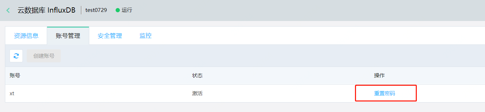
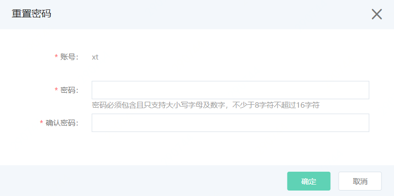

# 重置密码

如果您忘记密码，或者需要重新设置密码，或者创建时未设置密码，您可以通过控制台修改密码。

## 使用说明

InfluxDB 控制台提供的修改密码为修改高权限账号密码。

## 操作步骤

1. 登录 [InfluxDB控制台](http://tsds-console.jdcloud.com/list)。

2. 在“实例列表”页面选择目标实例，点击实例名称进入实例详情页。

3. 在实例详情页点击**账号管理**，进入“账号管理”页面。

4. 在“账号管理”页面点击**重置密码**，打开重置密码弹窗。

   

5. 在“重置密码”弹窗中，填写新密码，点击**确定**，完成密码重置。

   

   

