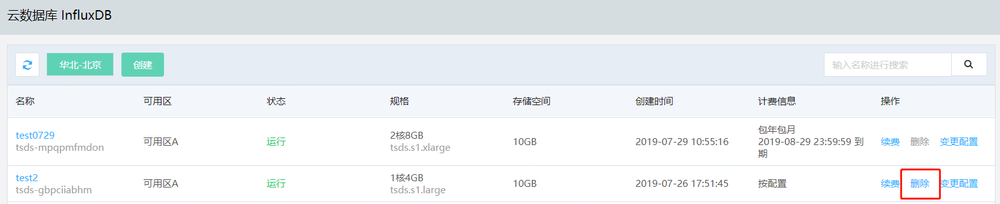

# 删除实例

如您不再需要使用某个 InfluxDB 实例，您可以删除该实例。

## 注意事项

- 计费类型为按配置的实例，您可以随时删除。
- 计费类型为包年包月的实例，暂不支持未到期删除。
- 实例删除后，不可恢复，请谨慎操作。

## 操作步骤

1. 登录 [InfluxDB控制台](http://tsds-console.jdcloud.com/list)。

2. 在“实例列表”页面选择目标实例，点击 **删除** ，打开确认弹窗。

   

3. 在确认弹窗中，点击 **确定**，等待实例删除完成。

4. 实例删除后，"实例列表"中将不再有该实例的信息。
