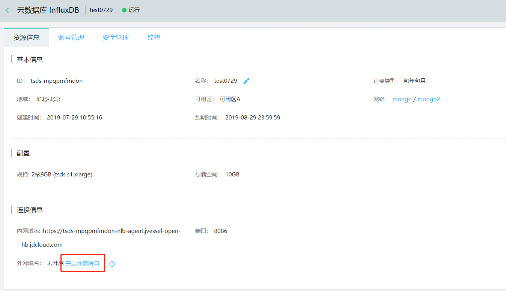

# 外网访问

出于安全性考虑，不建议开启外网访问，InfluxDB 实例默认不开启外网访问。如您的业务确实需要，可手动开启外网访问，为确保连接安全，建议设置白名单并启用SSL加密。

## 注意事项

- 由于外网域名生效需要一定时间，请耐心等待3~5分钟。
- 如果关闭了外网访问，下次再次开启外网访问，访问地址会发生变化。

## 操作步骤

1. 登录 [InfluxDB控制台](http://tsds-console.jdcloud.com/list)。

2. 在“实例列表”页面，选择目标实例，点击 **实例名称** ，进入实例详情页面。

3. 在连接信息模块，点击**开启外网访问**，打开确认弹窗。

   

4. 在确认弹窗中，点击**确定**，开启外网访问。

5. 创建的外网域名将展示在连接信息模块，如不在需要，可点击**关闭外网域名**。

   