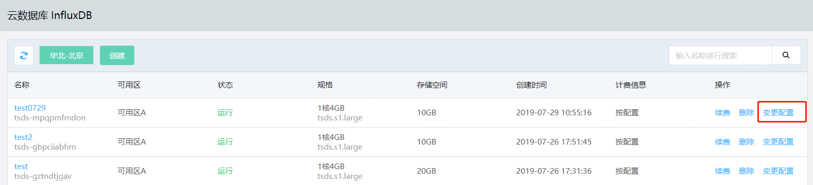
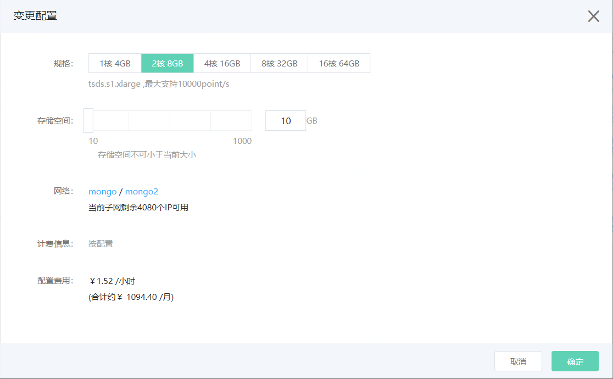

# 变更配置

如果当前 InfluxDB 实例规格配置与您的业务应用要求不匹配，你可以变更实例配置以满足业务要求。 

InfluxDB 实例支持变更的配置项，包括：

- 规格，即实例被分配的CPU核数和内存容量。
- 存储空间，即实例被分配的磁盘容量。

## 注意事项

- 实例规格支持升配或降配。
- 存储空间只支持升配，不支持降配。

## 前提条件

- 实例状态为运行且计费正常的实例，可执行变更配置操作。

## 操作步骤

1. 登录 [InfluxDB控制台](http://tsds-console.jdcloud.com/list)。

2. 在“实例列表”页面选择目标实例，点击 **变更配置** ，打开“变更配置”弹窗。

   

3. 在弹窗中，选择需要调整的新配置。

   

   - 规格：
     - 实例占用的CPU和内存，支持升级与降级。
     - 存储空间：实例占用的磁盘空间，仅支持升级，不支持降级。
   - 网络：当前实例所处的私有网络与子网，不可修改。
   - 计费类型：当前实例的计费类型，不可修改。
   - 到期时间：包年包月实例的到期时间。
   - 配置费用：
     - 计费类型为按配置实例，费用为新配置实例的每小时费用。
     - 计费类型为包年包月实例，费用为实例有效期内新旧配置的差价。

4. 选择配置完成后，点击 **确定**，进入"订单确认"页面。

5. 在"订单确认"页面，确认实例信息，并阅读《云数据库 InfluxDB 服务条款》。

   - 如计费类型为按配置，请点击 **立即开通**。
   - 如计费类型为包年包月，请点击 **立即支付**，进入"订单支付"页，完成支付流程。

6. 支付流程完成后，页面会自动跳转到 InfluxDB “实例列表”页面，等待实例变更配置完成，您可以在“实例详情”页面查看变更的配置信息。