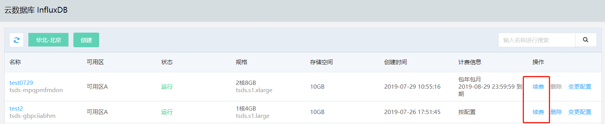
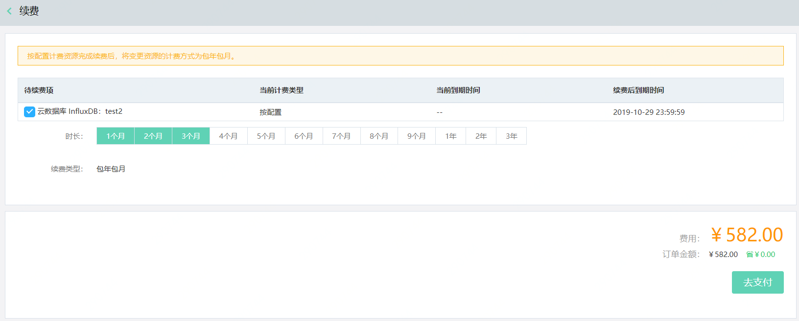

# 续费实例

通过京东云控制台，您可以对当前运行的实例续费，请在实例到期或欠费后7天内续费，否则实例将被删除。

## 注意事项

- 对计费类型为按配置的实例，续费完成后，实例计费类型将变更为包年包月。

## 操作步骤

1. 登录 [InfluxDB控制台](http://tsds-console.jdcloud.com/list)。

2. 在“实例列表”页面选择目标实例，点击**续费** ，打开“续费”页面。  

   

3. 在“续费”页面选择续费市场，点击**去支持**，完成支付流程。

   

4. 续费完成后，您可以在“实例列表”页或“实例详情”页面查看该实例的最新到期时间。