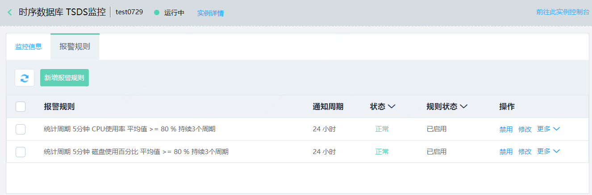
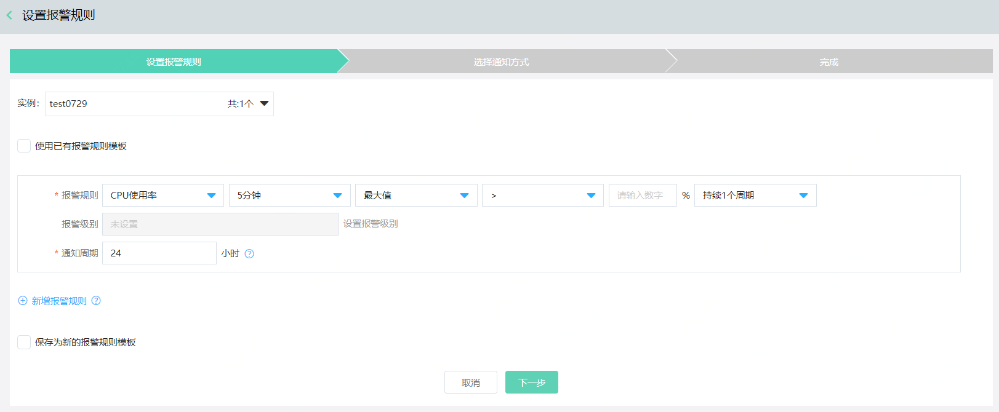

# 设置报警规则

在 InfluxDB 控制台，您可以根据监控项设置报警规则，当监控项达到设置的阈值时，我们会通过短信和邮件的方式向您发送报警信息。

## 注意事项

云数据库 InfluxDB 实例创建成功后，会自动设置2条报警规则，您可以根据实际情况修改。

| 监控项     | 统计周期 | 规则         | 监控周期 | 通知周期 |
| :--------- | :------- | :----------- | :------- | :------- |
| CPU使用率  | 5分钟    | 平均值 ≥ 80% | 3个      | 24小时   |
| 磁盘使用率 | 5分钟    | 平均值 ≥ 80% | 3个      | 24小时   |

## 操作步骤

1. 登录 [InfluxDB 控制台](http://tsds-console.jdcloud.com/list)。

2. 在"实例列表"页面，选择目标实例，点击 **实例名称**，进入"实例详情"页面。

3. 在"实例详情"页面，点击 **监控**，进入"监控信息"页面。

4. 点击页面右侧 **设置报警规**，进入"报警规则"页面。

   

5. 点击新增报警规则，定义监控项与报警方式。

   