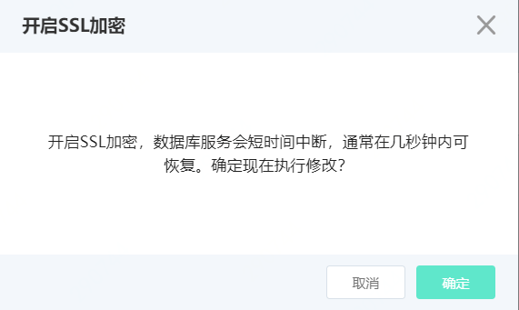
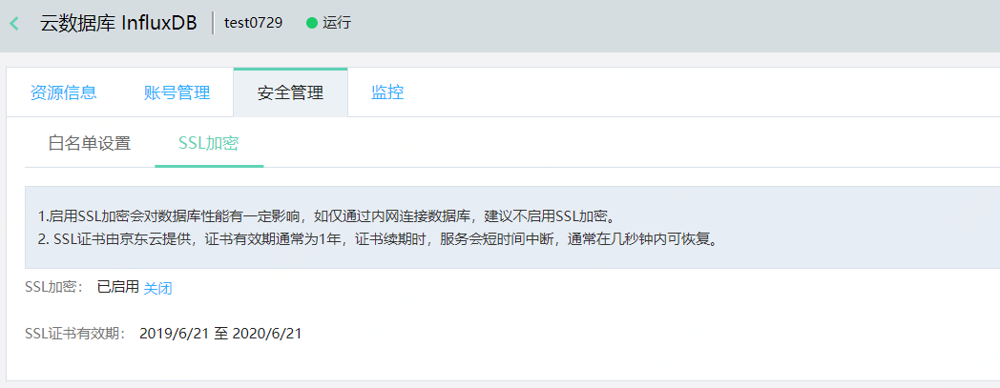
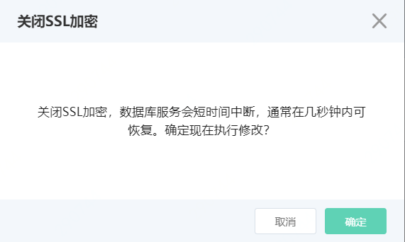
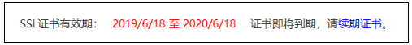

# 设置SSL加密

InfluxDB 实例默认不启用SSL加密，如果您的业务对数据传输有较高的要求，可以手动启用SSL加密。

## 注意事项

- 启用SSL加密会对数据库性能有一定影响，如仅通过内网连接数据库，建议不启用SSL加密。
- SSL证书由京东云提供，证书有效期通常为1年，证书续期时，服务会短时间中断，通常在几秒钟内可恢复。
- 业务已正常启用是，请勿修改SSL启用状态。

## 操作步骤

1. 登录 [InfluxDB控制台](http://tsds-console.jdcloud.com/list)。

2. 在“实例列表”页面，选择目标实例，点击 **实例名称** ，进入实例详情页面。

3. 在“实例详情”页面，依次点击 **安全管理**、**SSL加密**，进入“SSL设置”页面。

4. “SSL设置”页面，可开启、关闭SSL加密，以及需求证书。

   - 开启SSL加密

     点击**开启**，打开开启SSL加密确认弹窗。

     

     在确认弹窗，点击**确定**，开启SSL加密。

     

   - 关闭SSL加密

     点击**关闭**，打开关闭SSL加密确认弹窗。

     

     在确认弹窗，点击**确定**，关闭SSL加密。

     

   - 续期SSL证书

     SSL证书由京东云提供，通常有效期为1年，在到期前您需要手动执行证书需求。

     续期过程服务会中断，请避开业务繁忙的时间段。

     

     证书有效期到期前1个月，您可以点击续期证书按钮，执行证书续期操作。

