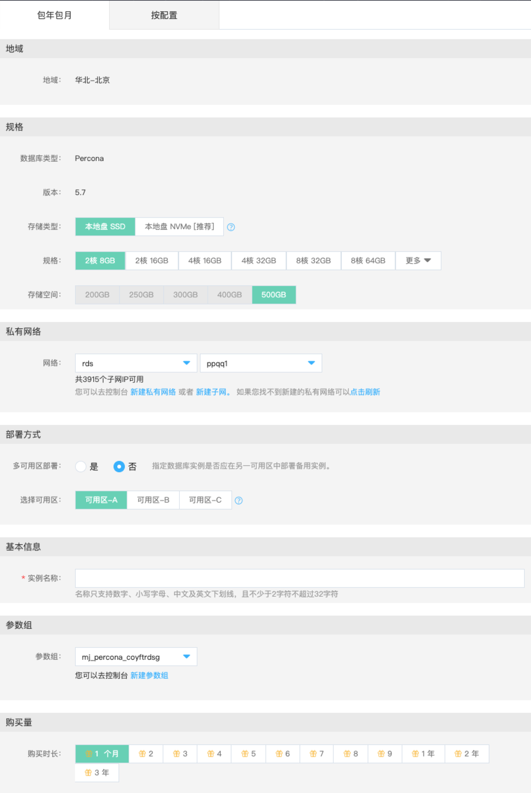

# Percona 根据备份创建
云数据库 Percona 实例可以根据实例的备份，在同一个地域创建一个新实例。

## 注意事项 
* 新实例的规格不能小于备份所在源实例的规格

## 操作步骤
1. 登录 [云数据库 RDS 控制台](https://rds-console.jdcloud.com/database) 。
2. 选择需要进行根据备份新建实例的目标实例，点击目标实例的名称，进入到实例详情页。
3. 点击 ***备份管理*** 标签，选择目标备份文件，点击操作列 ***根据备份创建*** 按钮点击，进入创建页面：
4. 实例配置的参数说明如下：

* 地域：不可以修改，默认就是备份源实例所在的地域。
* 数据库类型：新建实例的数据库类型，这里类型不能修改，默认采用目标实例的数据库类型。
* 版本：新建实例的数据库版本，这里版本不能修改，默认采用目标实例的数据库版本。
* 存储类型：不同的存储类对应的实例规格的最大IOPS不同, 请参考 [Percona 产品规格](../../../Introduction/Specifications/Percona-Specifications.md)。
* 规格：实例的CPU和内存，不同的规格对应不同的最大连接数和最大IOPS；关于规格的详细说明，请参考 [Percona 产品规格](../../../Introduction/Specifications/Percona-Specifications.md)。
* 存储空间：该存储空间包括数据空间、系统文件空间以及日志文件空间。
* 私有网络：只支持在私有网络中创建。如果用户没有私有网络及子网，可以通过【新建私有网络】和【新建子网】的链接创建私有网络和子网。创建完成后，点击【刷新】，就可以看到新创建的私有网络和子网了。
   * 在选择私有网络的时候，请确保需要连接数据库实例的云主机和数据库实例在同一个私有网络内。
   * 由于管理的需要，选择的子网保留若干剩余IP才允许创建实例。
      - MySQL, Percona, MariaDB：需要4个以上的剩余IP
* 部署方式：目前支持单可用区部署，多可用区部署两种部署方式。
   * 多可用区部署：数据库主从分别位于不同的可用区，可用性更高：一个可用区发生故障，整个实例仍然可提供服务。
   * 单可用区部署：主从位于同一可用区，如果该可用区发生故障，整个实例无法对外提供服务。
* 基本信息
   * 实例名称：允许重复，名称的长度和字符有一定限制，具体以控制台为准。
* 参数组：只能选择和数据库类型一直的参数组，如果当前账户下没有参数组，则系统会默认自动创建一个默认参数组。 
* 购买时长：如计费方式选择包年包月则需选择购买时长，可选择1个月至3年；购买的时长越长，折扣力度越大，具体以控制台为准。

5. 点击 ***立即购买*** 进入订单确认页。
6. 阅读完云数据库 RDS 服务条款，按照提示完成后续操作
    * 包年包月实例：点击立即支付，进入到支付确认页，可以选择多种支付方式，如可以使用代金券，余额，银行卡等等。
    * 按配置实例：点击立即开通，开始创建实例，进入到实例列表页。
