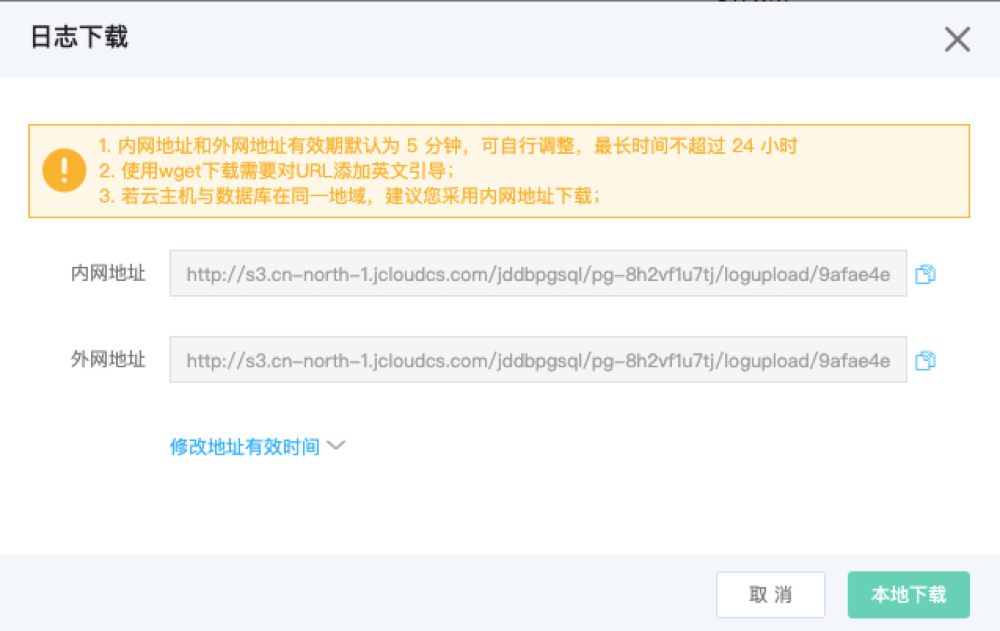

# PostgreSQL 日志管理
京东云云数据库 PostgreSQL 提供了详细的实例日志，您可以根据日志信息进行应用程序的排错、优化。

## 注意事项
* 默认情况下日志文件只会记录错误日志，慢查询日志，如果要开启 SQL 审计，可以通过修改参数组参数实现。
* SQL 查询记录为慢查询由参数组参数 ***log_min_duration_statement*** 控制，目前默认是 1 s。
* SQL 审计默认是关闭的，如果需要打开可以通过修改参数组参数 ***pgaudit.log*** 值实现。

## 日志下载
### 注意事项
* 内网地址，外网地址是有有效期的，如果超过了有效期地址会失效，需要点击下载按钮，才能生成下载弹出框，才能获取新地址。
* 内网地址，外网地址是有有效期支持自定义，最短有效期可以精确到秒，最长有效期可以精确到小时。

### 操作步骤
1. 登录 [云数据库 RDS 管理控制台](https://rds-console.jdcloud.com/database) 。
2. 选择需要进行日志下载的目标实例，点击目标实例的名称，进入到实例详情页。
3. 选择 ***日志管理*** 标签，选择你要下载的备份数据，点击 ***操作*** 这一列的 ***下载***。
4. 日志下载弹出框参数说明
    * 内网地址：提供内网访问的域名，比如可以通过和数据库实例在同一个 VPC 或者子网内的云主机访问这个地址，从而来下载日志文件。
    * 外网地址：提供公网访问的域名，可以通过互联网下载备份数据，下载速度受限于公网的网络带宽，所以如果你的公网网络带宽太小，并且日志文件太大的话，下载时间会比较长。
    * 地址有效时间：支持修改内网、外网地址的有效期，修改了有效时间，并点击 ***连接刷新*** 按钮，会重新生成新的内网、外网地址，并且新地址有效时间为你指定的值。
    * 点击 **本地下载** 按钮，直接通过浏览器的方式，下载日志文件。
    * 点击 **取消**按钮，放弃日志文件的下载。

