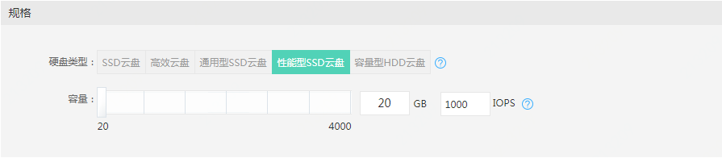
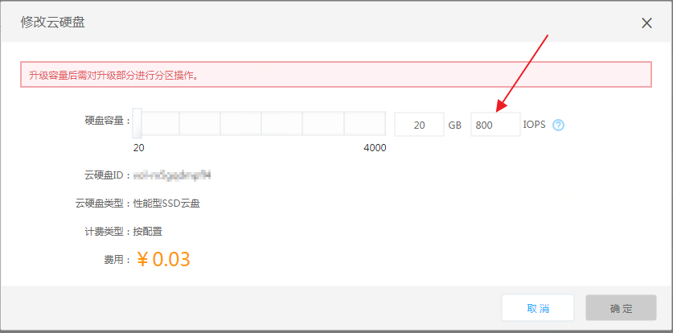

# 性能型SSD云盘配置IOPS

京东云提供了可配置性能型SSD云盘IOPS的功能。您在购买性能型SSD云盘时和针对已购买的性能型SSD云盘，均可以配置该云盘的IOPS。

配置后即时生效。按配置购买的性能型SSD云盘，将从变更的下一小时起根据新的IOPS配置对应价格计费；包年包月的云盘，将根据更新后的价格更新该云盘的资源到期时间。

具体操作如下：

## 新购性能型SSD云盘并配置IOPS

1. 登录京东云控制台，点击左侧菜单的”弹性计算“-”云硬盘“菜单，进入云硬盘列表页面。点击”创建“按钮，进入云硬盘创建页面。

2. 在购买页面中选择所需购买的”地域“和”可用区“，并在“规格”一栏选择“性能型SSD云盘”，此时可配置所需云盘的容量和IOPS。

   IOPS可配置的范围最低为200，最高不超过所创建云硬盘大小(GiB)的50倍且不超过32000。例如：当所创云盘容量为20GB时，IOPS最低为200，最高为20乘50=1000，所以此时IOPS最高可配置为1000；当所创云盘容量为700GB时，700乘50=35000，高于32000，所以此时IOPS最高可配置为32000。

3. 完成云盘规格的配置后，依次按需选择是否加密以及云盘的基本信息，点击“立即购买”即可完成预配置IOPS的性能型SSD盘创建。

4. 包年包月购买和按配置购买的操作一致。

## 修改已购性能型SSD云盘的IOPS

您可以对您已购的性能型SSD云盘配置其IOPS，操作如下：

1. 登录京东云控制台，点击左侧菜单的”弹性计算“-”云硬盘“菜单，进入云硬盘列表页面。在所需修改IOPS的云硬盘操作列“更多”中点击“修改云硬盘”按钮。

2. 在弹出的修改云硬盘修改框中，可在“IOPS”前的输入框中输入目标IOPS值。可修改的IOPS范围同样为200至32000且不超过该云硬盘容量的50倍。

  
  
3. 修改IOPS后，按配置计费的云盘会实时更新该云盘在此IOPS配置下的最新单价，包年包月云盘会实时计算IOPS变更后的“变配后到期时间”。如您提升了原盘的IOPS，会计算出您需要支付的配置提升所需金额；如您降低了IOPS配置，则会相应延长该云硬盘的到期时间。完成配置后，点击“确定”并完成支付流程（如需支付），即完成了该云盘的IOPS配置调整。

