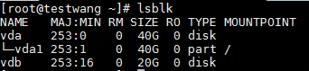
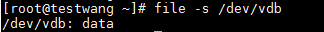
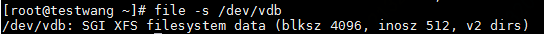
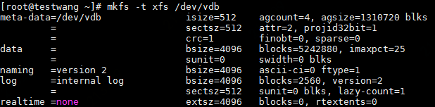
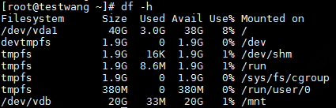

# Linux分区、格式化和创建文件系统

以Centos操作系统为例，数据盘分区、格式化及创建文件系统的操作如下：

1. 在控制台完成挂载后，您在云主机中就可以看到一块未经分区、格式化的磁盘，您可以通过如下命令来查看磁盘分区信息：

   `lsblk`

   如下图所示，未经分区、格式化的磁盘设备是/dev/vdb，**lsblk** 的输出从完整的设备路径中去掉了 `/dev/` 前缀。如果设备/dev/vdb已有分区，将会如/dev/vda一样列出其分区：/dev/vda1。

2. 新创建的云盘需要在其上创建文件系统后才能够挂载并使用它们。在此之前可以通过输入以下命令来确认设备是否包含文件系统，以设备/dev/vdb为例：

   `file -s /dev/vdb`

   当该设备无文件系统时如下图所示：

   

   如果该设备已有文件系统，系统输出入下图所示（设备/dev/vdb包含XFS格式的文件系统）：

   

   **注意：**如果您的云盘是通过快照创建的，此云盘可能已包含文件系统和数据，此时无需重新创建文件系统即可挂载，重新创建文件系统将覆盖原盘数据。如果确认无需创建文件系统，请跳过此步，直接执行第X步进行挂载。

3. 如果确认需要在此设备上创建新的文件系统，请输入mkfs -t 命令，以在/dev/vdb设备上创建XFS格式的文件系统为例：

   `mkfs -t xfs /dev/vdb`

   操作成功后入下图所示：

   

4. 使用mount命令将该设备挂载到指定目录，以将/dev/vdb挂载到/mnt目录为例：

   `sudo mount /dev/vdb /mnt`

   执行成功后，系统无提示信息。可以通过输入 `df -h` 命令检查挂载情况。如下图所示，设备/dev/vdb已挂载成功。

   

   如果希望将设备挂载在其他目录，也可以先通过输入mkdir 命令创建挂载目录，以目录名为/mypoint为例：

   `sudo mkdir /mypoint`

   然后以/mypoint 替换mount命令中的/mnt，`sudo mount /dev/vdb /mypoint`即可。

   
