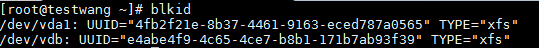
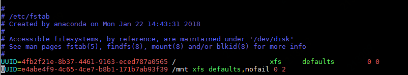

# Linux分区、格式化和创建文件系统

以Centos操作系统为例，数据盘分区、格式化及创建文件系统的操作如下：

1. 在控制台完成挂载后，您在云主机中就可以看到一块未经分区、格式化的磁盘，您可以通过如下命令来查看磁盘分区信息：

   `lsblk`

   如下图所示，未经分区、格式化的磁盘设备是/dev/vdb，**lsblk** 的输出从完整的设备路径中去掉了 `/dev/` 前缀。如果设备/dev/vdb已有分区，将会如/dev/vda一样列出其分区：/dev/vda1。
   
   

2. 新创建的云盘需要在其上创建文件系统后才能够挂载并使用它们。在此之前可以通过输入以下命令来确认设备是否包含文件系统，以设备/dev/vdb为例：

   `file -s /dev/vdb`

   当该设备无文件系统时如下图所示：

   

   如果该设备已有文件系统，系统输出入下图所示（设备/dev/vdb包含XFS格式的文件系统）：

   

   **注意：**如果您的云盘是通过快照创建的，此云盘可能已包含文件系统和数据，此时无需重新创建文件系统即可挂载，重新创建文件系统将覆盖原盘数据。如果确认无需创建文件系统，请跳过此步，直接执行第X步进行挂载。

3. 如果确认需要在此设备上创建新的文件系统，请输入mkfs -t 命令，以在/dev/vdb设备上创建XFS格式的文件系统为例：

   `mkfs -t xfs /dev/vdb`

   操作成功后入下图所示：

   

4. 使用mount命令将该设备挂载到指定目录，以将/dev/vdb挂载到/mnt目录为例：

   `sudo mount /dev/vdb /mnt`

   执行成功后，系统无提示信息。可以通过输入 `df -h` 命令检查挂载情况。如下图所示，设备/dev/vdb已挂载成功。

   

   如果希望将设备挂载在其他目录，也可以先通过输入mkdir 命令创建挂载目录，以目录名为/mypoint为例：

   `sudo mkdir /mypoint`

   然后以/mypoint 替换mount命令中的/mnt，`sudo mount /dev/vdb /mypoint`即可。

   
## 重启后自动挂载

云主机在每次重启时都需要重新挂载云硬盘，未避免每次云主机重启时都手动挂载与硬盘，可以通过在/etc/fstab文件中为设备添加条目来实现云主机重启后对云硬盘的自动挂载。

1. （可选）备份/etc/fstab文件，以便对此文件误操作后恢复。

   `sudo cp /etc/fstab /etc/fstab.bak`

2. 输入`blkid`命令查找此设备的UUID。

   

3. 使用vim或其他文本编辑器打开/etc/fstab文件，以下以使用vim为例：

   `vim /etc/fstab`

4. 在fstab中添加一行新的条目，分别加入希望重启后自动挂载的设备的UUID，当前挂载目录，文件系统和挂载选项。

   `UUID=e4abe4f9-4c65-4ce7-b8b1-171b7ab93f39 /mnt xfs defaults,nofail 0 2`

   

   **注意：**

   建议如上述示例一样，在挂载选项中加入 **nofail**，即允许该实例在挂载此设备过程中即时出现错误也可正常启动。否则可能会造成此实例重启或通过此实例创建的镜像再创建主机时，在此UUID的设备不存在（比如卸载了此云硬盘）的情况下，实例无法正常启动。

5. （可选）如果要检查fstab文件编辑的有效性，可以通过`umount /mnt`命令卸载已挂载的设备，然后输入：

   `mount -a`

   此命令将按照fstab文件中的挂载信息自动进行设备挂载，如果系统没有产生错误信息则fstab文件编辑成功。

