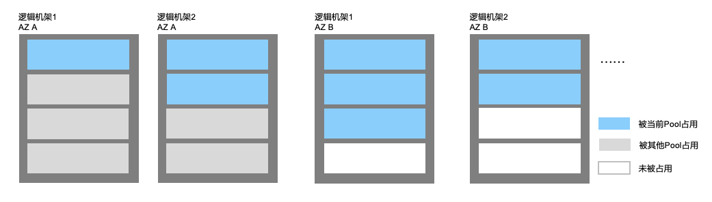

# 资源调度规则

专有资源池及专有宿主机涉及到两类资源调度，分别是：

1. 指定专有资源池创建专有宿主机时，专有宿主机如何调度；
2. 指定专有资源池或专有宿主机创建云主机时，云主机如何调度。

## 专有宿主机调度规则

当指定专有资源池创建专有宿主机时，会根据专有资源池配置的可用区信息及逻辑机架信息决定调度。系统将尽量保证在所选专有资源池内均衡调度，但当遇到物理资源不足情况则在其他资源充足的可用区或者逻辑机架上调度专有资源池。

如下图示，设专有资源池配置了可用区A及可用区B，若需要新建一台专有宿主机，系统将选择可用区B的逻辑机架2上分配。

## 云主机调度规则

当指定专有资源池创建云主机时，将随机选择专有宿主机调度。

当指定专有宿主机创建云主机时，则在该专有宿主机上调度。

