# ISO格式镜像转换
iso是光盘镜像格式，无法直接使用创建虚拟机，下文将介绍如何在Linux系统下使用virt-manager以及Windows系统下使用VMware Workstation，使用iso镜像创建虚拟机并导出为虚拟机镜像。

## Linux环境下使用virt-manager制作镜像

### 1、安装并运行virt-manager
准备一台支持虚拟化技术的Linux系统主机（物理机或虚拟机均可），执行下述指令进行安装。
```
sudo yum install virt-manager qemu-* libvirt
```
启动libvirt 服务。
```
systemctl start libvirtd
```
运行virt-manager。
```
virt-manager
```
如果您在本地windows系统下通过Xshell等客户端登录linux服务器后发现无法显示virt-manager界面，可尝试通过配置服务器sshd允许X11转发，同时在本地windows下安装Xming来启动X server的方式尝试解决，在此不做详细介绍。

### 2、配置 virt-manager 软件，设置虚机的虚拟硬件配置
在virt-manager 界面，点击左上角红框中图标打开创建虚机的界面，选择使用iso镜像安装操作系统，随后选择iso镜像文件（以CentOS 7为例）。

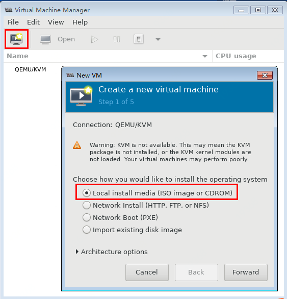<br>
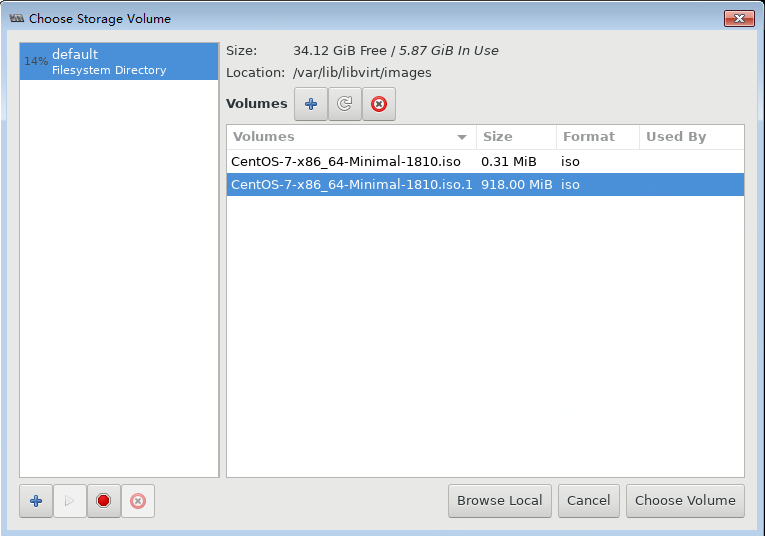<br>

设置虚拟 CPU 及 内存的容量，选择磁盘容量，可以设置的容量上限取决于创建虚拟机所有服务器的当前配置。配置完成后等待操作系统安装完成。

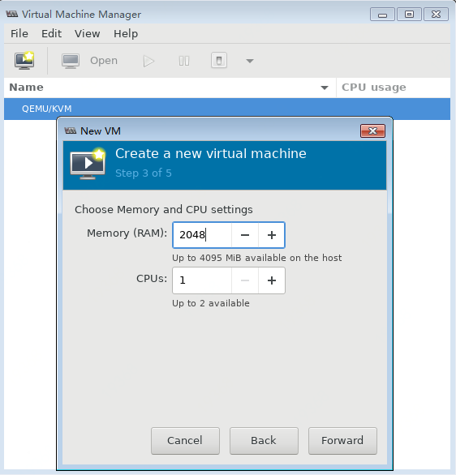<br>
<br>
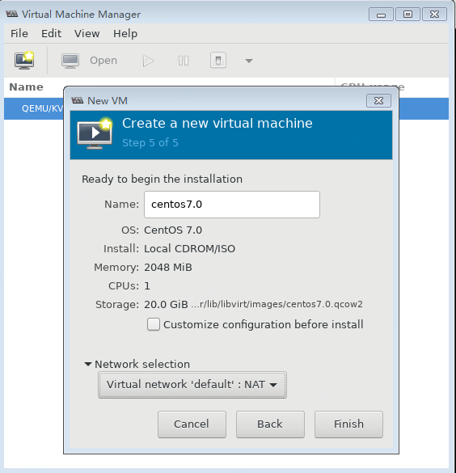<br>
选择语音后开始设置分区表，这是比较重要的一步，按照京东云的要求，使用一个根目录区域即可。如下所示，点击图中圈出的有黄色标识的选项，并在随后的界面中选择“I will configure partitioning”。
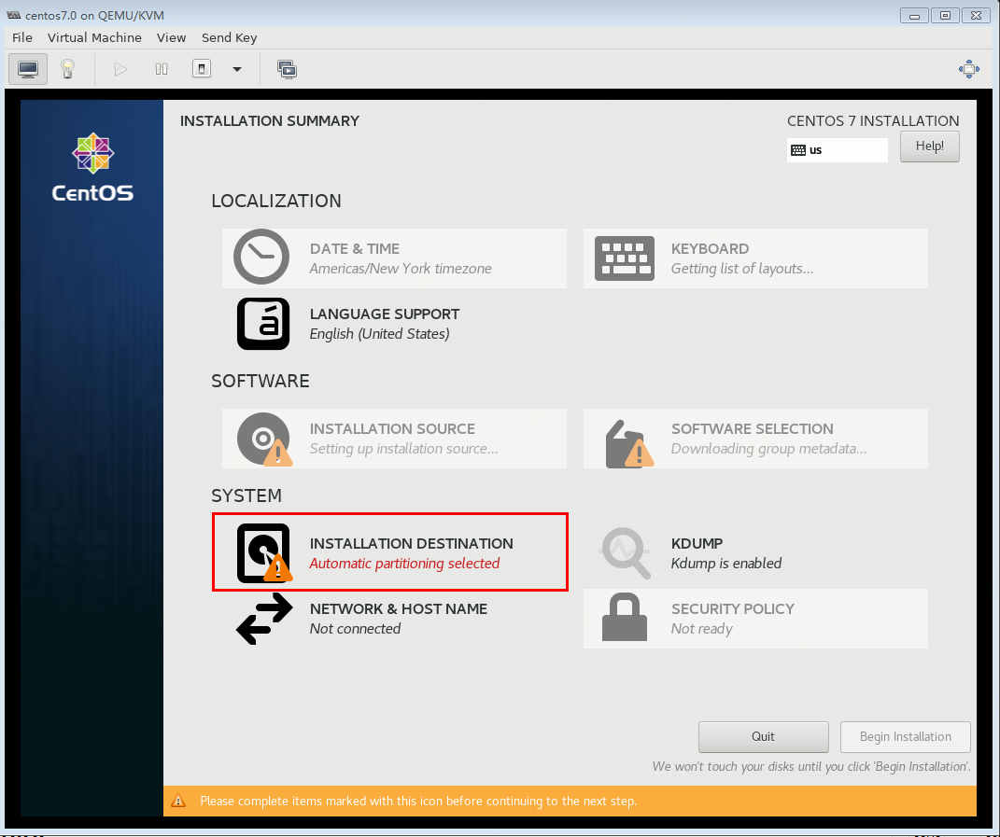<br>
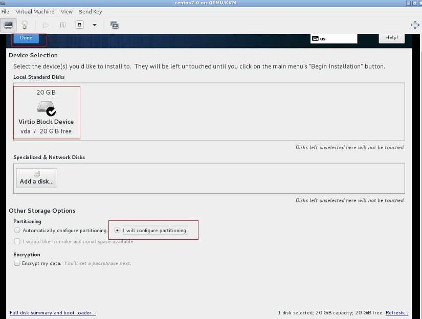<br>
需要特别注意的是，由于默认选中了使用“LVM”模式，必须改为使用传统的分区方式。请点击添加按钮，添加新的挂载点，选择标准分区，选择符合京东云要求的文件系统类型（CentOS 7 的默认文件系统是 xfs；Ubuntu 的默认文件系统是 ext4；Windows 的默认文件系统是 NTFS）。另外根据京东云的镜像要求，只需要一个系统盘的分区，无论 Windows 还是 Linux在设置分区的时候都只设置一个根分区即可。

如果制作Ubuntu 系统镜像，虽然安装界面不同，但都有一步设置磁盘分区的步骤，类似的我们只需要设置一个主分区即可。 Windows 系统稍有不同，安装 Windows 后，会产生一个隐藏分区（如下图所示）。所以 Windows 系统中应该有两个分区，除隐藏分区外另一个就是默认的系统分区，我们称作 C 盘。
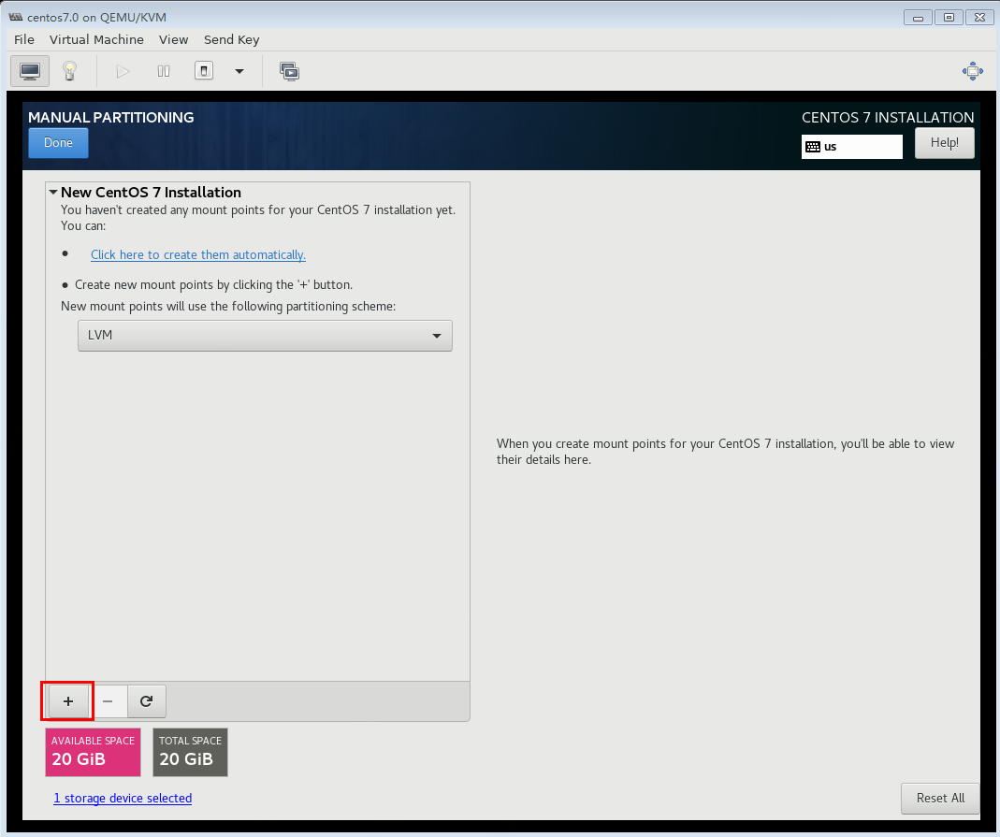<br>
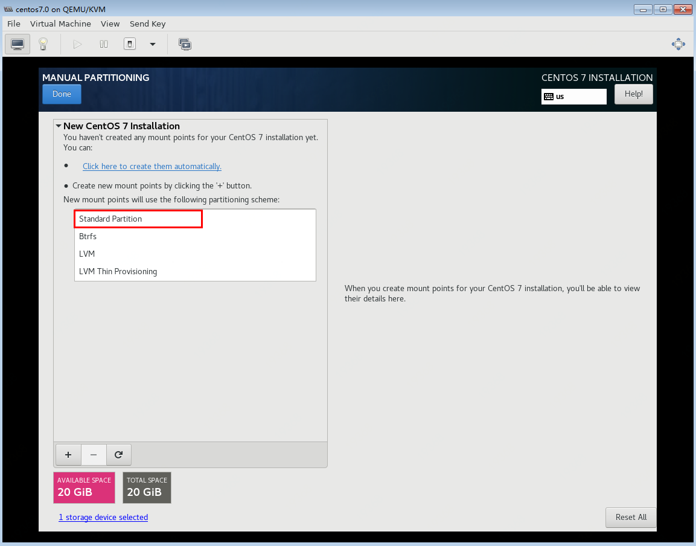<br>
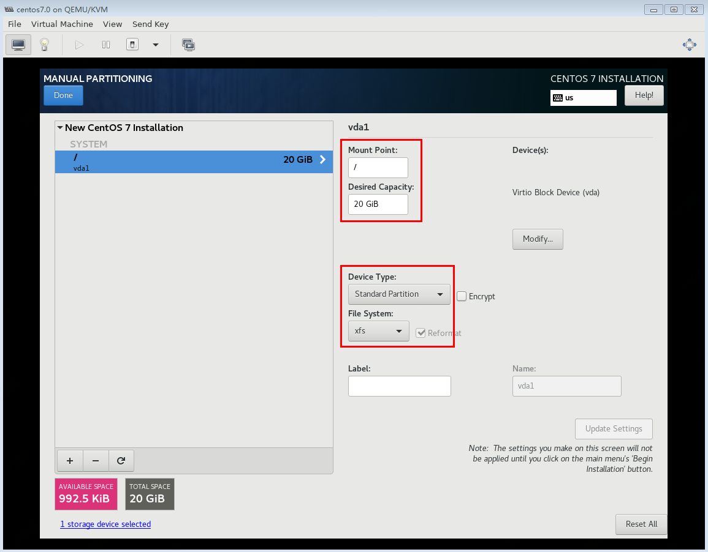<br>
配置完成后点击“DONE”返回主界面，随后点击“Begin Installation“开始安装。
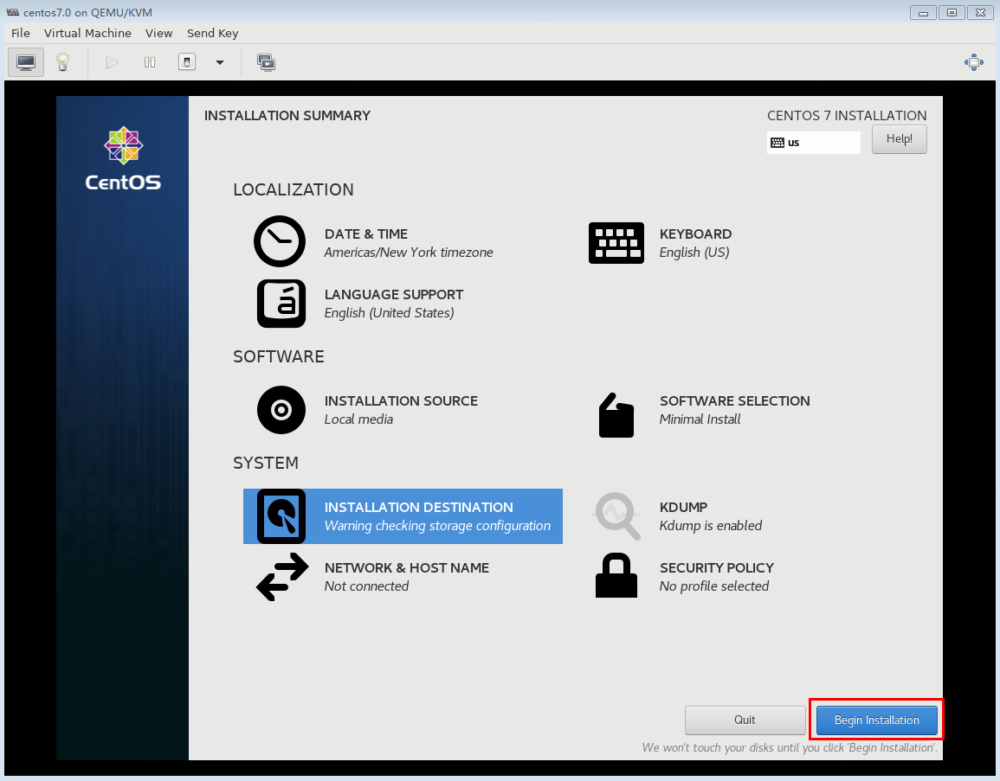<br>
设置用户密码与用户，完成安装，随后点击“reboot”重启系统。重启系统后，我们进入了刚刚安装的 CentOS 系统中，选择第一个启动选项。
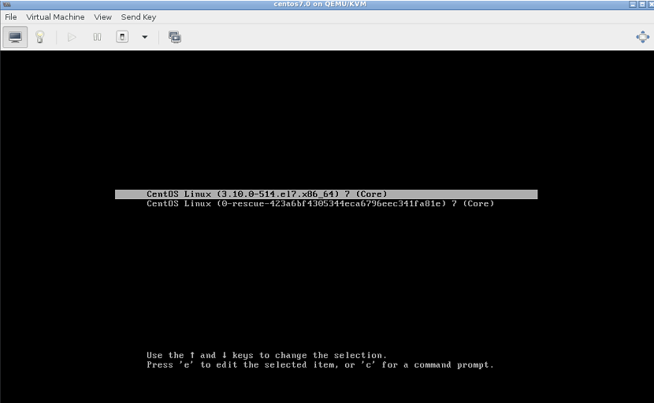<br>
至此，Centos 7 已经全部安装完毕。

### 3、安装VirtIO驱动程序

具体安装方式请参考 [安装virtio驱动](https://docs.jdcloud.com/cn/virtual-machines/install-virtio-driver) 。

### 4、配置京东云要求的软件环境
请参照 [私有镜像导入](https://docs.jdcloud.com/cn/virtual-machines/import-private-image) ，检查并配置系统环境，并安装 [官方镜像系统组件](https://docs.jdcloud.com/cn/virtual-machines/default-agent-in-public-image)。

### 5、获取镜像文件
打开 virt-manager，并打开硬件配置页面，打开有灯泡显示的图标，然后选择左侧的磁盘选项，右侧“Source path”即为镜像文件路径。

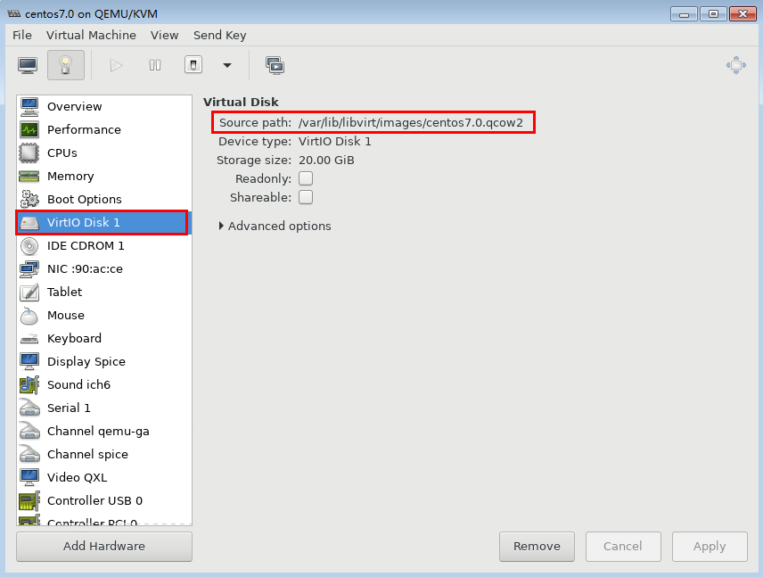<br>

## Windows环境下使用VMware Workstation制作镜像

### 1、安装并运行VMware Workstation

安装前请确保用当前笔记本/服务器开启了虚拟化配置，可在开机时进入BIOS界面，在Configuration中确认虚拟化配置是否为enabled。
前往[vmware官网](https://my.vmware.com/en/web/vmware/info/slug/desktop_end_user_computing/vmware_workstation_pro/15_0)下载并安装VMware Workstation。

### 2、使用VMware Workstation创建虚拟机
点击“创建新的虚拟机”，在安装来源环节选择本地iso镜像文件（此例中使用windows server 2016镜像）。

产品密钥用于正版激活，可暂不输入，主机名称可以输入Administrator也可新建用户，随后输入密码。

磁盘容量将决定后续导出镜像时的文件系统大小，间接决定了导入京东云环境时所指定的磁盘容量（导入镜像磁盘容量须不小于文件系统容量），请根据当前iso镜像文件所需空间合理设置。

确认配置后点击“完成”开始创建。
