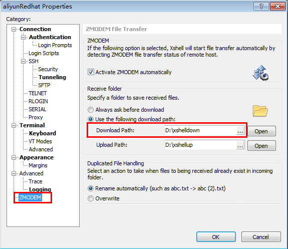
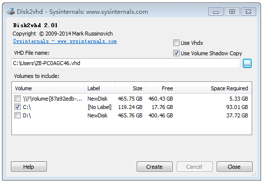

# 转换镜像格式
导入镜像的格式支持QCOW2、RAW、VHD和VMDK，如果您的镜像文件为其他格式，需要在导入前将镜像转换为以上四种格式中的任意一种。

在导出镜像之前，请参照 [私有镜像导入](https://docs.jdcloud.com/cn/virtual-machines/create-private-image) 并使用[镜像自检工具](https://docs.jdcloud.com/cn/virtual-machines/image-check-tool)，确保当前系统配置符合京东云镜像要求。

## Linux系统
Linux系统可使用qemu-img进行系统盘镜像的导出及格式转换。支持互相转换的格式包括：raw、qcow2、qcow、cow、vmdk、cloop。

### 导出系统盘为镜像文件
1、执行 `yum install qemu-img` （CentOS）或 `apt-get install qemu-utils` （Ubuntu）安装qemu-img。也可前往 https://pkgs.org/download/qemu-img 下载安装包。
2、执行下述指令可将指定磁盘整体导出为镜像并存储在指定目录下。
```
qemu-img convert -O qcow2 /dev/vda /mnt/vdb/image_out.qcow2
```
其中：
* -f 用来指定源镜像文件格式（示例中：raw）
* -O 用来指定目标镜像格式（示例中：qcow2）、导出为镜像的源磁盘（示例中：/dev/vda）、目标镜像文件名及存放路径（示例中：/mnt/vdb/image_out.qcow2）

3、如果本地远程连接工具使用的是Xshell，可以安装lrzsz，将文件压缩后（压缩后文件须小于4GB），下载至Xshell中设置的目录中。
```
yum -y install lrzsz
tar -zcvf image_out.tar.gz image_out.qcow2
sz image_out.tar.gz
```

<br>

### 转换镜像文件格式
1、如果镜像文件格式不在京东云支持的格式之内，可以使用qemu-img执行下述指令可进行指定镜像文件的格式转换。
```
qemu-img convert -f raw -O qcow2 image.raw image_out.qcow2
```
其中：
* -f 用来指定源镜像文件格式（示例中：raw）
* -O 用来指定目标镜像格式（示例中：qcow2）、源镜像文件名（示例中：image.raw）、目标镜像文件名（示例中：image_out.qcow2）
2、执行下述指令可查看生成的镜像信息。
```
qemu-img info image_out.qcow2
```

## Windows系统
Windows系统可使用微软官方提供的Disk2vhd（https://docs.microsoft.com/en-us/sysinternals/downloads/disk2vhd）导出VHD格式的镜像，如果镜像文件为其他格式可以使用qemu-img（for windows）进行格式转换。

### 导出系统盘为镜像文件
1、前往下载并安装Disk2vhd（https://docs.microsoft.com/en-us/sysinternals/downloads/disk2vhd）

2、解压后执行disk2vhd.exe，显示如下界面。指定存放路径及文件名称，勾选系统盘，并取消勾选“use Vhdx”，随后点击【Create】即可导出格式为VHD的系统盘镜像。

<br>

### 转换镜像文件格式
1、前往并下载qemu-img（https://cloudbase.it/qemu-img-windows/）

2、将解压后的文件（包括.exe文件和.dll文件）放置在与镜像文件相同的文件夹内

3、在powershell中进入镜像文件所在文件夹，执行下述指令进行格式转换，目标镜像会保存在源镜像所在目录内。
```
.\qemu-img.exe convert -f raw -O qcow2 image.raw image_out.qcow2
```
其中：
* -f 用来指定源镜像文件格式（示例中：raw）
* -O 用来指定目标镜像格式（示例中：qcow2）、源镜像文件名（示例中：image.raw）、目标镜像文件名（示例中：image_out.qcow2）
4、执行下述指令可查看生成的镜像信息。
```
.\qemu-img.exe info image_out.qcow2
```
