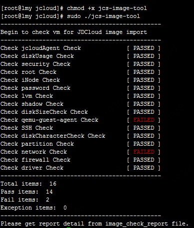

# 镜像自检工具
针对Linux系统，您可使用京东云提供的镜像自检工具，在从外部环境导出镜像之前，运行自检工具对关键系统配置进行检测，并根据检测报告进行调整。

为尽可能保证导入镜像的可用性和易用性，在导入镜像的过程中，系统会对镜像中的关键配置进行检测，如不符合会导致导入失败。因此，建议您在生产导入镜像之前，参照 [私有镜像导入](https://docs.jdcloud.com/cn/virtual-machines/copy-image) 中的镜像基本要求确认系统配置并使用镜像自检工具对主要配置进行检查。

## 适用系统
确定支持的操作系统包括：CentOS、Ubuntu、Debian、SLES(SUSE Linux Enterprise Server)、OpenSUSE、RedHat等Linux发行版本。

## 使用说明
1、登录您希望制作并导出镜像的服务器。<br>
2、下载镜像自检工具。<br>
3、在下载自检工具的目录内，赋予检测工具执行权限，随后以root账户执行检测。 https://iaas-cns-download.oss.cn-north-1.jcloudcs.com/jcs-image-tool <br>
```
chmod +x jcs-image-tool
sudo ./jcs-image-tool
```

4、等待检测结果。



5、检测完成后会在运行目录内自动生成检测报告，并以具体时间结尾以作标识，如：image_check_report_2019-03-26_16:02:03。查看检测报告可以了解未通过检测项的原因。

## 检测项说明

| 检测项                  | 检测要求      |不符合后果     | 建议操作 |
| :------------------- |  :------------------- | :------------------- |:------------------- |
|jcloudAgent      | 正确安装JCS-Agent     | 无法写入密码、密钥、自定义数据；无法上报实例机监控数据     | 正确安装安装JCS-Agent。请参考 [官方镜像系统组件](https://docs.jdcloud.com/cn/virtual-machines/default-agent-in-public-image)
| iNode       |inode使用率不大于98%	      | 实例启动后如果有其他任务占用系统空间，可能导致空间不足     |保留足够的inode资源
|security      |未开启SELinux服务      |无法正常启动实例      |不要通过修改/etc/selinux/config开启 SELinux
| diskSizeCheck    | 系统盘不能大于500GB      |  镜像无法导入    | 调整系统盘容量后制作镜像
| SSH     |已开启SSH服务      |  无法从控制台远程连接实例，无法远程SSH登录实例    |开启SSH服务
| password     | passwd命令存在     | 无法新增用户设置密码     |保留passwd命令
|root      | 存在root账户     |无法使用创建实例时的密码或密钥远程连接或SSH登录实例	      |保留root账户
|shadow     |  文件权限root可读写     | 无法写入密码、密钥、自定义数据     |保证root用户有读写权限
| diskUsage     | 磁盘使用率不大于98%     | 实例启动后如果有其他任务占用系统空间，可能导致空间不足     |使用导入镜像创建实例时设置足够大的磁盘容量，以保证服务运行正常。
| qemu-guest-agent	     | 未安装qemu-guest-agent     |  可能导致重要系统组件JCS-Agent无法正常运行    |卸载qemu-guest-agent
| lvm     |未使用LVM      | 无法正常启动实例     |未使用LVM  
| partition     | 采用MBR分区     | 无法正常启动实例     |采用MBR分区
|  diskCharacterCheck    |正确配置fstab  | 无法正常启动实例     | 使用/dev/vda或者uuid的形式配置自动挂载
| network     | 未启用NetworkManager	     |可能与network服务冲突导致网络不可用      |关闭或删除NetworkManager
| firewall      |iptables服务已关闭      | 在京东云环境下配置的访问策略失效，可能导致某些内部服务由于访问受限导致无法正常运行     |关闭防火墙
| driver     | virtio驱动已编译进内核或编译成内核模块     |  无法正常启动实例    |  [安装virtio驱动](https://docs.jdcloud.com/cn/virtual-machines/install-virtio-driver)

