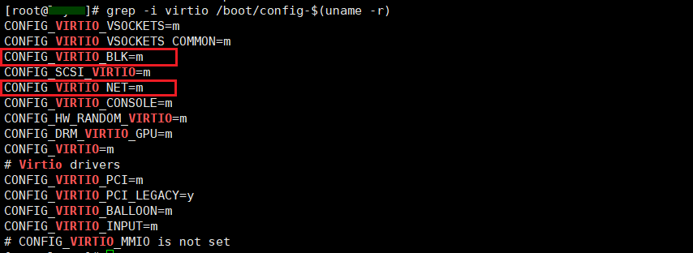
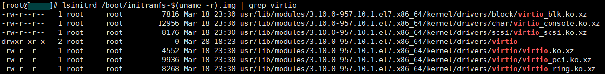
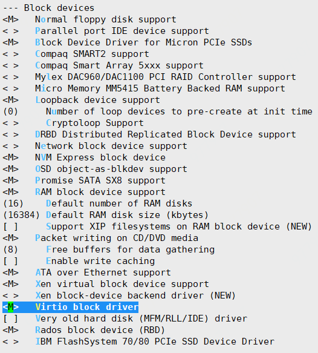
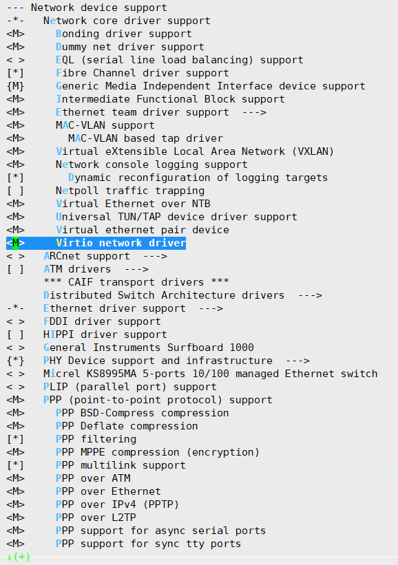
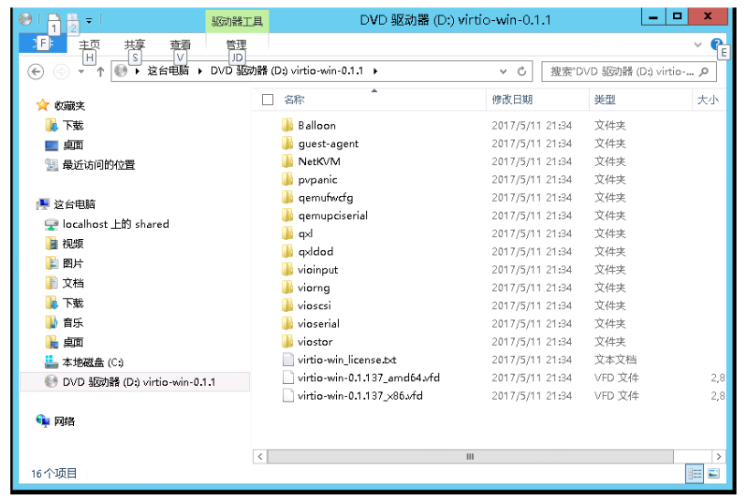
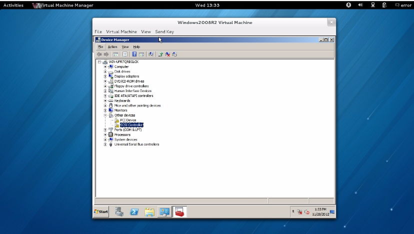
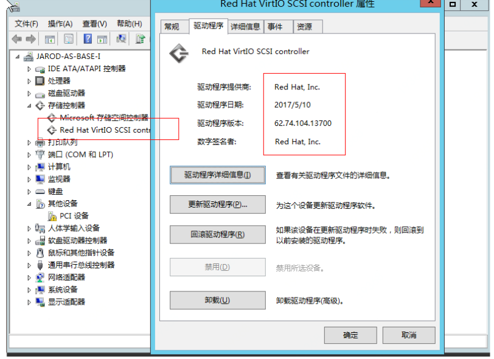

# 安装virtio驱动
为了保证私有镜像导入后可以成功启动云主机，virtio的驱动必须编译进内核或编译为内核模块，请务必在导入镜像之前确保系统中已正确安装了virtio驱动。
## Linux系统
以CentOS7系列镜像举例说明如何确认当前系统已正确安装 virtio 驱动。<br>
① 运行以下指令检查服务器内核是否支持virtio驱动：<br>
```
grep -i virtio /boot/config-$(uname -r)
```

<br>
* 如果参数 `CONFIG_VIRTIO_BLK` 及 `CONFIG_VIRTIO_NET` 取值为 y，表示驱动已编译进了内核，无须执行下述操作，可导入。
* 如果参数 `CONFIG_VIRTIO_BLK` 及 `CONFIG_VIRTIO_NET` 取值为 m，表示驱动已编译成内核模块，请执行下述操作“②”,确认initramfs（或initrd）文件中是否包含virtio_blk驱动，若无则需要重新制作文件。
* 如果在输出信息中没有找到 `VIRTIO_BLK` 及 `VIRTIO_NET` 的信息，表示该操作系统没有安装 virtio 相关驱动，需要编译安装virtio驱动，见请执行下述“③”。

② 执行以下指令确认 virtio 驱动是否包含在临时文件系统 initramfs 或者 initrd 中(Ubuntu系统请将initramfs替换为initrd)：<br>
```
lsinitrd /boot/initramfs-$(uname -r).img | grep virtio
```

<br>
如果initramfs已经包含了`virtio_blk`驱动，以及其所依赖的`virtio.ko`、`virtio_pci.ko` 和 `virtio_ring.ko`，则无须执行下述操作。<br>
如果initramfs未找到 virtio 相关信息，则需要修复临时文件系统：<br>
A. CentOS 7/6
```
cp /boot/initramfs-$(uname -r).img /boot/initramfs-$(uname -r).img.bak
mkinitrd -f --with=virtio_blk --with=virtio_pci /boot/initramfs-$(uname -r).img $(uname -r)
```
B. Ubuntu
```
echo -e "virtio_pci\nvirtio_blk" >> /etc/initramfs-tools/modules
update-initramfs  -u
```

③ 编译安装virtio驱动:<br>
A.下载内核安装包
* 安装编译内核的必要组件：
```
yum install -y ncurses-devel gcc make wget
```
* 查询当前系统使用的内核版本：
```
uname -r
```
* 前往 Linux 内核列表页面( https://mirrors.edge.kernel.org/pub/linux/kernel/ )找到对应的内核版本源码。
* 切换目录，下载安装包（以3.0内核为例），解压：
```
cd /usr/src/
wget https://mirrors.edge.kernel.org/pub/linux/kernel/v3.0/linux-3.10.tar.gz
tar -zxvf linux-3.10.tar.gz
```
* 建立链接：
```
ln -s linux-3.10 linux
```
* 切换目录：
```
cd /usr/src/linux
```
B.编译内核
* 清除之前编译过程生成的文件：
```
make mrproper
```
* 进入图形化配置界面
```
make menuconfig
```

<br>
在 Device Drivers-->Block devices 中选择Virtio block driver <br>
<br>

在 Device Drivers-->Network device support 中选择Virtio network driver

* 完成模块编译 (可能需要30~40分钟，具体时间取决于服务器配置)
```
make bzImage && make modules && make modules_install
```
* 安装
```
make install
```
* 运行以下命令查看 virtio 驱动的安装情况，如果任一命令输出 virtio_blk、virtio_pci.virtio_console 等文件列表，表明已经正确安装了 virtio 驱动。
```
find /lib/modules/"$(uname -r)"/ -name "virtio.*" | grep -E "virtio.*"
```

## Windows系统
① 前往下载iso格式的virtio软件包（以virtio-win-0.1.137.iso为例），iso文件里面包含了各种设备驱动，如网卡驱动（NetKVM), 磁盘驱动（virtsor)等。https://docs.fedoraproject.org/en-US/quick-docs/creating-windows-virtual-machines-using-virtio-drivers/index.html <br>

② 将virtio-win-0.1.137.iso文件拷贝到Windows虚机里面的某个目录下，可以通过远程连接共享文件夹等方式，将ios文件拷贝到虚机里。<br>

③ 双击iso文件，Windows会自动将其挂载到DVD设备上用于读取数据，下图中右侧的文件夹就是iso软件包里的内容，包括各种设备的驱动程序，如NetKVM对应的就是网卡驱动。<br>
<br>

④ 从控制面板里，找到并打开“设备管理器”窗口，只需要安装以下三个设置的驱动程序：
* 存储控制器－Red Hat VirtIO SCSI controller
* 网络适配器－Red Hat VirtIO Ethernet Adpater
* 串口设备－Virtio Serial Driver

打开设备管理器。会发现有三个打着黄色感叹号的设备没有安装驱动程序，一个SCSI Controller设备，一个网卡和一个PCI简单通信设备，如下图所示。<br>
<br>

⑤ 首先安装存储控制器驱动，右键点击选择“更新驱动程序软件”，在出现的窗口点击“浏览计算机以查找驱动程序软件”，并在弹出的窗口中定位到DVD驱动器里的“viostor“目录中的2k12R2/amd64/文件夹（Windows Server 2012R2）。点击确定按钮后，再点击下一步，直到按指示完成该驱动安装。系统如果提示重启，请选择稍后重启。待完全安装完三个驱动以后再考虑重启操作。<br>

⑥ 安装网卡驱动，右键点击选择“更新驱动程序软件”，在出现的窗口点击“浏览计算机以查找驱动程序软件”，并在弹出的窗口中定位到DVD驱动器里的NetKVM/2k12R2/amd64/文件夹，点击确定，按照提示完成按照。<br>

⑦ 安装串口驱动，右键点击选择“更新驱动程序软件”，在出现的窗口点击“浏览计算机以查找驱动程序软件”，并在弹出的窗口中定位到DVD驱动器里的vioserial/2k12R2/amd64/文件夹，点击确定，按照提示完成按照。<br>

⑧ 重启系统。<br>

⑨ 打开“设备管理器”，并检查我们安装的三个驱动程序的版本号：在我们文档的例子里，目标版本号是以13700结尾的数字字符串。<br>
<br>

⑩ 清理配置信息，此步骤极为重要。打开命令行窗口或powershell运行窗口，执行如下命令：
```
c:\windows\system32\Sysprep\sysprep.exe /generalize /oobe /shutdown
```
执行完该命令会弹出对话框，等待直到完成，系统会自动关机，完成升级Virtio驱动的全部流程。

需要特别注意的是，在卸载和安装后都要重启系统以保证更新驱动生效。
