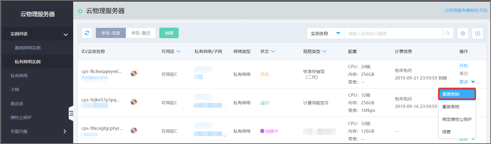

# 重置密码

重置密码适用于在创建时未设置密码或者忘记密码的情况下操作。

### 支持范围
基础网络实例：华北-北京 可用区B支持提交工单方式重置密码。其余可选择的地域可用区均支持在线重置密码操作。 
私有网络实例：可选择的地域可用区均支持在线重置密码操作。

### 前提条件
云物理服务器只有处于关机状态，才允许用户进行重置密码操作。重置实例密码后，只有在控制台对实例进行开机才能生效。

### 操作步骤
进入云物理服务器页面，点击选择私有网络实例(以私有网络实例为例)，点击 **重置密码** 按钮 ，具体如下图： 

