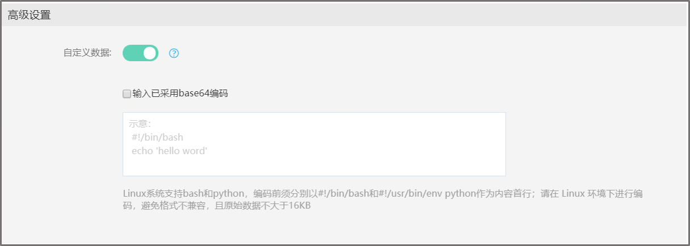

# 自定义数据

在创建云物理服务器实例时，您可以通过指定自定义数据，进行实例的配置。当云物理服务器首次启动时，用户可以将可执行脚本以指定的数据格式传入实例，并执行该文本。如果您一次购买多台云物理服务器实例，自定义数据会在所有的实例首次启动时执行该文本。

### 支持范围

基础网络实例：华北-北京 可用区B不支持设置自定义数据功能。其余可选择的地域可用区均支持该功能。 
私有网络实例：可选择的地域可用区均支持自定义数据功能。

### 格式要求

1、实例自定义数据需要完成Base64编码后传入，且编码前的数据不能超过16 KB（编码后不大于21848Byte）。 
2、如果通过控制台创建实例，可以选择不对数据进行Base64编码，勾选对应提示框后由系统完成编码，如果通过API创建，您必须自行完成编码。 
3、Linux系统支持bash和python，编码前须分别以#!/bin/bash和#!/usr/bin/env python作为内容首行。 
4、请在 Linux 环境下进行编码，避免格式不兼容，且原始数据不大于16KB；  
5、支持的镜像：CentOS 7.5 64位、CentOS 7.2 64位、CentOS 7.1 64位、CentOS 6.6 64位、CentOS 7.5 64位 TD增强版、Ubuntu 18.04 64位、Ubuntu 16.04 64位、Ubuntu 14.04 64位。 

### 操作步骤
进入创建云物理服务器页面，选择高级设置部分，默认自定义数据为关闭状态，选择开启操作 ，具体如下图： 

注意： 
1、仅限首次启动云物理服务器或重装系统时，通过传递文本执行命令。 
2、如果自定义数据没有按预期执行，可前往指定目录查看执行日志查找原因。Linux系统日志路径：/root/launch-script.log；另外，也可以查看执行的自定义脚本，详见路径：/root/launch-script。

