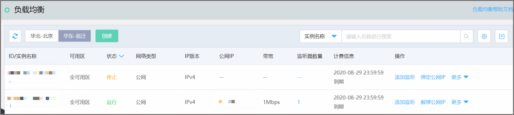
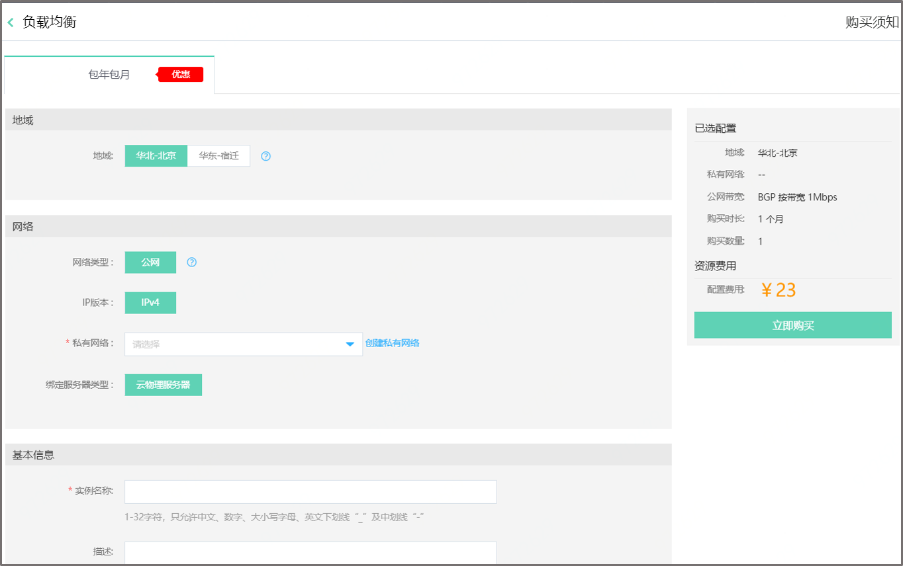
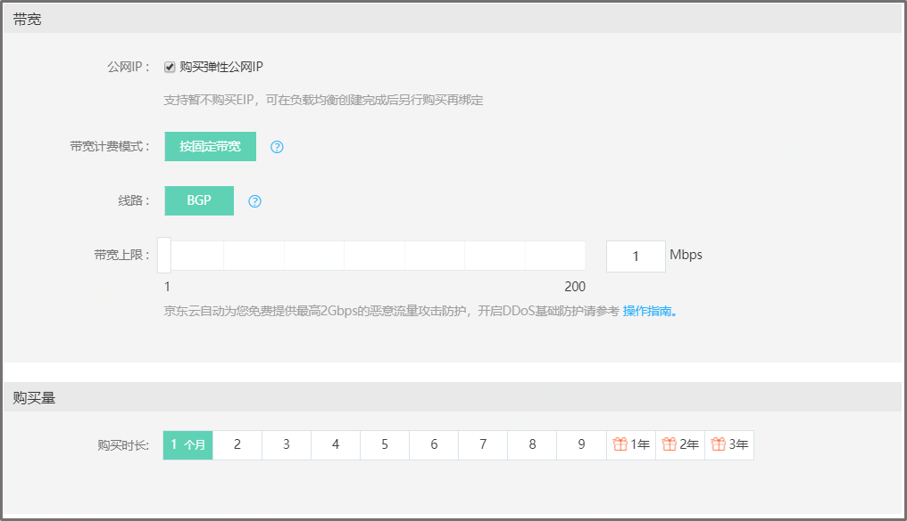
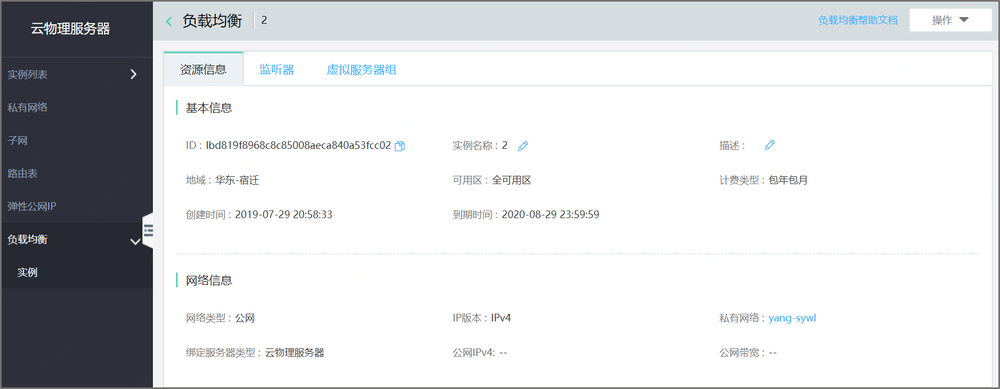
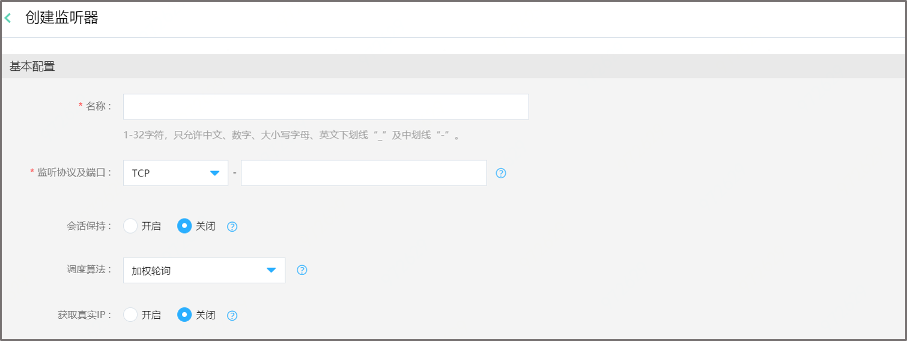
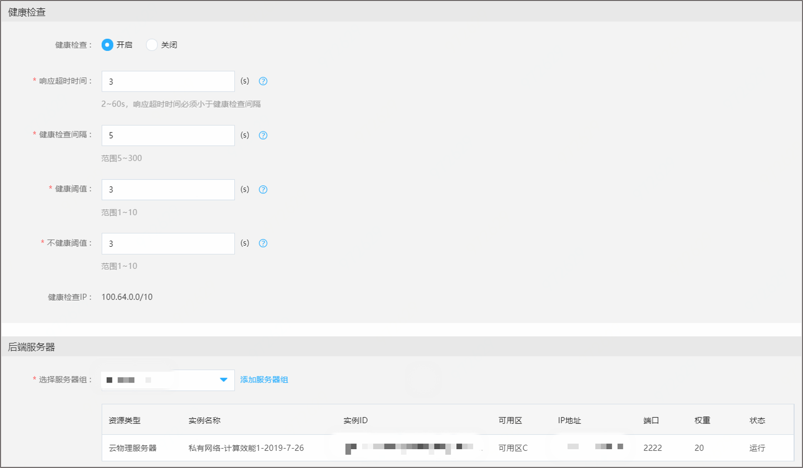
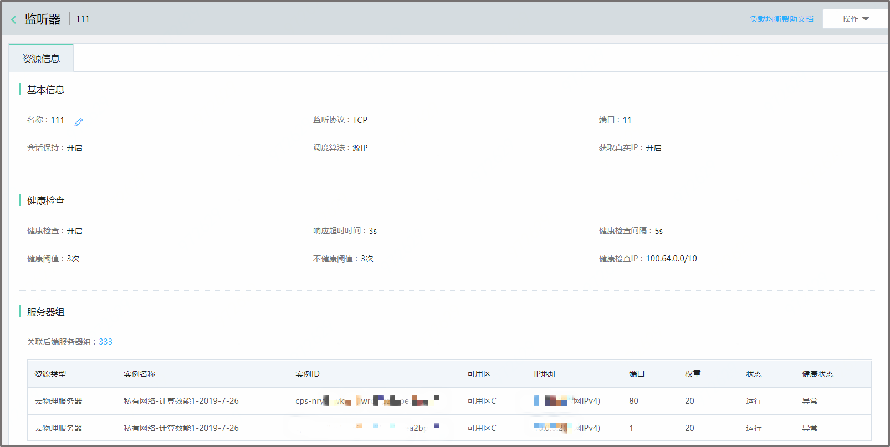
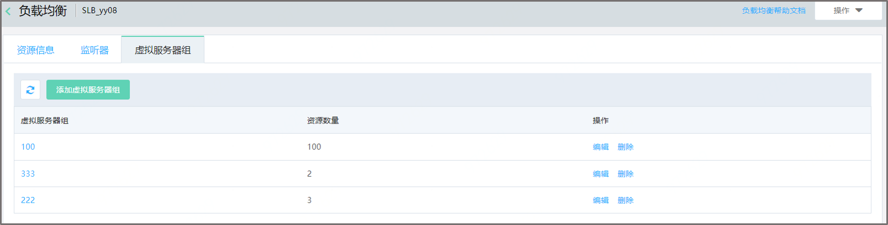
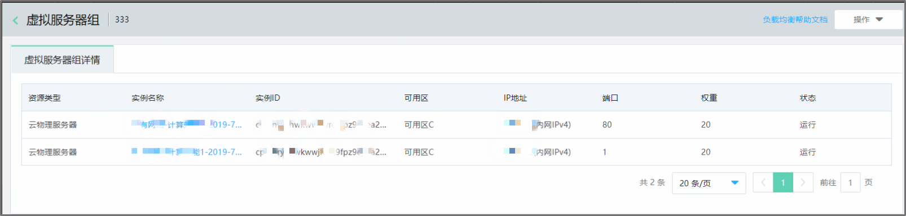

# 负载均衡

## 产品概述

负载均衡可将大并发流量分发到多台后端实例（专指于云物理服务器），调整资源利用情况，消除由于单台设备故障对系统的影响，提高系统的可用性、扩展服务能力，目前提供基于4层（TCP、UDP）的流量监听、转发服务。负载均衡又称“物理云负载均衡”。

## 使用限制

您在使用负载均衡时请注意以下使用限制。

1、目前每个京东云账户支持每个地域（region）最多申请10个负载均衡，如需更多配额请提交工单申请。目前只开放华东-宿迁，华北-北京开放时间敬请期待。 

2、负载均衡支持与弹性公网IP进行1:1绑定。 

3、一个负载均衡实例可以添加多个监听器，上限为50个。 

4、一个负载均衡可以添加多个虚拟服务器组，上限为20个。 

5、一个虚拟服务器组组内可以添加100个实例。 

6、目前包年包月的资源不允许删除。 

## 计费概述

负载均衡支持包年包月的计费方式。

**欠费/到期说明**

当您的包年包月付费网络资源到期时间早于或等于当前时间，则您的付费网络资源状态会变为过期。到期后付费网络资源将被停止服务，不能继续使用；

您的包年包月付费网络资源到期前，京东云会向您发送邮件、短信，提醒您的资源即将到期，请您注意查看并及时续费；

您的付费网络资源到期后，会向您发送邮件和短信通知您的资源已到期，请您务必注意查看通知并及时充值，以免造成不必要的损失；

从停止服务时刻起，您的付费网络资源和资源中的数据保留7天，7天后系统回收资源，数据无法找回；

您续费后被停用资源可正常使用。

## 计费规则

目前使用负载均衡产品不收费，如绑定了弹性公网IP资源，需要单独支付弹性公网IP 费用，详见弹性公网IP[价格总览](../../Pricing/Price-Overview.md)。

## 价格总览

**包年包月**

目前使用包年包月负载均衡，所有Region 均免费。

## 续费流程

**续费规则**

包年包月计费实例续费：延长包年包月负载均衡的使用时长。续费时间段为1个月~9个月、1年、2年、3年。如您在实例到期前操作续费，则新订单的开始时间为原订单的到期时间；如您在资源到期后续费，则新订单的开始时间为续费当天。

关联续费：在为实例续费时，会显示该实例绑定的弹性公网IP，用户按需选择需一同续费的关联资源进行续费。

## 操作指南

负载均衡主要由以下部分组成：负载均衡实例、监听器、虚拟服务器组。目前，支持四层负载均衡。

**创建负载均衡实例**

打开控制台，在左侧导航栏依次点击云物理服务器->负载均衡，进入负载均衡实例列表页，点击 **创建** ，如下图： 

根据需求选择 **地域** ，**网络部分**--网络类型（支持公网类型），IP版本（目前支持IPv4），私网网络，绑定的服务器类型（支持云物理服务器），**基本信息**--输入实例名称，描述，**带宽**--勾选弹性公网IP，选择带宽计费模式，线路类型，带宽上限，也支持暂不购买（待实例创建完成后在绑定IP），**购买量**--选择购买时长，点击 **确定** ，即可创建一个负载均衡。 

**负载均衡实例管理**

1.**添加监听**，点击**添加监听**跳转到监听器页面 
2.**开启/关闭**，可启动、停止负载均衡（若未负载均衡未绑定EIP，“开启”按钮置灰不可点击） 
3.**绑定/解绑弹性公网IP**，若负载均衡提供外网服务，需要绑定弹性公网IP；若不需要也可解绑弹性公网IP 
4.**续费**，支持负载均衡单独续费，也支持负载均衡和EIP关联续费 
5.点击**ID/实例名称**,跳转到实例详情页，如下图 

**监听器管理**

打开控制台，在左侧导航栏依次点击云物理服务器->负载均衡->实例详情，选择监听器tab页，进入监听器列表页，点击 **创建监听器** ，如下图： 

根据需求选择， 
**基本配置**-- 
**名称**：所输入的监听器名称（同一用户下负载均衡实例名称不能重复）； 
**监听协议**：支持四层TCP和UDP协议； 
**端口**：监听规则创建后，协议和端口不允许修改。负载均衡对外提供的端口，通常TCP使用80； 
**会话保持**：四层协议会话保持默认关闭； 
**调度算法**：若会话保持关闭，支持加权轮询、加权最小连接数；若会话保持开启，支持源IP。**加权轮询**：加权轮询会将访问请求依序分发后端服务器，权重值越高的后端服务器，被轮询到的次数（概率）也越高。**加权最小连接数**：除了根据每台后端服务器设定的权重值来进行轮询，同时还考虑后端服务器的实际负载（即连接数）。当权重值相同时，当前连接数越小的后端服务器被轮询到的次数（概率）也越高。**源IP**：基于源IP地址的一致性hash，相同的源地址会调度到相同的后端服务器。 
**获取真实IP**：协议为TCP时，默认为关闭，如果开启需要用户设置：通过yum源安装。以Centos为例，使用yum install kmod-toa安装toa内核模块插件后，可通过socket.accept()返回参数或调用 socket.getpeername()获取真实源IP。 

**健康检查**--负载均衡实例可以定期向后端服务器发送 Ping、尝试连接或发送请求来测试后端服务器运行的状况 
**健康检查**：默认开启，若关闭，以下字段均不显示； 
**响应超时时间**：健康检查响应的最大超时时间，如后端云服务器在相应时间内没有正确响应，则判定为健康检查失败。限制：2-60s。响应超时时间必须小于健康检查间隔。默认值是3。 
**健康检查间隔**：进行健康检查的时间间隔。限制：5-300s，默认值是5。 
**健康阈值**：表示后端实例从失败到成功的连接健康次数。限制：1-10次，默认值是3。 
**不健康阈值**：表示后端实例从成功到失败的连接健康检查失败次数。限制：1-10次，默认值是3。 
**健康检查IP**：100.64.0.0/10 

**后端服务器**-- 
选择虚拟服务器组，若没有已创建的服务器组，点击**添加服务器器组**即可创建。

完成以上步骤，点击**确定**，监听器即可创建成功。

打开控制台，在左侧导航栏依次点击云物理服务器->负载均衡->实例详情，选择监听器tab页，进入监听器列表页，点击 **监听器名称**，进入监听器详情页 ，如下图： 

**监听器支持操作** 
1.**编辑**：监听端口及协议不可修改，其余字段可以修改 
2.**开启/关闭**：支持开启和关闭状态切换。  
3.**删除**：删除监听器后，响应的后端服务器也将与此监听器解除绑定关系。 

**虚拟服务器组管理**

打开控制台，在左侧导航栏依次点击云物理服务器->负载均衡->实例详情，选择虚拟服务器组tab页，进入虚拟服务器组列表页，点击 **添加虚拟服务器组** ，如下图： 

选择**虚拟服务器组名称**（虚拟服务器组名称不能重复）、选择实例（非必填），点击**确定**，虚拟服务器组即创建完成。 

点击**虚拟服务器组**名称，进入虚拟服务器组详情页，如下图： 

**虚拟机服务器组支持操作** 
1.**编辑**：支持编辑操作。 
2.**删除**：虚拟服务器组删除条件：不与任何监听器绑定。 

