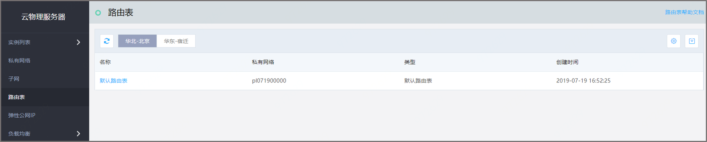
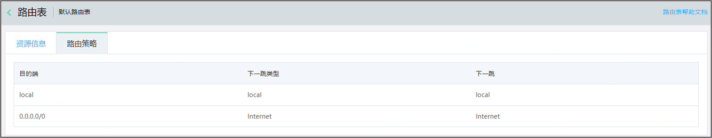

# 路由表

## 产品概述

路由表是由一系列路由规则组成。目前仅提供默认路由规则。 
创建私有网络后，系统会自动为您创建一张默认路由表。您不能创建默认路由，也不能删除默认路由。 

路由表由一系列路由策略组成，路由策略由路由的目的端、下一跳类型和下一跳地址组成，下一跳的类型支持的选项为：Internet，用于公网访问。目前不支持修改下一跳类型操作。 

## 默认路由表

用户创建虚拟私有网络时，自动创建的路由表为默认路由表，默认路由表不可删除。默认的两条路由策略不可删除，不可编辑。 

## 路由策略

默认路由表会自动产生默认路由规则。默认路由策略，每条路由策略包含三个参数，自动产生的路由规则： 

目的端：目的网段描述。 
下一跳类型：下一跳类型支持“Internet”。 
下一跳：指定具体跳转至的路由下一跳地址。 

<table>
    <tr>
      <th>目的端</th>
      <th>下一跳类型</th>
      <th>下一跳</th>
    </tr>
    <tr>
      <td>local</td>
      <td>local</td>
      <td>local</td>
    </tr>
    <tr>
      <td>0.0.0.0</td>
      <td>Internet</td>
      <td>Internet</td>
    </tr>
  </table>

默认local路由规则，指私有网络内网互通，其路由规则为【local，local，local】，该路由规则不能被删除和修改。 
默认0.0.0.0/0，流量若要访问公网，其规则为【0.0.0.0/0，Internet,Internet】,目前不支持操作。 

## 路由表管理

**路由表列表**

打开控制台，在左侧导航栏依次点击云物理服务器->路由表，进入路由表列表页，如下图： 

点击**路由表名称**，查看路由表详情和路由策略，如下图： 

