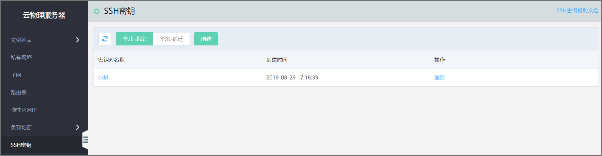
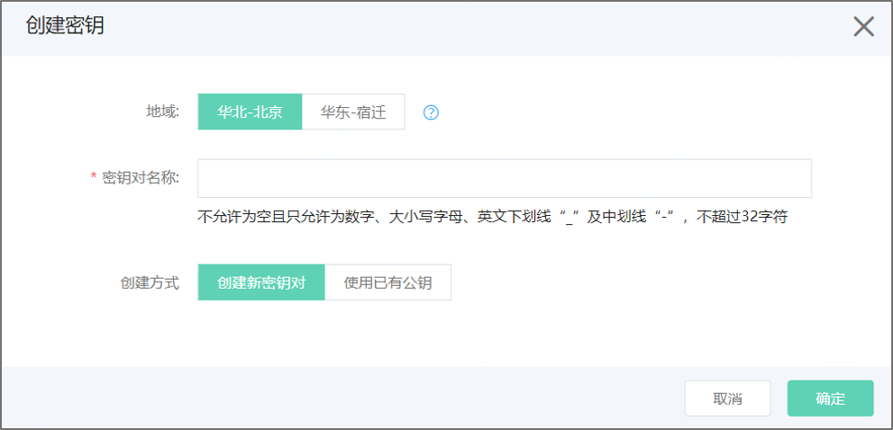
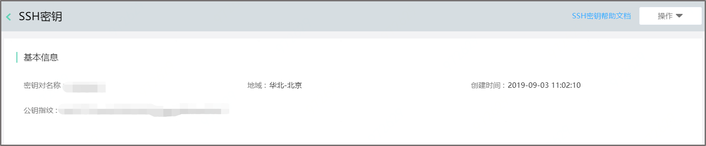

# SSH密钥

## 操作步骤

### 创建密钥

进入云物理服务器-SSH密钥列表，点击**创建密钥**操作，选择地域，输入密钥对名称，可以选择创建新的密钥对，也可以选择使用已有公钥。

选择创建密钥方式： 

1、创建新密钥对：京东云会为您创建一个新的密钥对。其中京东云保存公钥，私钥会自动下载至您本地，请您务必需要保存好对应的私钥，并确保私钥不在Internet上传播，京东云不会保存您的私钥。 

2、选择使用已有密钥，需要将您本地的公钥文件上传到京东云，请确保您本地保存与公钥配对的私钥。 

3.创建成功后，可以在密钥详情中查看公钥指纹信息。 

### 删除密钥

进入云物理服务器-SSH密钥列表，点击**删除**操作，即可删除SSH密钥。删除后，您仍可以使用本地保存的私钥登录绑定该密钥的实例。 

### 限制条件

1、同一账户同一个地域下最多可创建20个密钥。 

