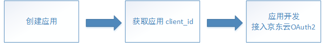
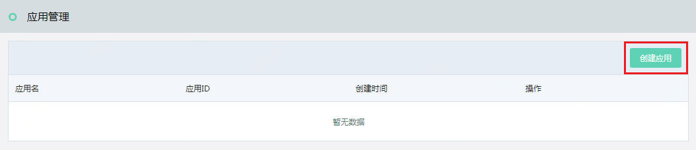
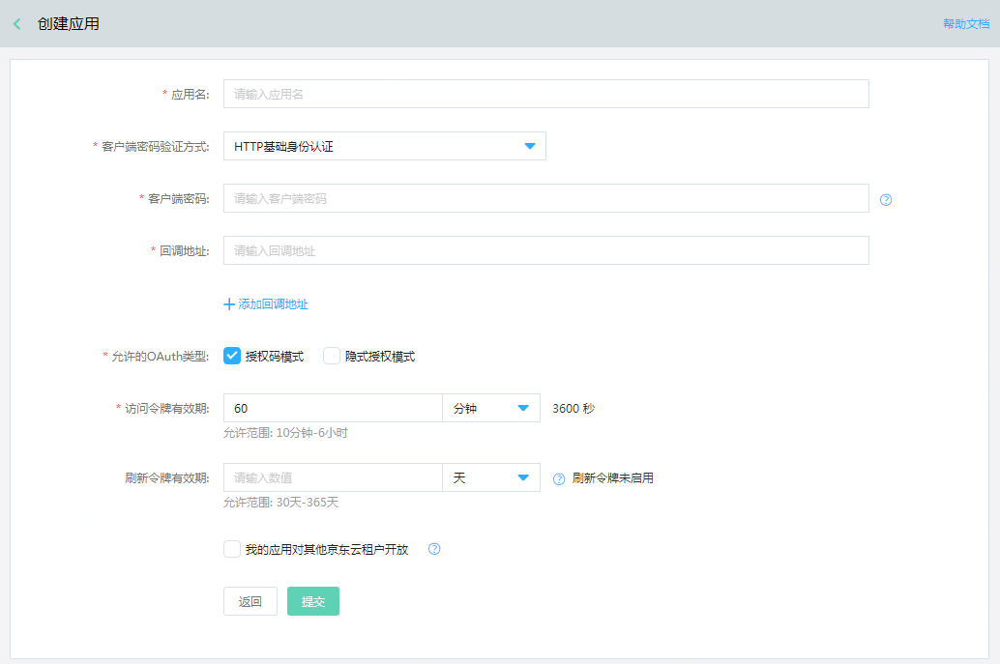
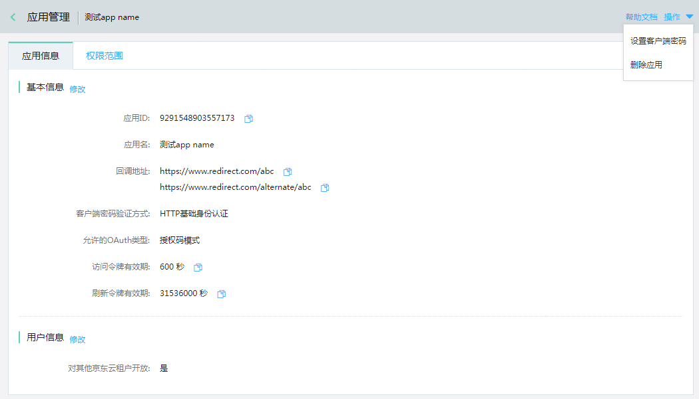
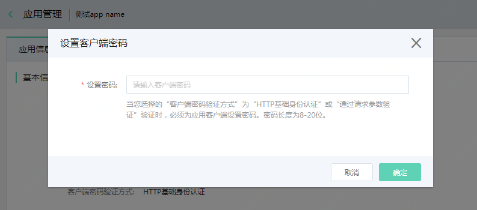
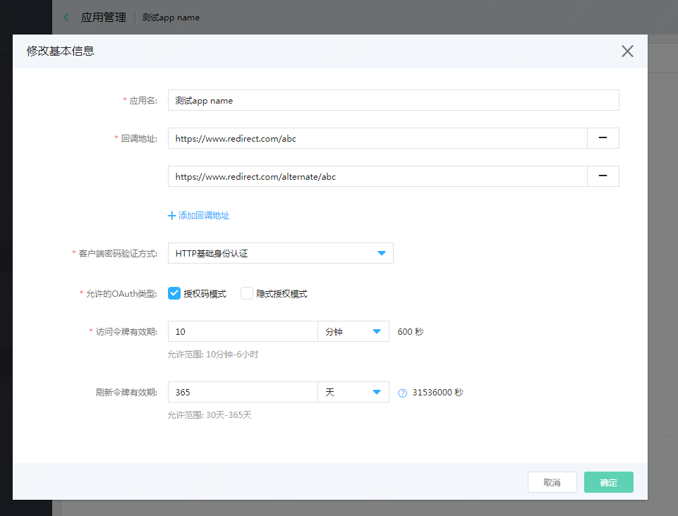
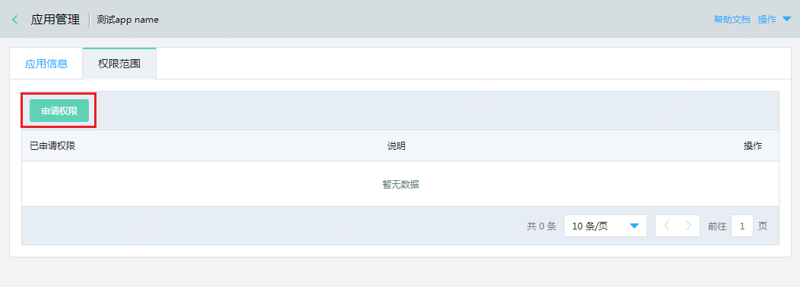
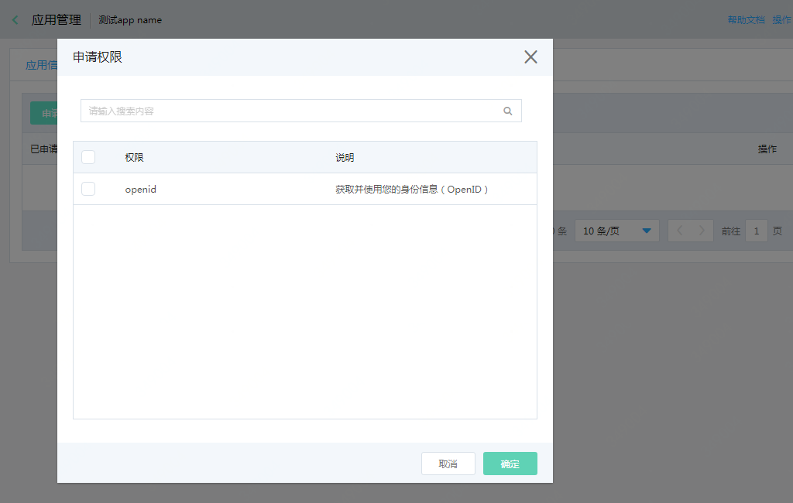
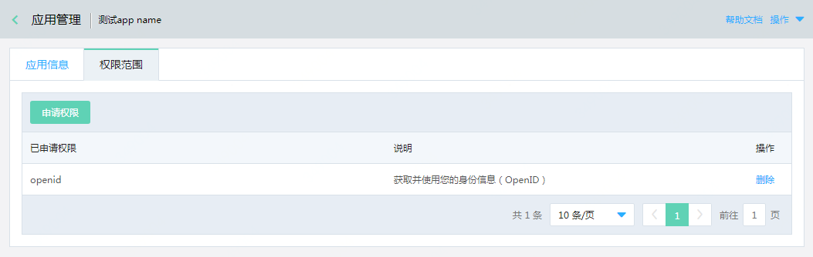

# 应用管理

创建应用、[接入京东云OAuth2](../../../documentation/Identity-Authentication-Service/Application-Management/OAuth2.md)的总体流程如下： 

您可以在京东云[身份管理控制台](https://ias-console.jdcloud.com/ias/apps)创建、管理应用程序。 

## 创建应用

每个账号可以创建最多20个应用。在应用管理列表页，点击“创建”按钮，开始创建应用。 

**各字段填写说明**

|字段名|字段说明|字段值描述|
|---|---|---|
|应用名|应用的名称|1-255位任意字符|
|客户端密码验证方式|在京东云将访问令牌颁发给应用前，需要先验证应用的身份，防止其他客户端伪造应用请求。选择不同的选项，在京东云OAuth2的[令牌端点](../../../documentation/Identity-Authentication-Service/Application-Management/OAuth2.md/#3)申请访问令牌时，应采用不同的方式进行应用的身份验证|(1) HTTP基础身份认证：京东云推荐的默认选项。选择该选项，需要设置客户端密码，并使用HTTP基础身份认证方案（HTTP Basic authentication scheme）进行应用的身份认证，即在令牌端点的请求头部包含应用ID和密码的编码信息 (2) 通过请求参数验证：当无法使用HTTP基础身份认证方案时可选择该选项，需要设置客户端密码，并在令牌端点的请求参数中包含应用ID和密码信息 (3) 不验证客户端密码：不设置客户端密码。在令牌端点不使用密码验证，而是通过代码质询验证实现应用身份验证|
|客户端密码|如果客户端密码验证方式为“HTTP基础身份认证”或“通过请求参数验证”，则需要为应用设置客户端密码|8-20位字母数字或符号，设置后请牢记该密码，因为您无法在京东云再次查看该密码|
|回调地址|京东云OAuth2的授权码端点中，回调地址参数的值应和应用设置的回调地址完全一致。用户在京东云完成登录授权后，将被重定向回指定的回调地址|可以设置最多四个回调地址，URI格式，不支持#符号，每个URI长度应小于1k|
|允许的OAuth类型|应用适用的[京东云OAuth2授权流程](../../../documentation/Identity-Authentication-Service/Application-Management/OAuth2.md/#0)|(1)授权码模式：京东云推荐的默认选项 (2)隐式授权模式：在应用无法实现授权码模式的授权流程时，可以选则隐私授权模式 如果多选，则在实现京东云OAuth2时，两种模式都适用|
|访问令牌有效期|在京东云OAuth2的[令牌端点](../../../documentation/Identity-Authentication-Service/Application-Management/OAuth2.md/#3)中获取到的访问令牌的有效期|根据应用的需要进行设置，默认值为3600秒|
|刷新令牌有效期|默认不启用刷新令牌，访问令牌失效时，需要重新通过授权码端点和令牌端点请求访问令牌； 如果应用需要在访问令牌失效时，直接使用刷新令牌申请一个新的访问令牌，则可以设置刷新令牌有效期|根据应用的需要进行设置，默认不启用刷新令牌|
|我的应用对其他京东云租户开放|默认应用为单租户应用，即仅当前账号下的子用户可以访问应用，应用接入京东云OAuth2时，联合登录的页面为京东云子用户登录页； 如果应用是多租户应用，应勾选此项，联合登录的页面为京东云账号登录页|根据应用的需要进行勾选|

应用创建成功，将生成一个应用ID，可以在应用管理列表页或应用管理详情页查看。 

## 管理应用

在应用管理列表页，点击应用的“管理”按钮，可查看应用详情、编辑应用信息、申请应用权限、重置应用密码。 

1. 快捷复制按钮，点击复制应用ID 
2. 如果应用通过“HTTP基础身份认证”或“通过请求参数验证”方式验证客户端密码，可以通过页面右上角的操作按钮，重置客户端密码 

3. 点击修改按钮，可以修改应用信息，各字段填写说明请参考创建应用 

4. 如果应用本身也需要作为身份提供商，为其他应用提供联合认证服务，则可能需要京东云用户的OpenID信息。此时，需要在权限范围页面申请权限。 
京东云OAuth2授权码端点中，scope参数的值应在已申请的权限范围中。所有申请的权限必须在scope参数中指明，并获得用户授权后，访问令牌的权限才会生效 

