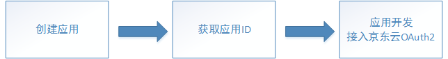

# 应用管理

创建应用、[接入京东云OAuth2](../../../documentation/Identity-Authentication-Service/Application-Management/OAuth2.md)的总体流程如下： 

您可以在京东云[身份管理控制台](https://ias-console.jdcloud.com/ias/apps)创建、管理应用程序。 

## 创建应用

在应用管理列表页，点击“创建”按钮，可以开始创建应用。 

**各字段填写说明**

|字段名|字段说明|字段值描述|
|---|---|---|
|应用名|应用的名称|1-255位任意字符|
|客户端密码验证方式|在京东云将访问令牌颁发给应用前，需要先验证应用的身份，防止其他客户端伪造应用请求。选择不同的选项，在京东云OAuth2的令牌端点申请访问令牌时，应采用不同的方式进行应用的身份验证|(1) HTTP基础身份认证：京东云推荐的默认选项。选择该选项，需要设置客户端密码，并使用HTTP基础身份认证方案（HTTP Basic authentication scheme）进行应用的身份认证，即，在令牌端点的请求头部包含应用ID和密码的编码信息 (2) 通过请求参数验证：当无法使用HTTP基础身份认证方案时可选择该选项，需要设置客户端密码，并在令牌端点的请求参数中包含应用ID和密码信息 (3) 不验证客户端密码：不设置客户端密码。在令牌端点不使用密码验证，而是通过代码质询验证实现应用身份验证|
|客户端密码|如果客户端密码验证方式为“HTTP基础身份认证”或“通过请求参数验证”，则需要为应用设置客户端密码|8-20位字母和数字，设置后请牢记该密码，因为您无法在京东云再次查看该密码|
|回调地址|京东云OAuth2的授权码端点中，回调地址参数的值应和应用设置的回调地址完全一致。用户在京东云完成登录授权后，将被重定向回指定的回调地址|可以设置最多四个回调地址，URI格式，不支持#符号，每个URI长度应小于1k|
|允许的OAuth类型|应用适用的[京东云OAuth2授权流程](../../../documentation/Identity-Authentication-Service/Application-Management/OAuth2.md/#0)|(1)授权码模式：京东云推荐的默认选项 (2)隐式授权模式：在应用无法实现授权码模式的授权流程时，可以选则隐私授权模式 如果多选，则在实现京东云OAuth2时，两种模式都适用|
|访问令牌有效期|---|---|
|刷新令牌有效期|---|---|
|我的应用对其他京东云租户开放|---|---|
