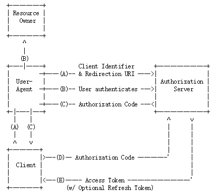

# 京东云OAuth2接入指引
## 一. 什么是京东云OAuth2
**OAuth2**（开放授权）是一个开放的标准授权协议，允许用户授权第三方应用访问该用户存储在服务商处的私密资源。用户无需向第三方应用共享自己在服务商处的用户名和密码，而是提供给第三方应用一个令牌，第三方应用即可使用该令牌来访问服务商处的用户资源。每一个令牌只能授权给一个特定的应用在特定的时间段内访问特定的资源，因此第三方应用无法访问未经用户授权的资源。 
OAuth2的更多说明，请参考其[官方网站](https://oauth.net/2/)。 

**京东云OAuth2**采用OAuth2协议来实现用户的身份验证和授权，在用户授权的基础上支持第三方应用获取用户的身份信息，以及通过京东云OpenAPI访问用户在京东云的资源。 

## 二. 接入京东云OAuth2
京东云OAuth2支持网站或Web应用接入，接入流程如下： 
1. [创建应用](../../../documentation/Identity-Authentication-Service/Application-Management/Create-Application.md)，获取client_id； 
2. 根据[京东云OAuth2协议](#0)，开发应用： 
&emsp;2.1 在应用中[放置京东云登录按钮](#1)； 
&emsp;2.2 [获取用户的授权码](#2)； 
&emsp;2.3 [获取用户的访问令牌](#3)； 
&emsp;2.4 [获取用户的京东云账号](#4)； 
&emsp;2.5 如有必要，[刷新访问令牌](#5)； 
&emsp;2.6 如有必要，[撤销令牌](#6)。 

<h3 id="0">京东云OAuth2协议</h3>

**名词解释** 
资源所有者（Resource Owner）：终端用户 
客户代理（User-Agent）：浏览器 
客户端（Client）：第三方应用 
授权服务器（Authorization Server）：京东云授权服务器 

**授权流程** 

- (A) 用户通过浏览器访问应用，应用向京东云授权服务器发起登录授权请求（提供应用的client_id、重定向URI、需要的访问范围说明），同时浏览器将重定向到京东云登录页面； 
- (B) 用户登录京东云，京东云验证用户身份（通过是否成功登录），并询问用户是否同意给应用授权； 
- (C) 如果用户同意授权，京东云将浏览器重定向回到应用指定的重定向URI，同时附上一个授权码； 
- (D) 应用向京东云申请令牌（提供上一步收到的授权码和它的重定向URI）; 
- (E) 京东云核对应用信息无误，向应用颁发用户的访问令牌和刷新令牌。 

通过上述流程，应用获得了用户的访问令牌，凭令牌可以从京东云获取用户信息或访问用户资源。访问令牌的权限是用户在(B)步骤中授权的范围。 

<h3 id="1">放置京东云登录按钮</h3>

<h3 id="2">获取用户的授权码</h3>

<h3 id="3">获取用户的访问令牌</h3>

<h3 id="4">获取用户的京东云账号</h3>

<h3 id="5">刷新访问令牌</h3>

<h3 id="6">撤销令牌</h3>

